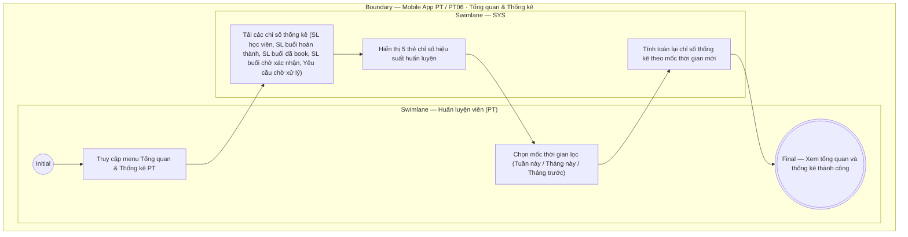

# PT06-US01 - Xem tổng quan và thống kê hiệu suất PT

## Preconditions
- Huấn luyện viên (PT) đã đăng nhập ứng dụng Mobile bằng tài khoản PT hợp lệ.
- PT có dữ liệu lịch dạy và danh sách học viên được phân công.

## Trigger
- PT mở ứng dụng Mobile PT hoặc chọn menu footer `PT06 · Tổng quan`.
- Màn hình liên quan: Mobile App PT — Màn hình `Tổng quan & Thống kê PT`.

## Main Flow

1. PT mở ứng dụng Mobile PT hoặc chọn menu footer **Tổng quan**.
2. Hệ thống nạp và hiển thị màn hình **Tổng quan & Thống kê hiệu suất PT**.
3. Cụm 5 thẻ chỉ số thống kê hiệu suất (thời gian lọc mặc định: Tháng hiện tại) bao gồm:
   - **Số lượng học viên phụ trách:** Tổng số học viên đang được phân công cho PT (`ACTIVE`).
   - **Số buổi đã dạy hoàn thành:** Tổng số buổi tập đã đủ xác nhận 2 chiều và chuyển trạng thái `DONE` trong kỳ (căn cứ đối soát thù lao dạy thực tế).
   - **Số buổi đã được book (sắp dạy):** Tổng số ca tập ở trạng thái `Đã đặt` (`UPCOMING`) trong tương lai.
   - **Số buổi đang chờ xác nhận:** Tổng số ca tập ở trạng thái `Chờ xác nhận hoàn thành` (`AWAITING_CONFIRMATION`).
   - **Số yêu cầu phân công chờ xử lý:** Tổng số yêu cầu chọn PT từ học viên đang ở trạng thái `PENDING`.
4. PT có thể thay đổi mốc thời gian xem thống kê (Tuần này / Tháng này / Tháng trước).
5. Hệ thống tự động tính toán và nạp lại các con số thống kê theo mốc thời gian được chọn.
6. **Quy tắc nghiệp vụ:**
   - Màn hình tổng quan đóng vai trò là Dashboard cung cấp bức tranh toàn cảnh về khối lượng công việc và hiệu suất huấn luyện của PT trong kỳ.
   - Mọi thao tác xem chi tiết lịch dạy theo ngày và bấm xác nhận hoàn thành ca tập được tập trung xử lý tại menu `PT01 · Lịch`.
   - Các con số thống kê tự động cập nhật ngay khi có buổi tập hoàn thành hoặc có lịch đặt mới.

### Field-level specification — Màn hình Tổng quan & Thống kê hiệu suất PT
| Field / control | State | Required | Conditional / dynamic | Source / validation |
| :--- | :--- | :--- | :--- | :--- |
| **Bộ lọc mốc thời gian** | `USER-INPUT` + `PREFILL` | required | `TRIGGER`: Chọn mốc thời gian kích hoạt tính toán lại các ô chỉ số hiệu suất bên dưới | Segmented Control / Chips: `Tuần này`, `Tháng này` (mặc định), `Tháng trước` |
| **Chỉ số: Học viên phụ trách** | `READONLY` | required | `DYNAMIC`: Cập nhật tổng số lượng học viên theo mốc thời gian của TRIGGER | Số nguyên ≥ 0; đếm số học viên có hợp đồng PT `ACTIVE` được phân công cho PT |
| **Chỉ số: Buổi đã hoàn thành** | `READONLY` | required | `DYNAMIC`: Cập nhật tổng số buổi hoàn thành theo mốc thời gian của TRIGGER | Số nguyên ≥ 0; đếm số ca tập có trạng thái `DONE` (đã đủ xác nhận 2 chiều) trong kỳ |
| **Chỉ số: Buổi đã được book** | `READONLY` | required | `DYNAMIC`: Cập nhật tổng số buổi sắp dạy theo mốc thời gian của TRIGGER | Số nguyên ≥ 0; đếm số ca tập có trạng thái `Đã đặt` (`UPCOMING`) trong tương lai |
| **Chỉ số: Buổi chờ xác nhận** | `READONLY` | required | `DYNAMIC`: Cập nhật tổng số buổi chờ xác nhận theo mốc thời gian của TRIGGER | Số nguyên ≥ 0; đếm số ca tập có trạng thái `AWAITING_CONFIRMATION` |
| **Chỉ số: Yêu cầu phân công** | `READONLY` | required | `DYNAMIC`: Cập nhật tổng số yêu cầu chờ duyệt theo mốc thời gian của TRIGGER | Số nguyên ≥ 0; đếm số yêu cầu ghép PT trạng thái `PENDING` |

## Alternate Flows

### AF-01 — Đổi mốc thời gian thống kê
1. PT chọn lọc theo "Tuần này" hoặc "Tháng trước".
2. SYS tính toán và cập nhật lại toàn bộ các chỉ số thống kê tương ứng với khoảng thời gian đã chọn.

## Exception Flows

- Lỗi kết nối mạng: SYS hiển thị thông báo "Không thể nạp dữ liệu thống kê, vui lòng kiểm tra kết nối mạng".

## Activity Diagram — Swimlane
**Trigger:** PT mở ứng dụng Mobile PT hoặc truy cập menu footer Tổng quan.

