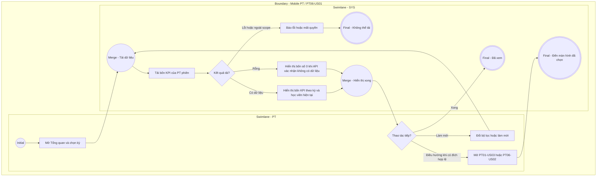

# PT06-US01 - Xem tổng quan và thống kê hiệu suất PT

## Preconditions
- Huấn luyện viên (PT) đã đăng nhập ứng dụng Mobile bằng tài khoản PT hợp lệ.
- PT có thể chưa có học viên hoặc lịch dạy; khi API trả rỗng hiển thị số 0.

## Trigger
- PT mở ứng dụng Mobile PT hoặc chọn menu footer `PT06 · Tổng quan`.
- Màn hình liên quan: Mobile App PT — Màn hình `Tổng quan & Thống kê PT`.

## Main Flow

1. PT mở ứng dụng Mobile PT hoặc chọn menu footer **Tổng quan**.
2. Hệ thống nạp và hiển thị màn hình **Tổng quan & Thống kê hiệu suất PT**.
3. Cụm 4 thẻ chỉ số thống kê hiệu suất (thời gian lọc mặc định: Tháng hiện tại) bao gồm:
   - **Số lượng học viên phụ trách:** Tổng số học viên đang được phân công cho PT (`ACTIVE`).
   - **Số buổi đã dạy hoàn thành:** Tổng số buổi tập đã đủ xác nhận 2 chiều và chuyển trạng thái `DONE` trong kỳ (căn cứ đối soát thù lao dạy thực tế).
   - **Số buổi đã được book (sắp dạy):** Tổng số ca tập ở trạng thái `Đã đặt` (`UPCOMING`) trong tương lai.
   - **Số buổi đang chờ xác nhận:** Tổng số ca tập ở trạng thái `Chờ xác nhận hoàn thành` (`AWAITING_CONFIRMATION`).
4. PT có thể thay đổi mốc thời gian xem thống kê (Tuần này / Tháng này / Tháng trước).
5. Hệ thống tự động tính toán và nạp lại các con số thống kê theo mốc thời gian được chọn.
6. **Quy tắc nghiệp vụ:**
   - Màn hình tổng quan đóng vai trò là Dashboard cung cấp bức tranh toàn cảnh về khối lượng công việc và hiệu suất huấn luyện của PT trong kỳ.
   - Mọi thao tác xem chi tiết lịch dạy theo ngày và bấm xác nhận hoàn thành ca tập được tập trung xử lý tại menu `PT01 · Lịch`.
   - Các con số thống kê tự động cập nhật ngay khi có buổi tập hoàn thành hoặc có lịch đặt mới.

### Field-level specification — Màn hình Tổng quan & Thống kê hiệu suất PT
| Field / control | Loại UI Control | State | Required | Conditional / dynamic | Source / validation |
| :--- | :--- | :--- | :--- | :--- | :--- |
| **Bộ lọc mốc thời gian** | `Segmented Control / Chips` | `USER-INPUT (PREFILL)` | required | `TRIGGER`: Chọn mốc thời gian kích hoạt tính toán lại các ô chỉ số hiệu suất bên dưới | Segmented Control / Chips: `Tuần này`, `Tháng này` (mặc định), `Tháng trước` |
| **Chỉ số: Học viên phụ trách** | `KPI Metric Card` | `READONLY` | required | Không: số học viên đang phụ trách tại thời điểm tải | Số nguyên ≥ 0; đếm số học viên có hợp đồng PT `ACTIVE` được phân công cho PT |
| **Chỉ số: Buổi đã hoàn thành** | `KPI Metric Card` | `READONLY` | required | Không: giá trị tính theo kỳ đã chọn; cập nhật tổng số buổi hoàn thành theo mốc thời gian của TRIGGER | Số nguyên ≥ 0; đếm số ca tập có trạng thái `DONE` (đã đủ xác nhận 2 chiều) trong kỳ |
| **Chỉ số: Buổi đã được book** | `KPI Metric Card` | `READONLY` | required | Không: giá trị tính theo kỳ đã chọn; cập nhật tổng số buổi sắp dạy theo mốc thời gian của TRIGGER | Số nguyên ≥ 0; đếm số ca tập có trạng thái `Đã đặt` (`UPCOMING`) trong tương lai |
| **Chỉ số: Buổi chờ xác nhận** | `KPI Metric Card` | `READONLY` | required | Không: giá trị tính theo kỳ đã chọn; cập nhật tổng số buổi chờ xác nhận theo mốc thời gian của TRIGGER | Số nguyên ≥ 0; đếm số ca tập có trạng thái `AWAITING_CONFIRMATION` |

- Chỉ lấy thống kê của PT phiên. Học viên phụ trách là số hội viên duy nhất đang có phân công/hợp đồng hợp lệ tại thời điểm tải; ba KPI buổi lọc theo ngày tập trong kỳ, buổi sắp dạy còn phải ở tương lai. Không đếm request legacy.
- Dữ liệu hoàn thành dùng COMPLETED; DONE/UPCOMING là tên legacy hiển thị. Số buổi chờ xác nhận theo trạng thái máy chủ; không tự đánh dấu hoàn thành.
- Nút Đặt lịch nhanh mở PT01-US03; nút Xem bảng kê hoa hồng mở PT06-US02. Hoa hồng là khối truy cập riêng, không phải KPI thứ năm.

### Field-level specification — Thao tác Tổng quan
| Field / control | UI | State | Required | Conditional / dynamic | Source / validation |
| --- | --- | --- | --- | --- | --- |
| Đặt lịch nhanh | Icon + text button | USER-INPUT | required | Không | Mở PT01-US03, PT/chi nhánh chỉ đọc |
| Xem bảng kê hoa hồng | Button | USER-INPUT | required | Không | Mở PT06-US02 own scope |
| Thử lại | Button | USER-INPUT | conditional | CONDITIONAL: hiện khi tải lỗi; ẩn khi tải thành công/đang tải | Nạp lại bốn KPI; không dùng số 0 giả thay lỗi |

## Alternate Flows

### AF-01 — Đổi mốc thời gian thống kê
1. PT chọn lọc theo "Tuần này" hoặc "Tháng trước".
2. SYS tính toán và cập nhật lại toàn bộ các chỉ số thống kê tương ứng với khoảng thời gian đã chọn.

## Exception Flows

- Lỗi kết nối mạng: SYS hiển thị thông báo "Không thể nạp dữ liệu thống kê, vui lòng kiểm tra kết nối mạng".

## Activity Diagram — Swimlane
**Trigger:** PT mở ứng dụng Mobile PT hoặc truy cập menu footer Tổng quan.

