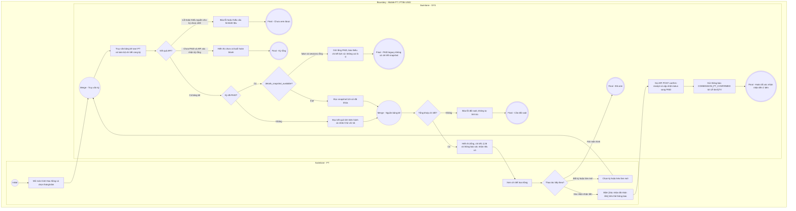

# PT06-US02 - Xem bảng kê hoa hồng tháng

## Trạng thái triển khai
Người dùng đã phê duyệt snapshot bất biến cho chi tiết từng buổi PAID. Backend agent phụ trách migration/ERD; tài liệu PT mô tả hợp đồng đã chốt, không tự thêm schema. Nghiệm thu runtime do Main xác nhận sau triển khai.

## Preconditions
- Người dùng đăng nhập thành công vào ứng dụng Mobile Huấn luyện viên bằng tài khoản PT.
- PT có hồ sơ huấn luyện viên đang ở trạng thái hoạt động (`ACTIVE`).
- Có thể chưa có cấu hình hoặc chưa có buổi; xử lý riêng các trạng thái này.

## Trigger
- PT mở menu **Hoa hồng**, hoặc chạm thẻ/nút xem bảng kê từ **PT06 · Tổng quan**.
- Màn hình liên quan: Mobile PT — Màn hình Chi tiết Bảng kê hoa hồng tháng.

## Main Flow

1. PT mở menu **Hoa hồng** hoặc lối tắt hoa hồng từ Tổng quan.
2. SYS mở màn hình **Hoa hồng** độc lập, không mở modal; nạp bảng kê từ API của chính PT.
3. PT chọn kỳ tính thù lao: `Tháng này` (mặc định) hoặc `Tháng trước` (hoặc bộ chọn tháng/năm).
4. SYS tự động nạp và hiển thị khối tổng kết hoa hồng của PT trong tháng:
   - **Tổng hoa hồng ước tính**: Số tiền hoa hồng (VNĐ) làm nổi bật.
   - **Trạng thái quyết toán**: Badge trạng thái (`Chờ chi trả` (`PENDING`), `Chờ bạn xác nhận` (`PENDING_CONFIRMATION`), hoặc `Đã chi trả` (`PAID`)).
   - **Tỷ lệ hoa hồng áp dụng**: Tỷ lệ % theo cấu hình (ví dụ: `25.0%`).
   - **Tổng số buổi đã dạy**: Đếm các buổi tập có trạng thái `COMPLETED` trong tháng.
   - **Doanh thu phần PT cơ sở**: Tổng giá trị phần gói PT tương ứng với các buổi đã dạy.
   - **Khối thông báo phát lệnh chi trả**: Nếu trạng thái là `PENDING_CONFIRMATION`, hiển thị rõ số tiền, hình thức (`Tiền mặt tại quầy` hoặc `Chuyển khoản VietQR`), và nút bấm hành động **[Xác nhận đã nhận tiền]**.
5. Khi PT kiểm tra tài khoản/tiền mặt thấy đã nhận đủ số tiền và bấm **[Xác nhận đã nhận tiền]**:
   - SYS thực hiện giao dịch xác nhận 2 bên trên App (`POST /pt/my-commissions/:id/confirm-receipt`).
   - Trạng thái lập tức chuyển sang `Đã chi trả` (`PAID`), hệ thống ghi nhận `pt_confirmed_at = NOW()` lưu vết pháp lý vĩnh viễn chống chối nhận tiền.
   - Khối thông báo xác nhận ẩn đi, thay thế bằng dòng trạng thái xanh: `Đã xác nhận nhận tiền lúc: DD/MM/YYYY HH:mm`.
6. Bên dưới là danh sách chi tiết từng buổi dạy trong tháng:
   - Ngày giờ buổi tập, Tên học viên, Tên gói tập (Gói cá nhân 1-1 hoặc Nhóm 1-Nhiều).
   - Giá trị buổi học và tiền hoa hồng trích cho buổi đó.
7. PT có thể kéo để làm mới (Pull-to-refresh) dữ liệu bất kỳ lúc nào.

### Field-level specification — Màn hình Bảng kê hoa hồng tháng
| Field / control | Loại UI Control | State | Required | Conditional / dynamic | Source / validation |
| :--- | :--- | :--- | :--- | :--- | :--- |
| Bộ chọn kỳ thù lao | `Segmented Control / Chips` | `USER-INPUT (PREFILL)` | required | `TRIGGER` | Tùy chọn: `Tháng này`, `Tháng trước`, `Chọn tháng khác`. Khi chạm kích hoạt nạp lại số liệu |
| Kỳ hoa hồng tùy chọn | Month picker | USER-INPUT (PREFILL) | conditional | CONDITIONAL: hiện và bắt buộc khi chọn Tháng khác; ẩn khi chọn Tháng này/Tháng trước | Tháng/năm hợp lệ; mặc định kỳ đang xem; gọi API theo tháng/năm đã chọn |
| Thẻ tổng quan thù lao | `Card View (Highlight)` | `READONLY` | required | Không: giá trị theo kỳ | Hiển thị Tổng tiền hoa hồng, Trạng thái (`PENDING`, `PENDING_CONFIRMATION`, `PAID`), Tỷ lệ % |
| Khối xác nhận chi trả | `Card Box (Info)` | `READONLY` | conditional | CONDITIONAL: hiện khi trạng thái = `PENDING_CONFIRMATION`; ẩn khi `PENDING` hoặc `PAID` | Hiển thị số tiền, hình thức nhận tiền và thông báo xác nhận từ Lễ tân/QTV |
| Nút [Xác nhận đã nhận tiền] | `Button (Primary)` | `USER-INPUT` | conditional | CONDITIONAL: hiện khi trạng thái = `PENDING_CONFIRMATION`; ẩn khi `PENDING` hoặc `PAID` | PT bấm để xác nhận đã nhận đủ tiền hoa hồng, hoàn tất quy trình 2 chiều và lưu vết pháp lý |
| Thời gian nhận tiền | `Timestamp Text` | `READONLY` | conditional | CONDITIONAL: hiện khi `PAID`; ẩn khi chưa hoàn tất chi trả | Hiển thị ngày giờ chi trả và ngày giờ PT xác nhận nhận tiền |
| Tổng số buổi hoàn thành | `Badge / Stat Number` | `READONLY` | required | `Không` | Đếm các buổi `COMPLETED` của PT trong tháng |
| Doanh thu phần PT cơ sở | `Readonly Text` | `READONLY` | required | `Không` | Tổng giá trị `pt_price` trích theo buổi |
| Danh sách buổi dạy chi tiết | `List View` | `READONLY` | required | DYNAMIC: luôn hiển thị danh sách, bản ghi theo kỳ | Danh sách từng buổi tập kèm thông tin học viên, gói tập và tiền hoa hồng buổi |
| Thao tác Pull-to-refresh | `Gesture / Touch` | `USER-INPUT` | optional | `Không` | Kéo xuống để đồng bộ số liệu mới nhất từ máy chủ |
| Làm mới bảng kê | Icon button | USER-INPUT | required | Không | Gọi lại API cùng kỳ; không thay đổi snapshot PAID |
| Cảnh báo đối soát | Text | READONLY | conditional | CONDITIONAL: hiện khi tổng số buổi/doanh thu/hoa hồng không khớp chi tiết; ẩn khi khớp hoặc legacy thiếu snapshot | So sánh dữ liệu API cùng kỳ, không tự sửa số tiền |

- **Business rules / logic:**
  - Hoa hồng chỉ tính trên các buổi tập PT đã hoàn thành xác nhận kép 2 chiều (`COMPLETED`).
  - Tiền hoa hồng chỉ tính trên phần giá trị dịch vụ PT (`pt_price`), không tính trên phần dịch vụ Gym của gói Combo.
  - Khi trạng thái chuyển sang `Đã chi trả` (`PAID`), hiển thị rõ ngày giờ phòng gym đã thanh toán tiền cho PT.

- Server chỉ trả bảng kê của PT phiên, không tin pt_id do client thay; PT không cấu hình, duyệt, trả tiền hoặc sửa bảng kê.
- Luồng hiện hành chi trả trực tiếp: PENDING = Chờ chi trả; không có bước duyệt PT. APPROVED legacy nếu còn tồn tại chỉ đọc, không tạo thao tác duyệt mới.
- Tổng số buổi, doanh thu phần PT và tiền hoa hồng phải bằng tổng chi tiết của cùng PT/kỳ/phạm vi (toàn bộ chi tiết, không chỉ trang đang hiển thị). Chỉ tính COMPLETED đủ xác nhận kép; loại phần Gym, buổi hủy/chưa hoàn thành.
- Khi chi trả mới, backend lưu tổng và snapshot chi tiết từng buổi trong cùng transaction; lỗi lưu snapshot phải rollback toàn bộ, không có PAID mới chỉ chứa tổng. PT chỉ đọc, không thực hiện chi trả.
- PAID có snapshot: API trả chi tiết bất biến đúng lúc chi trả, không tính lại từ booking/tên học viên/gói/tỷ lệ hiện tại. Tổng đối soát chính bộ snapshot này.
- PAID legacy không snapshot: API details_snapshot_available=false và sessions=[]; UI giữ tổng lịch sử, ngày chi trả và hiện Không có chi tiết lịch sử cho kỳ đã chi trả này. Không coi [] là không có buổi/0 đồng, không tái dựng dữ liệu sống.
- Thiếu cấu hình mới không được che bảng kê PAID cũ; refresh/đổi kỳ không làm thay đổi snapshot.
- Thiếu chi tiết hoặc tổng không khớp: báo chưa đối soát được; không tự bổ sung buổi/số tiền để khớp. Chính sách làm tròn hoặc nhiều tỷ lệ phải theo kết quả tính/chốt của server; quyết định snapshot đã duyệt tại PT-OQ-04.

### Field-level specification — Dữ liệu đối soát
| Field / control | UI | State | Required | Conditional / dynamic | Source / validation |
| --- | --- | --- | --- | --- | --- |
| Ngày giờ, học viên, gói của từng buổi | Text | READONLY | required | Không | Chi tiết API cùng kỳ và PT |
| Giá trị PT và hoa hồng từng buổi | Money | READONLY | required | Không | Dữ liệu tính/chốt API; không lấy toàn giá Combo |
| Ngày chi trả | Timestamp | READONLY | conditional | CONDITIONAL: hiện khi PAID; ẩn khi chưa chi trả | Ngày thực tế từ bảng kê API |
| Thông báo thiếu chi tiết lịch sử | Text | READONLY | conditional | CONDITIONAL: hiện khi PAID và details_snapshot_available=false; ẩn khi có snapshot hoặc kỳ chưa PAID | Giữ tổng lịch sử; không hiển thị số 0 hoặc dựng lại chi tiết |

## Alternate Flows

### AF-01 - Chọn Tháng Cũ Hơn
1. PT chạm vào tùy chọn **Chọn tháng khác**.
2. SYS hiển thị bộ chọn Month/Year Picker.
3. PT chọn tháng/năm mong muốn và xem lịch sử hoa hồng các tháng trước đó.

- AF-02: Kéo làm mới cùng kỳ; kỳ PAID vẫn trả dữ liệu lịch sử đã khóa.
- AF-04: Chuyển sang màn hình khác rồi mở lại Hoa hồng trong cùng phiên giữ kỳ đã chọn và tải lại API; đăng xuất xóa trạng thái kỳ, phiên mới mặc định Tháng này.

- AF-03: PAID legacy thiếu snapshot → giữ tổng lịch sử và thông báo thiếu chi tiết; không đi nhánh kỳ không có buổi.

## Exception Flows
- **Chưa có buổi dạy nào trong tháng:** SYS hiển thị trạng thái rỗng: *"Bạn chưa có buổi dạy hoàn thành nào trong tháng này. Hãy tiếp tục cố gắng!"*.
- **Chưa có cấu hình hoa hồng:** SYS hiển thị thông báo: *"Chưa có cấu hình tỷ lệ hoa hồng từ quản lý. Vui lòng liên hệ QTV"*.

- Lỗi API/ngoài own scope: hiển thị lỗi, không dùng bảng kê PT khác hoặc số mẫu.
- Tổng và chi tiết không khớp: đánh dấu lỗi đối soát, giữ dữ liệu nhận được để kiểm tra; không khẳng định số tiền hoàn tất.

## Activity Diagram — Swimlane
**Trigger:** PT mở menu Hoa hồng hoặc lối tắt hoa hồng tại Tổng quan.

