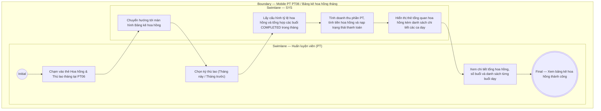

# PT06-US02 - Xem bảng kê hoa hồng tháng

## Preconditions
- Người dùng đăng nhập thành công vào ứng dụng Mobile Huấn luyện viên bằng tài khoản PT.
- PT có hồ sơ huấn luyện viên đang ở trạng thái hoạt động (`ACTIVE`).
- Chi nhánh hoặc quản lý đã thiết lập cấu hình tỷ lệ hoa hồng cho PT (`pt_commission_configs`).

## Trigger
- PT truy cập menu **PT06 · Tổng quan** và chạm vào thẻ **"Hoa hồng & Thù lao tháng"** (hoặc nút [Xem bảng kê hoa hồng]).
- Màn hình liên quan: Mobile PT — Màn hình Chi tiết Bảng kê hoa hồng tháng.

## Main Flow

1. PT mở màn hình PT06 Tổng quan và chạm vào thẻ **Hoa hồng & Thù lao tháng**.
2. SYS chuyển hướng tới màn hình Chi tiết Bảng kê hoa hồng tháng.
3. PT chọn kỳ tính thù lao: `Tháng này` (mặc định) hoặc `Tháng trước` (hoặc bộ chọn tháng/năm).
4. SYS tự động nạp và hiển thị khối tổng kết hoa hồng của PT trong tháng:
   - **Tổng hoa hồng ước tính**: Số tiền hoa hồng (VNĐ) làm nổi bật.
   - **Trạng thái quyết toán**: Badge trạng thái (`Chờ duyệt` / `Đã duyệt` / `Đã chi trả` kèm ngày nhận tiền nếu có).
   - **Tỷ lệ hoa hồng áp dụng**: Tỷ lệ % theo cấu hình (ví dụ: `25.0%`).
   - **Tổng số buổi đã dạy**: Đếm các buổi tập có trạng thái `COMPLETED` trong tháng.
   - **Doanh thu phần PT cơ sở**: Tổng giá trị phần gói PT tương ứng với các buổi đã dạy.
5. Bên dưới là danh sách chi tiết từng buổi dạy trong tháng:
   - Ngày giờ buổi tập, Tên học viên, Tên gói tập (Gói cá nhân 1-1 hoặc Nhóm 1-Nhiều).
   - Giá trị buổi học và tiền hoa hồng trích cho buổi đó.
6. PT có thể kéo để làm mới (Pull-to-refresh) dữ liệu sau khi vừa hoàn thành thêm một buổi dạy mới.

### Field-level specification — Màn hình Bảng kê hoa hồng tháng
| Field / control | Loại UI Control | State | Required | Conditional / dynamic | Source / validation |
| :--- | :--- | :--- | :--- | :--- | :--- |
| Bộ chọn kỳ thù lao | `Segmented Control / Chips` | `USER-INPUT (PREFILL)` | required | `TRIGGER` | Tùy chọn: `Tháng này`, `Tháng trước`, `Chọn tháng khác`. Khi chạm kích hoạt nạp lại số liệu |
| Thẻ tổng quan thù lao | `Card View (Highlight)` | `READONLY` | required | `DYNAMIC` | Hiển thị Tổng tiền hoa hồng, Trạng thái (`PENDING`/`APPROVED`/`PAID`), Tỷ lệ % |
| Tổng số buổi hoàn thành | `Badge / Stat Number` | `READONLY` | required | `Không` | Đếm các buổi `COMPLETED` của PT trong tháng |
| Doanh thu phần PT cơ sở | `Readonly Text` | `READONLY` | required | `Không` | Tổng giá trị `pt_price` trích theo buổi |
| Danh sách buổi dạy chi tiết | `List View` | `READONLY` | required | `DYNAMIC` | Danh sách từng buổi tập kèm thông tin học viên, gói tập và tiền hoa hồng buổi |
| Thao tác Pull-to-refresh | `Gesture / Touch` | `USER-INPUT` | optional | `Không` | Kéo xuống để đồng bộ số liệu mới nhất từ máy chủ |

- **Business rules / logic:**
  - Hoa hồng chỉ tính trên các buổi tập PT đã hoàn thành xác nhận kép 2 chiều (`COMPLETED`).
  - Tiền hoa hồng chỉ tính trên phần giá trị dịch vụ PT (`pt_price`), không tính trên phần dịch vụ Gym của gói Combo.
  - Khi trạng thái chuyển sang `Đã chi trả` (`PAID`), hiển thị rõ ngày giờ phòng gym đã thanh toán tiền cho PT.

## Alternate Flows

### AF-01 - Chọn Tháng Cũ Hơn
1. PT chạm vào tùy chọn **Chọn tháng khác**.
2. SYS hiển thị bộ chọn Month/Year Picker.
3. PT chọn tháng/năm mong muốn và xem lịch sử hoa hồng các tháng trước đó.

## Exception Flows
- **Chưa có buổi dạy nào trong tháng:** SYS hiển thị trạng thái rỗng: *"Bạn chưa có buổi dạy hoàn thành nào trong tháng này. Hãy tiếp tục cố gắng!"*.
- **Chưa có cấu hình hoa hồng:** SYS hiển thị thông báo: *"Chưa có cấu hình tỷ lệ hoa hồng từ quản lý. Vui lòng liên hệ QTV"*.

## Activity Diagram — Swimlane
**Trigger:** PT chạm vào thẻ Hoa hồng & Thù lao tháng trong menu PT06.

