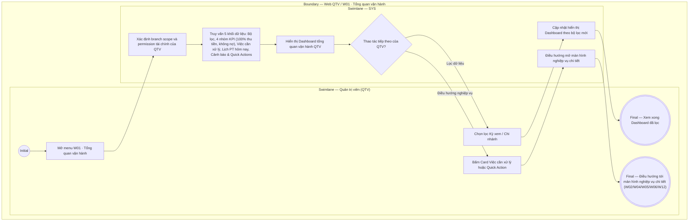

# QTV-W01-US01 - Xem tổng quan vận hành

## Preconditions
- QTV có tài khoản hoạt động, phân quyền quản trị và branch scope (Toàn hệ thống hoặc danh sách chi nhánh được cấp).
- Hệ thống áp dụng chính sách thanh toán 100% 1 lần duy nhất để kích hoạt gói (bỏ hoàn toàn công nợ, nợ tồn, thanh toán một phần).

## Trigger
- QTV truy cập menu sidebar `W01 · Tổng quan vận hành` trên Web Portal.
- Màn hình liên quan: Web QTV — Dashboard W01 (`screenshot/qtv/light-web-W01-tong-quan.png`).

## Main Flow

1. QTV mở menu **W01 · Tổng quan vận hành**.
2. Hệ thống (SYS) xác định vai trò, branch scope và permission tài chính của QTV.
3. SYS truy vấn và hiển thị 5 khối thành phần của Dashboard quản trị theo branch scope hiện tại:
   - **Khối 1 — Bộ lọc Dashboard:**
     - Bộ lọc Kỳ xem: `[Hôm nay]`, `[Tuần này]`, `[Tháng này]`.
     - Bộ lọc Chi nhánh: Combobox `[Toàn hệ thống ▼]`, `[Chi nhánh A]`, `[Chi nhánh B]` (chỉ hiển thị cho QTV có scope nhiều chi nhánh).
   - **Khối 2 — KPI Vận hành & Tài chính (4 nhóm chỉ số chính):**
     - *Hội viên:* `Hội viên đang hoạt động`, `Hội viên mới trong kỳ`.
     - *Đăng ký & Gói:* `Registration mới`, `Gói đang hiệu lực`.
     - *Thanh toán & Doanh thu (100% đã thu, KHÔNG còn công nợ):* `Tổng tiền đã thu` (Tiền mặt + Chuyển khoản), `Số Payment thành công`.
     - *Vận hành & Lịch tập:* `Booking PT hôm nay`, `Buổi PT hoàn thành`, `Lượt Check-in hôm nay`.
   - **Khối 3 — Việc cần xử lý (Các thẻ Card click được để điều hướng):**
     - Card `Registration chờ thanh toán` $\rightarrow$ Click mở danh sách Đăng ký chờ thu tiền (`QTV-W04`).
     - Card `Yêu cầu PT đang chờ phản hồi` $\rightarrow$ Click mở Quản lý phân công HLV (`QTV-W05`).
     - Card `Booking chờ xác nhận hoàn thành` $\rightarrow$ Click mở Quản lý lịch tập (`QTV-W06`).
     - Card `PT inactive nhưng còn booking tương lai` $\rightarrow$ Click mở Quản lý PT / Lịch tập (`QTV-W05`/`QTV-W06`).
     - Card `Cảnh báo chi nhánh / Thiết bị lỗi` $\rightarrow$ Click mở Quản lý thiết bị (`QTV-W12`).
   - **Khối 4 — Hoạt động hôm nay (Lịch tập PT hôm nay):**
     - Danh sách các booking PT sắp tới trong ngày (Khung giờ, HLV, Hội viên, Trạng thái booking).
     - Nút `[ Xem toàn bộ lịch PT ]` $\rightarrow$ Điều hướng tới `QTV-W06`.
   - **Khối 5 — Cảnh báo vận hành & Quick Actions:**
     - *Cảnh báo vận hành:* Thẻ cảnh báo thiết bị nhận diện / cổng ra vào bị Offline hoặc xảy ra sự cố vận hành chi nhánh.
     - *Quick Actions (Thao tác nhanh):* `[+ Thêm hội viên]`, `[+ Tạo đăng ký]`, `[Cấu hình thông báo]`, `[Xem báo cáo]`.
4. QTV tùy chọn thay đổi Kỳ xem `[Hôm nay / Tuần này / Tháng này]` hoặc chọn Chi nhánh trong Combobox.
5. SYS truy vấn lại dữ liệu và cập nhật hiển thị đồng bộ cho cả 5 khối thành phần theo bộ lọc mới.
6. QTV có thể bấm vào một thẻ Card trong khối Việc cần xử lý hoặc nút Quick Action để điều hướng tới màn hình nghiệp vụ chi tiết.

- **Business rules / logic:**
  - Dashboard chỉ dùng để theo dõi trạng thái vận hành hôm nay và danh sách việc cần xử lý; không thực hiện trực tiếp thao tác chỉnh sửa dữ liệu nghiệp vụ tại W01.
  - Loại bỏ hoàn toàn các chỉ số liên quan đến công nợ, nợ tồn, thanh toán một phần hay phải thu còn thiếu.
  - QTV chi nhánh con chỉ xem được dữ liệu thuộc chi nhánh được phân quyền, không hiển thị combobox chuyển chi nhánh khác.

## Alternate Flows

### AF-01 — QTV xem tổng quan toàn hệ thống (Multi-branch Scope)
1. QTV cấp cao đăng nhập, hệ thống nạp sẵn Combobox chọn chi nhánh với mặc định `Toàn hệ thống`.
2. QTV chọn một chi nhánh cụ thể từ danh sách.
3. SYS lọc và cập nhật toàn bộ 5 khối dashboard theo đúng chi nhánh đã chọn.

## Exception Flows

- Tài khoản thiếu quyền xem dữ liệu tài chính: SYS ẩn nhóm KPI `Tổng tiền đã thu` và `Số Payment thành công`, chỉ hiển thị các KPI vận hành còn lại.
- Chi nhánh không có dữ liệu/công việc trong kỳ: SYS hiển thị trạng thái `0` hoặc thẻ trống với thông điệp "Không có dữ liệu trong kỳ".

## Activity Diagram — Swimlane
**Trigger:** QTV mở màn hình W01 · Tổng quan vận hành trên Web Portal.

