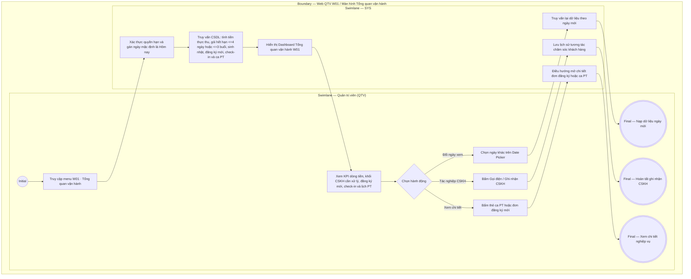

# QTV-W01-US01 - Xem tổng quan vận hành

## Preconditions
- Quản trị viên (QTV) đã đăng nhập thành công vào Web Portal và được phân quyền truy cập menu Tổng quan.
- Tài khoản đã được gán phạm vi chi nhánh làm việc (Branch Scope: Toàn hệ thống hoặc danh sách chi nhánh được cấp).
- Hệ thống đã có dữ liệu vận hành về hồ sơ hội viên, gói tập đã thanh toán 100%, lượt ra vào và lịch phân công/đặt hẹn PT.

## Trigger
- QTV chọn menu **W01 · Tổng quan vận hành** trên thanh điều hướng chính của Web Portal.
- Màn hình liên quan: Web QTV — Màn hình `W01 · Tổng quan vận hành`.

## Quy tắc sắp hết hạn
- Gói đã thanh toán, đang có hiệu lực và chưa hết hạn: theo thời gian còn <= 4 ngày, theo buổi còn <= 3 buổi; Combo dùng OR giữa các quyền lợi áp dụng. Nguồn hiển thị là is_expiring và display_status do SYS/API tính; status nội bộ ACTIVE vẫn dùng cho kiểm tra quyền tập. Không tạo enum/field DB mới và không tự tính ngưỡng riêng trên UI.

## Main Flow

1. QTV truy cập menu **W01 · Tổng quan vận hành**.
2. Hệ thống (SYS) xác thực vai trò, quyền hạn tài chính và phạm vi chi nhánh của QTV; mặc định nạp mốc thời gian là ngày làm việc hiện tại (`Hôm nay - dd/mm/yyyy`).
3. SYS truy vấn cơ sở dữ liệu thời gian thực và hiển thị đồng bộ giao diện Tổng quan tập trung vào Dòng tiền & Chăm sóc khách hàng gồm:
   - **Thanh tiêu đề & Ô chọn ngày tác nghiệp:** Tiêu đề `Tổng quan`, tên chi nhánh đang chọn, ô Date Picker `[ 📅 dd/mm/yyyy ]` và nút Làm mới.
   - **Khối 1 — Hàng 4 Thẻ KPI Vận hành chung (Interactive Metric Cards):**
     + `Hội viên đang hoạt động`: Số hội viên `ACTIVE` tại chi nhánh; click điều hướng đến màn hình Hội viên (W02).
     + `Tiền thực thu hôm nay`: Dòng tiền thanh toán 100% thu được trong ngày; click điều hướng đến màn hình Thu ngân / Bán hàng (W08).
     + `Lượt check-in hôm nay`: Tổng lượt quét tại chi nhánh; click điều hướng đến Cổng kiểm soát ra vào (W07).
     + `Buổi PT trong ngày`: Tổng số ca tập PT được xếp lịch trong ngày; click điều hướng đến Lịch PT (W06).
   - **Khối 2 — Hôm nay cần xử lý (Hàng 4 Thẻ KPI Chăm sóc khách hàng & Vận hành):** Thiết kế đồng bộ chuẩn thẻ KPI như Khối 1 (có icon màu, số đếm nổi bật, chú thích hành động và click điều hướng trực tiếp):
     + `Sinh nhật hôm nay`: Số hội viên có ngày sinh nhật hôm nay; click chuyển sang tab Sinh nhật của Chăm sóc khách hàng (W14).
     + `Gói sắp hết hạn (<= 4 ngày hoặc <= 3 buổi)`: Số gói tập cận hạn cần liên hệ gia hạn gấp (tone đỏ cảnh báo nếu > 0); click chuyển sang tab Nhắc sắp hết hạn của W14.
     + `Chờ nhắc gia hạn (14 ngày qua)`: Số gói đã hết hạn trong 14 ngày gần nhất chưa gia hạn; click chuyển sang tab Chờ gia hạn của W14.
     + `Đăng ký mới hôm nay`: Số hợp đồng đăng ký mới tạo trong ngày; click chuyển sang tab Đăng ký trong ngày của W14.
   - **Khối 3 — Thanh thao tác nhanh (Quick Actions):** Các nút hành động tắt gồm: `[+ Thêm hội viên]`, `[+ Tạo đăng ký]`, `[+ Đặt lịch PT]`, `[Lớp cộng đồng]`, `[Ghi nhận ra/vào]`.
   - **Khối 4 — Ra/vào gần nhất:** Danh sách 8 lượt quẹt thẻ/nhận diện gần nhất: Họ tên, avatar, mã HV, gói tập, giờ quét, kết quả (`Hợp lệ`, `Sắp hết hạn`, `Không đủ điều kiện`).
   - **Khối 5 — Lịch PT theo ngày:** Danh sách ca dạy PT sắp xếp theo giờ bắt đầu trong ngày: Giờ, tên HV, tên PT, trạng thái (`Sắp tới`, `Đang diễn ra`, `Đã ghi nhận`, `Chờ xác nhận`).
4. QTV có thể bấm trực tiếp vào bất kỳ thẻ KPI nào để chuyển nhanh đến màn hình tác nghiệp chuyên biệt.
5. QTV có thể đổi ngày trên Date Picker để xem lại số liệu doanh thu và nhật ký của ngày trong quá khứ.

### Field-level specification — Màn hình Tổng quan vận hành (W01)
| Field / control | Loại UI Control | State | Required | Conditional / dynamic | Source / validation |
| :--- | :--- | :--- | :--- | :--- | :--- |
| Ô chọn ngày tác nghiệp (Date Picker) | `Date Input / Picker` | `USER-INPUT (PREFILL)` | required | `TRIGGER` | Mặc định hôm nay; chọn ngày nạp lại toàn bộ dữ liệu |
| Nút Làm mới tổng quan | `Action Button` | `USER-INPUT` | optional | `Không` | Bấm nạp lại dữ liệu tổng quan thời gian thực |
| Thẻ KPI Hội viên đang hoạt động | `Metric Card` | `READONLY` | required | `DYNAMIC` | Đếm tổng số hội viên có trạng thái `ACTIVE`; click mở W02 |
| Thẻ KPI Tiền thực thu hôm nay | `Metric Card` | `READONLY` | conditional | `CONDITIONAL` | **Hiện khi**: tài khoản có quyền `view_financial = true`; **Ẩn khi**: không có quyền tài chính. Click mở W08 |
| Thẻ KPI Lượt check-in hôm nay | `Metric Card` | `READONLY` | required | `DYNAMIC` | Tổng lượt quét thành công tại chi nhánh trong ngày; click mở W07 |
| Thẻ KPI Buổi PT trong ngày | `Metric Card` | `READONLY` | required | `DYNAMIC` | Tổng số ca tập PT được xếp lịch trong ngày; click mở W06 |
| Nút Mở CSKH | `Action Button` | `USER-INPUT` | optional | `Không` | Nút trên header khối Hôm nay cần xử lý; click mở menu W14 |
| Thẻ KPI CSKH — Sinh nhật hôm nay | `Metric Card` | `READONLY` | required | `DYNAMIC` | Số hội viên có sinh nhật hôm nay; click mở tab birthdays W14 |
| Thẻ KPI CSKH — Gói sắp hết hạn (<= 4 ngày hoặc <= 3 buổi) | `Metric Card` | `READONLY` | required | `DYNAMIC` | Số gói hết hạn trong <= 4 ngày hoặc <= 3 buổi (tone đỏ nếu > 0); click mở tab expiring W14 |
| Thẻ KPI CSKH — Chờ nhắc gia hạn | `Metric Card` | `READONLY` | required | `DYNAMIC` | Số gói hết hạn trong 14 ngày qua chưa gia hạn; click mở tab pending-renewals W14 |
| Thẻ KPI CSKH — Đăng ký mới hôm nay | `Metric Card` | `READONLY` | required | `DYNAMIC` | Số hợp đồng tạo trong ngày; click mở tab today-regs W14 |
| Nút Quick Action — Thêm hội viên | `Action Button` | `USER-INPUT` | optional | `Không` | Bấm mở popup Thêm hội viên mới (`QTV-W02-US01`) |
| Nút Quick Action — Tạo đăng ký | `Action Button` | `USER-INPUT` | optional | `Không` | Bấm mở popup Tạo đăng ký gói mới (`QTV-W04-US01`) |
| Nút Quick Action — Đặt lịch PT | `Action Button` | `USER-INPUT` | optional | `Không` | Bấm mở popup Đặt lịch tập PT (`QTV-W06-US02`) |
| Nút Quick Action — Lớp cộng đồng | `Action Button` | `USER-INPUT` | optional | `Không` | Bấm chuyển đến menu Lớp tập cộng đồng (`QTV-W16`) |
| Nút Quick Action — Ghi nhận ra/vào | `Action Button` | `USER-INPUT` | optional | `Không` | Bấm chuyển đến Cổng kiểm soát ra vào (`QTV-W07`) |
| Danh sách Ra/vào gần nhất | `List Item` | `READONLY` | required | `DYNAMIC` | Hiển thị 8 lượt ra vào gần nhất kèm trạng thái check-in |
| Danh sách Lịch PT theo ngày | `List Item / Button` | `READONLY` | required | `DYNAMIC` | Hiển thị danh sách ca PT theo mốc giờ; click xem chi tiết ca tập |

## Alternate Flows

### AF-01 — QTV bấm nút Gọi điện hoặc Ghi nhận liên hệ tại khối CSKH
1. QTV click nút **`Gọi`** tại dòng hội viên có sinh nhật hoặc sắp hết hạn gói.
2. Thiết bị kích hoạt cuộc gọi; sau khi gọi, QTV bấm **`Liên hệ`** để nhập ghi chú (ví dụ: *"Hội viên đồng ý gia hạn gói 6 tháng vào ngày mai"*).
3. SYS lưu lịch sử tương tác vào nhật ký chăm sóc khách hàng.

### AF-02 — QTV thay đổi ngày xem tác nghiệp qua Date Picker
1. QTV chọn một ngày trong quá khứ trên Date Picker.
2. SYS nạp lại doanh thu thực thu, danh sách đăng ký mới và lượt check-in của ngày đó.

## Exception Flows
- **Tài khoản thiếu quyền xem tài chính:** SYS tự động ẩn Thẻ KPI `Tiền thực thu hôm nay` và danh sách Đăng ký mới hôm nay khỏi Dashboard.
- **Ngày xem không có dữ liệu:** Các khối hiển thị trạng thái rỗng (*"Không phát sinh dữ liệu trong ngày này"*).

## Activity Diagram — Swimlane
**Trigger:** QTV chọn menu W01 · Tổng quan vận hành trên thanh điều hướng chính của Web Portal.

