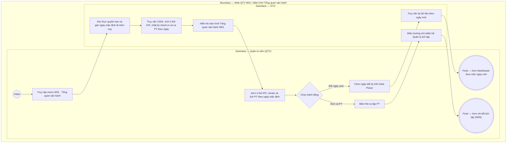

# QTV-W01-US01 - Xem tổng quan vận hành

## Preconditions
- Quản trị viên (QTV) đã đăng nhập thành công vào Web Portal và được phân quyền truy cập menu Tổng quan.
- Tài khoản đã được gán phạm vi chi nhánh làm việc (Branch Scope: Toàn hệ thống hoặc danh sách chi nhánh được cấp).
- Hệ thống đã có dữ liệu vận hành về hồ sơ hội viên, gói tập đã thanh toán 100%, lượt ra vào và lịch phân công/đặt hẹn PT.

## Trigger
- QTV chọn menu **W01 · Tổng quan vận hành** trên thanh điều hướng chính của Web Portal.
- Màn hình liên quan: Web QTV — Màn hình `W01 · Tổng quan vận hành` (`screenshot/qtv/light-web-W01-tong-quan.png`).

## Main Flow

1. QTV truy cập menu **W01 · Tổng quan vận hành**.
2. Hệ thống (SYS) xác thực vai trò, quyền hạn tài chính và phạm vi chi nhánh của QTV; mặc định nạp mốc thời gian là ngày làm việc hiện tại (`Hôm nay - dd/mm/yyyy`).
3. SYS truy vấn cơ sở dữ liệu thời gian thực và hiển thị đồng bộ giao diện Tổng quan gồm ô chọn ngày và 3 khối giám sát chính:
   - **Thanh tiêu đề & Ô chọn ngày tác nghiệp:**
     + Tiêu đề trang `Tổng quan` kèm thông tin chi nhánh đang phục vụ.
     + Ô chọn ngày `[ 📅 dd/mm/yyyy ]` (Date Picker) ở góc phải, mặc định nạp ngày hiện tại (`Hôm nay`).
   - **Khối 1 — Hàng 4 Thẻ KPI Vận hành (Metric Cards):**
     + `Hội viên đang hoạt động`: Đếm tổng số lượng hội viên có hồ sơ `ACTIVE` tại chi nhánh (chú thích *Không gộp với trạng thái thanh toán*).
     + `Tiền thực thu trong ngày`: Tổng số tiền đã thanh toán đủ 100% trong ngày được chọn (chú thích *Giao dịch đã xác nhận*, không công nợ).
     + `Gói sắp hết hạn`: Số lượng gói tập sẽ hết hạn trong 14 ngày tới tính từ mốc ngày đang xem.
     + `Buổi PT trong ngày`: Tổng số ca dạy PT được xếp lịch trong ngày được chọn kèm số buổi sắp tới (nếu là hôm nay) hoặc số buổi đã hoàn thành (nếu là quá khứ).
   - **Khối 2 — Ra/vào (Recent Check-ins):**
     + Tiêu đề khối kèm mô tả *Phân biệt nhận diện, điều kiện gói và ghi thủ công*.
     + Danh sách các lượt quẹt thẻ/nhận diện ra vào trong ngày được chọn: Badge `VÀO`, Họ tên hội viên in đậm, mã HV · tên gói · cửa check-in, giờ quẹt thẻ và Badge kết quả (`Hợp lệ` - xanh lá, `Sắp hết hạn` - vàng, `Không đủ điều kiện` - đỏ).
   - **Khối 3 — Lịch PT trong ngày (PT Schedule):**
     + Tiêu đề khối kèm ngày làm việc đang xem: `Lịch PT · <Thứ, Ngày/Tháng/Năm>`.
     + Dải thẻ các ca tập PT theo dòng thời gian trong ngày: Mốc giờ bắt đầu (`07:00`, `08:00`...), Họ tên học viên in đậm, Tên PT phụ trách, Badge trạng thái ca (`Đã ghi nhận`, `Đang diễn ra`, `Sắp tới`).
4. QTV có thể thay đổi ngày xem tác nghiệp bằng cách chọn ngày bất kỳ trên ô Date Picker; SYS tự động làm mới đồng bộ dữ liệu của các khối theo mốc ngày mới.
5. QTV có thể bấm vào thẻ ca tập PT để điều hướng đến phân hệ Quản lý lịch tập (`W06`) xem chi tiết buổi dạy.

### Field-level specification — Màn hình Tổng quan vận hành (W01)
| Field / control | Loại UI Control | State | Required | Conditional / dynamic | Source / validation |
| :--- | :--- | :--- | :--- | :--- | :--- |
| Ô chọn ngày tác nghiệp (Date Picker) | `Date Input / Picker` | `USER-INPUT (PREFILL)` | required | `TRIGGER` | Hộp chọn ngày định dạng `dd/mm/yyyy`; mặc định ngày hôm nay; click mở lịch popup chọn ngày bất kỳ trong quá khứ hoặc hôm nay để nạp lại dữ liệu toàn màn hình |
| Thẻ KPI Hội viên đang hoạt động | `Metric Card` | `READONLY` | required | `DYNAMIC` | Đếm số lượng hội viên có trạng thái hồ sơ `ACTIVE` tại chi nhánh |
| Thẻ KPI Tiền thực thu trong ngày | `Metric Card` | `READONLY` | conditional | `CONDITIONAL` | Hiện khi tài khoản QTV có quyền xem tài chính (`permission.view_financial = true`); Ẩn khi tài khoản không có quyền tài chính (`permission.view_financial = false`). Tổng tiền thanh toán 100% đã xác nhận trong ngày được chọn |
| Thẻ KPI Gói sắp hết hạn | `Metric Card` | `READONLY` | required | `DYNAMIC` | Đếm số lượng gói tập có ngày kết thúc nằm trong 14 ngày tới tính từ ngày đang xem |
| Thẻ KPI Buổi PT trong ngày | `Metric Card` | `READONLY` | required | `DYNAMIC` | Tổng số lượng ca tập PT được xếp lịch trong ngày được chọn kèm chú thích số ca |
| Lượt check-in — Badge chiều | `Status Badge` | `READONLY` | required | `DYNAMIC` | Huy hiệu chiều ra vào: `VÀO` (xanh mint) |
| Lượt check-in — Thông tin hội viên | `Text (Bold) + Subtext` | `READONLY` | required | `DYNAMIC` | Họ tên in đậm kèm dòng phụ `<Mã HV> · <Tên gói> · <Điểm check-in Gate>` (ví dụ: `HV001 · Gói 3 tháng · Gate-Q1-01`) |
| Lượt check-in — Thời gian & Kết quả | `Time + Status Badge` | `READONLY` | required | `DYNAMIC` | Giờ quẹt thẻ (`hh:mm`) kèm badge kết quả: `Hợp lệ` (xanh lá), `Sắp hết hạn` (vàng cam), `Không đủ điều kiện` (đỏ) |
| Ca tập PT — Khung giờ | `Time Label` | `READONLY` | required | `DYNAMIC` | Mốc giờ bắt đầu ca tập (ví dụ: `07:00`, `08:00`, `09:00`, `10:00`) |
| Ca tập PT — Thông tin buổi dạy | `Text (Bold) + Subtext` | `READONLY` | required | `DYNAMIC` | Tên học viên in đậm kèm tên huấn luyện viên PT phụ trách ở dòng phụ |
| Ca tập PT — Trạng thái ca tập | `Status Badge` | `READONLY` | required | `DYNAMIC` | Trạng thái buổi tập: `Đã ghi nhận` (xanh lá nhạt), `Đang diễn ra` (vàng cam), `Sắp tới` (xanh dương nhạt) |
| Ca tập PT — Thao tác click | `Clickable Card` | `USER-INPUT` | optional | Không | Thẻ ca tập có thể click; click mở chi tiết ca tập hoặc điều hướng sang Quản lý lịch tập (`W06`) |

## Alternate Flows

### AF-01 — QTV thay đổi ngày xem tác nghiệp qua Date Picker
1. QTV click vào ô lịch **`[ 📅 dd/mm/yyyy ]`** (Date Picker) và chọn một ngày cụ thể trong quá khứ hoặc hôm nay.
2. SYS nhận diện mốc ngày mới, gửi truy vấn CSDL và làm mới dữ liệu cho các khối:
   - Thẻ `Tiền thực thu trong ngày`: Tính tổng tiền thanh toán 100% thu được trong ngày đó.
   - Thẻ `Buổi PT trong ngày`: Nạp các ca PT diễn ra trong ngày đó.
   - Khối `Ra/vào`: Hiển thị nhật ký quẹt thẻ check-in của ngày đó.
   - Khối `Lịch PT trong ngày`: Hiển thị dải thẻ các ca PT của ngày đó.

### AF-02 — QTV bấm xem chi tiết ca tập PT
1. QTV click vào một thẻ ca tập PT trong khối **Lịch PT trong ngày**.
2. SYS điều hướng sang phân hệ Quản lý lịch tập (`W06 · Lịch tập & buổi PT`) hiển thị chi tiết thông tin ca dạy.

## Exception Flows
- **Tài khoản thiếu quyền xem tài chính:** SYS tự động ẩn Thẻ KPI `Tiền thực thu trong ngày` khỏi màn hình Dashboard và co giãn hàng thẻ cho cân đối.
- **Ngày được chọn không phát sinh dữ liệu:**
  + Khối Ra/vào hiển thị *"Không có lượt ra vào nào được ghi nhận trong ngày này"*.
  + Khối Lịch PT hiển thị *"Không có lịch tập PT nào trong ngày này"*.

## Activity Diagram — Swimlane
**Trigger:** QTV chọn menu W01 · Tổng quan vận hành trên thanh điều hướng chính của Web Portal.

