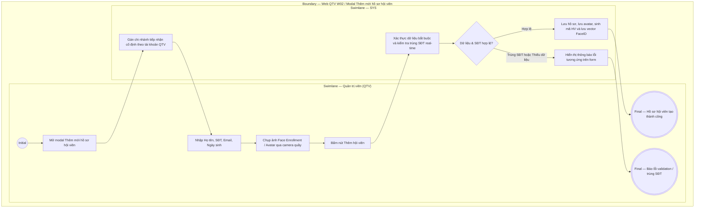

# QTV-W02-US01 - Thêm hội viên

## Preconditions
- QTV đã đăng nhập, có quyền tạo hồ sơ hội viên tại chi nhánh đang thao tác và chi nhánh tiếp nhận đang cho phép vận hành.
- QTV thao tác trong phạm vi chi nhánh được phục vụ (branch scope); PT và hội viên không tạo hồ sơ gốc cho người khác.

## Trigger
- QTV chọn **Thêm hội viên** trong menu W02.
- Màn hình liên quan: Web QTV — W02 Hội viên & khách hàng, modal **Thêm mới hồ sơ hội viên**.

## Main Flow

1. QTV mở modal **Thêm mới hồ sơ hội viên**.
2. Hệ thống tự động pre-fill cố định trường **Chi nhánh tiếp nhận** theo chi nhánh của tài khoản QTV đang thao tác.
3. QTV nhập Họ tên, SĐT, Email (nếu có), Ngày sinh (nếu có).
4. QTV thực hiện bước **Đăng ký nhận diện khuôn mặt (Face Enrollment) & Avatar**: Chụp ảnh trực tiếp từ camera tại quầy hoặc tải ảnh chân dung của khách hàng lên. Ảnh chụp đạt chuẩn sẽ được hiển thị xem trước (preview), lưu vào hồ sơ làm avatar và đồng thời trích xuất vector khuôn mặt nạp vào hệ thống nhận diện Kiosk check-in.
5. QTV chọn **Thêm hội viên**.
6. SYS kiểm tra trường bắt buộc, định dạng email (nếu có nhập) và kiểm tra SĐT hợp lệ, chưa tồn tại trong `MEMBER_PROFILES`.
7. Nếu SĐT hợp lệ và chưa tồn tại, SYS tạo hồ sơ, sinh mã duy nhất, gán trạng thái ban đầu `ACTIVE`, lưu avatar và vector khuôn mặt, đồng thời ghi audit log.
8. SYS hiển thị thông báo thành công và cập nhật danh sách hội viên.

### Field-level specification — modal Thêm mới hồ sơ hội viên
| Field / control | Loại UI Control | State | Required | Conditional / dynamic | Source / validation |
| :--- | :--- | :--- | :--- | :--- | :--- |
| Họ và tên | `Textbox` | `USER-INPUT` | required | `Không` | QTV nhập (ví dụ: "Nguyễn Hoài Nam"); hỗ trợ dấu tiếng Việt, bỏ khoảng trắng thừa |
| Số điện thoại | `Textbox (Phone Input)` | `USER-INPUT` | required | `Không` | QTV nhập (ví dụ: "0908 111 222"); khóa nghiệp vụ duy nhất của hội viên, chuẩn hóa và kiểm tra trùng lặp realtime, `UNIQUE` toàn hệ thống |
| Email | `Textbox (Email Input)` | `USER-INPUT` | optional | `Không` | QTV nhập nếu có (ví dụ: "name@example.vn"); kiểm tra định dạng email hợp lệ |
| Chi nhánh tiếp nhận | `Readonly Text` | `PREFILL` + `READONLY` | required | `Không` | Tự động điền theo chi nhánh làm việc hiện tại của tài khoản thao tác |
| Ngày sinh | `Date Picker / Textbox (Date)` | `USER-INPUT` | optional | `Không` | QTV nhập từ khách cung cấp (`DD/MM/YYYY`); dùng cho phân hệ Chăm sóc khách hàng nhắc sinh nhật hôm nay |
| Avatar & Đăng ký khuôn mặt | `Camera Capture / File Upload` | `USER-INPUT` | optional | `Không` | Chụp trực tiếp từ camera quầy hoặc chọn file ảnh; ảnh vừa hiển thị làm avatar hồ sơ, vừa nạp vector nhận diện khuôn mặt cho Kiosk check-in |

## Alternate Flows

### AF-01 - Số điện thoại đã tồn tại
1. SYS phát hiện số điện thoại nhập vào trùng với hồ sơ hiện có.
2. SYS báo lỗi SĐT trùng và hiển thị liên kết mở hồ sơ đã có.
3. QTV sửa lại số điện thoại hoặc đóng modal hủy thao tác.

### AF-02 - Bỏ qua bước chụp ảnh khuôn mặt
1. Khách hàng chưa sẵn sàng chụp ảnh hoặc muốn bổ sung sau.
2. QTV bỏ qua bước chụp ảnh khuôn mặt.
3. SYS vẫn cho phép tạo hồ sơ khi các trường bắt buộc hợp lệ; cờ `face_enrolled = false`. QTV có thể bổ sung sau ở chức năng Sửa hồ sơ hội viên.

## Exception Flows
- **Thiếu họ tên hoặc số điện thoại:** SYS báo lỗi validation trường bắt buộc.
- **Email sai định dạng hoặc Ngày sinh không hợp lệ:** SYS hiển thị thông báo lỗi chi tiết.
- **Số điện thoại đã tồn tại:** SYS báo lỗi SĐT đã được đăng ký trên hệ thống.
- **QTV chọn Hủy hoặc nút X:** Đóng modal và không lưu dữ liệu.

## Activity Diagram — Swimlane
**Trigger:** QTV chọn Thêm hội viên trong menu W02.

