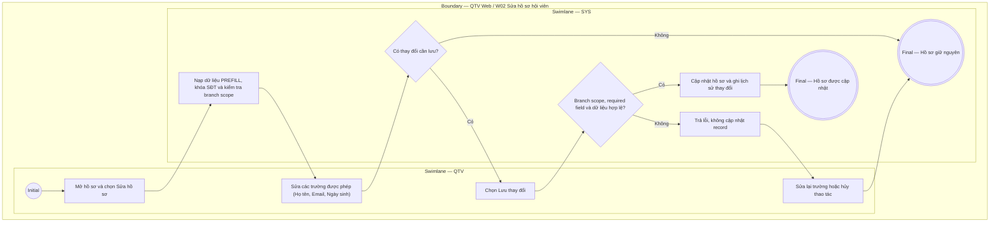

# QTV-W02-US02 - Sửa hồ sơ hội viên

## Preconditions
- QTV đã đăng nhập, hồ sơ hội viên đã tồn tại thuộc chi nhánh mà QTV quản lý (branch scope).
- QTV thao tác trong phạm vi chi nhánh được phục vụ (branch scope); các thay đổi không làm thay đổi nhầm dữ liệu gói, lịch sử thanh toán hoặc quyền sử dụng.

## Trigger
- QTV mở một hồ sơ trong danh sách W02 và chọn **Sửa hồ sơ**.
- Màn hình liên quan: Web QTV — W02 Hội viên & khách hàng, modal Sửa hồ sơ hội viên.

## Main Flow

1. QTV mở modal **Sửa hồ sơ hội viên**.
2. SYS nạp dữ liệu hiện tại và khóa các field không thuộc phạm vi sửa (ví dụ: Số điện thoại, Chi nhánh tiếp nhận).
3. QTV cập nhật các trường được phép (Họ tên, Email, Ngày sinh).
4. QTV chọn **Lưu thay đổi**.
5. SYS kiểm tra branch scope, required field và định dạng dữ liệu.
6. SYS cập nhật hồ sơ, ghi lịch sử thay đổi và hiển thị kết quả.

### Field-level specification — modal Cập nhật hồ sơ hội viên
| Field / control | Loại UI Control | State | Required | Conditional / dynamic | Source / validation |
| :--- | :--- | :--- | :--- | :--- | :--- |
| Họ và tên | `Textbox` | `USER-INPUT` | required | Không | Giá trị hiện tại `PREFILL` (ví dụ: "Nguyễn Hoài Nam"); hỗ trợ dấu tiếng Việt, bỏ khoảng trắng thừa trước khi lưu |
| Số điện thoại | `Readonly Text` | `READONLY (PREFILL)` | required | Không | Giá trị hiện tại hiển thị cố định (ví dụ: "0901 234 567"); không cho phép chỉnh sửa SĐT vì là khóa định danh |
| Email | `Textbox (Email Input)` | `USER-INPUT` | optional | Không | Giá trị hiện tại `PREFILL` (ví dụ: "nam.nguyen@example.vn"); chỉ kiểm tra định dạng khi có nhập |
| Chi nhánh tiếp nhận | `Readonly Text` | `READONLY (PREFILL)` | required | Không | Trường cố định: lấy từ hồ sơ khởi tạo (ví dụ: "Chi nhánh Quận 1"), không thể thay đổi |
| Ngày sinh | `Date Picker / Textbox (Date)` | `USER-INPUT` | optional | Không | Giá trị hiện tại `PREFILL` (ví dụ: "15/05/1990"); dùng cho nhắc sinh nhật nếu hội viên đồng ý |

- **Business rules / logic:**
  - Không cho phép sửa đổi số điện thoại để đảm bảo tính toàn vẹn của dữ liệu định danh và tài khoản.
  - Sửa hồ sơ không đồng nghĩa đổi trạng thái; đổi trạng thái dùng `QTV-W02-US03`.
  - Dữ liệu gói, số buổi và quyền sử dụng không bị sửa bởi flow này.
  - Hồ sơ có lịch sử không bị xóa vật lý bằng thao tác thông thường.
  - Mọi thay đổi hợp lệ phải lưu lịch sử người sửa và thời điểm sửa.

## Alternate Flows

### AF-01 - Không Có Thay Đổi

1. QTV mở hồ sơ nhưng không sửa field nào.
2. Nút **Lưu thay đổi** ở trạng thái không khả dụng hoặc thao tác kết thúc không phát sinh bản ghi mới.

## Exception Flows

- Hồ sơ không tồn tại hoặc ngoài branch scope: từ chối truy cập.
- QTV cố sửa trạng thái, gói, số buổi hoặc ghi chú ngoài quyền: từ chối field/thao tác.
- Xóa required field: không cho lưu và chỉ rõ field lỗi.
- Lỗi khi lưu: giữ dữ liệu hiện tại, không cập nhật dở dang.

- **Câu hỏi còn mở, không suy diễn rule:**
  - OPEN-05: Quy trình xóa dữ liệu cá nhân theo yêu cầu hội viên cần được chốt riêng.

## Activity Diagram — Swimlane
**Trigger:** QTV mở hồ sơ và chọn Sửa hồ sơ.

