# QTV-W02-US04 - Xem danh sách hội viên

## Preconditions

- QTV đã đăng nhập và có quyền tra cứu hồ sơ trong branch scope được cấp.
- Hồ sơ được mở phải thuộc phạm vi chi nhánh hiện hành; ALL chỉ hợp lệ trong các chi nhánh QTV được phép.
- Dữ liệu tài chính chỉ được xem khi có quyền tài chính. Không cần quyền này để xem phần hồ sơ và lịch tập được phép.

## Trigger

QTV mở W02 **Hội viên & khách hàng**, bấm **Mã HV** hoặc dòng hội viên để mở popup **Hồ sơ hội viên**.

## Main Flow

1. SYS kiểm tra QTV/branch scope và tải danh sách có phân trang; QTV tìm theo mã, họ tên, SĐT, lọc trạng thái hoặc chi nhánh tiếp nhận.
2. QTV bấm Mã HV hoặc dòng của hội viên; SYS giữ member ID cùng phạm vi đang chọn, mở popup và tải projection QTV chỉ đọc. Profile lấy từ danh sách field cho phép trong projection, không gọi detail cũ trả thừa dữ liệu giá/sinh trắc.
3. SYS hiển thị định danh đúng hội viên và các khu vực **Trang chủ**, **Lịch tập**, **Gói của tôi**, **Thanh toán**, **Tài khoản**; Thanh toán chỉ hiện khi được cấp quyền tài chính.
4. QTV chọn khu vực cần xem. Registrations gồm gói sở hữu và gói có tham gia nhóm ACCEPTED trong scope; không lặp cùng registration. Lịch PT bao gồm booking của hội viên và booking có snapshot xác nhận hội viên là participant; không suy lịch sử từ thành viên nhóm hiện tại.
5. QTV dùng bộ lọc tìm kiếm, trạng thái và khoảng ngày tại các bảng có hỗ trợ. SYS chỉ lọc phần dữ liệu của đúng hội viên đang mở; không mở rộng scope và không thay quyền lợi/trạng thái hồ sơ.
6. Tại Thanh toán, SYS tải đủ các trang lịch sử của cùng hội viên trong scope trước khi hiển thị kết quả hoàn chỉnh. Đăng ký chờ thanh toán nằm riêng; không đưa trạng thái chờ/hết hạn suy diễn vào khoản đã thu. QTV có thể bấm Xem phiếu thu; SYS kiểm tra payment_id và hiển thị chi tiết inline chỉ đọc.
7. Tại Tài khoản, QTV tra cứu thông tin hồ sơ. Không có mật khẩu, phiên/thiết bị cá nhân, đăng xuất, hay cài đặt tự phục vụ. Ảnh đại diện không đồng nghĩa sinh trắc đã đăng ký.
8. QTV đóng popup để trở về danh sách. Thêm/sửa/đổi trạng thái và đăng ký gói tiếp tục qua hành động quản trị hiện hữu và US tương ứng, không thực hiện bằng giả danh hội viên.

### Field-level specification - Danh sách W02

| Field / control | Loại UI Control | State | Required | Conditional / dynamic | Source / validation |
| --- | --- | --- | --- | --- | --- |
| Tìm hội viên | Textbox | USER-INPUT | optional | Không | Placeholder Mã HV, họ tên, SĐT; truy vấn trong scope, có xóa |
| Trạng thái hồ sơ | Select Dropdown | USER-INPUT | optional | Không | Tất cả trạng thái, Đang hoạt động, Ngừng hoạt động, Đã lưu trữ |
| Chi nhánh tiếp nhận | Select Dropdown | PREFILL | optional | Không | Chi nhánh đang chọn hoặc Tất cả trong phạm vi; danh sách được phép từ API; đây là filter của danh sách W02, không phải bộ chọn chi nhánh toàn cục |
| Đặt lại bộ lọc | Icon Button | USER-INPUT | optional | Không | Tooltip; xóa tìm kiếm/trạng thái, khôi phục chi nhánh ban đầu |
| Tải lại danh sách hội viên | Icon Button | USER-INPUT | optional | Không | Tooltip; nạp lại API, không sinh dữ liệu mẫu |
| Thêm hội viên | Action Button | USER-INPUT | optional | Không | Mở QTV-W02-US01 theo điều kiện chi nhánh cụ thể hiện hữu |
| Mã HV | Link Column | READONLY | required | Không | member_code; bấm mở đúng hồ sơ |
| Họ và tên | Grid Column | READONLY | required | Không | full_name và avatar API hoặc chữ viết tắt từ tên; không ảnh mẫu |
| Số điện thoại | Grid Column | READONLY | required | Không | phone từ hồ sơ |
| Email | Grid Column | READONLY | optional | Không | email; thiếu hiển thị dấu - |
| Chi nhánh | Grid Column | READONLY | required | Không | home_branch_name từ API |
| Trạng thái hồ sơ | Status Badge in Grid | READONLY | required | Không | ACTIVE/INACTIVE/ARCHIVED với nhãn tương ứng; không phải trạng thái gói |
| Sửa hồ sơ | Icon Button | USER-INPUT | optional | Không | Tooltip; mở US02 đúng member ID, không đổi rule sửa |
| Đổi trạng thái | Icon Button | USER-INPUT | optional | Không | Tooltip; mở US03 đúng member ID, không đổi rule trạng thái |
| Xem đăng ký gói | Icon Button | USER-INPUT | optional | Không | Tooltip; sang W04 với member ID, khác hành động bấm dòng mở popup |
| 10 / 20 / 50 | Page Size Selector | USER-INPUT | optional | Không | Mặc định 20; phân trang server; control hiển thị bằng số |
| Số trang / trước / sau | Numeric Pager | USER-INPUT | optional | Không | Ký hiệu phân trang DevExtreme, không có nhãn field riêng |
| Thử lại | Action Button | USER-INPUT | conditional | CONDITIONAL: hiện khi tải dữ liệu lỗi; ẩn khi tải thành công | Gọi lại yêu cầu trong cùng scope |

### Field-level specification - Điều hướng khu vực trong popup tra cứu

Popup là bề mặt tra cứu có tab/bộ lọc, không phải form nhập liệu. Các bảng dưới mô tả control nghiệp vụ của từng khu vực; không đưa header/footer điều hướng chung của ứng dụng vào đặc tả.

| Field / control | Loại UI Control | State | Required | Conditional / dynamic | Source / validation |
| --- | --- | --- | --- | --- | --- |
| Trang chủ | Tab Button | USER-INPUT | required | TRIGGER: chọn khu vực tổng quan | Mặc định khi mở popup; định danh và nguồn dữ liệu của chính hội viên |
| Lịch tập | Tab Button | USER-INPUT | optional | TRIGGER: chọn khu vực lịch PT/lớp | Dữ liệu cùng member trong scope |
| Gói của tôi | Tab Button | USER-INPUT | optional | TRIGGER: chọn khu vực gói/lời mời | Bao gồm gói sở hữu và tham gia nhóm được phép |
| Thanh toán | Tab Button | USER-INPUT | conditional | CONDITIONAL: hiện khi QTV có quyền tài chính; ẩn khi không có quyền | Không tải/hiển thị tiền từ request khác để vượt quyền |
| Tài khoản | Tab Button | USER-INPUT | optional | TRIGGER: chọn khu vực hồ sơ | Projection hồ sơ chỉ đọc; không giả danh tài khoản Mobile |
| Thử lại | Action Button | USER-INPUT | conditional | CONDITIONAL: hiện ở phần bị lỗi tải; ẩn khi phần đó tải thành công | Giữ member ID/scope, không đổi lỗi thành danh sách rỗng |

Định danh bên trong popup lấy tên, mã hội viên, trạng thái, số điện thoại, chi nhánh và avatar thực; giá trị thiếu hiển thị thiếu dữ liệu, không mặc định chi nhánh Quận 1 hoặc tự sinh mã QR. Đóng popup bằng biểu tượng đóng hiện hữu.

### Field-level specification - Bộ lọc các bảng tra cứu

| Field / control | Loại UI Control | State | Required | Conditional / dynamic | Source / validation |
| --- | --- | --- | --- | --- | --- |
| Tìm kiếm | Search Box | USER-INPUT | optional | Không | Placeholder/aria-label; tìm trong cột hiển thị của bảng hiện hành, không đổi scope |
| Trạng thái | Select Dropdown | USER-INPUT | conditional | CONDITIONAL: hiện khi bảng có status; ẩn khi không có status hoặc là Lịch sử thanh toán | Options từ display_status hoặc status thực; mặc định Tất cả trạng thái |
| Phương thức | Select Dropdown | USER-INPUT | conditional | CONDITIONAL: hiện ở Lịch sử thanh toán; ẩn ở bảng khác | Mặc định Tất cả phương thức; options từ payment_method thực tế |
| Từ ngày | DateBox | USER-INPUT | conditional | CONDITIONAL: hiện khi bảng hỗ trợ lọc ngày; ẩn ở bảng không có ngày lọc | Trống mặc định, tùy chọn khi hiện; không sau Đến ngày |
| Đến ngày | DateBox | USER-INPUT | conditional | CONDITIONAL: hiện khi bảng hỗ trợ lọc ngày; ẩn ở bảng không có ngày lọc | Trống mặc định, tùy chọn khi hiện; không trước Từ ngày |
| 10 / 20 / 50 | Page Size Selector | USER-INPUT | optional | Không | Mặc định 10 của grid tra cứu; đổi số dòng hiển thị, không đổi tập nguồn |
| Số trang / trước / sau | Numeric Pager | USER-INPUT | optional | Không | Control phân trang bằng số/biểu tượng; không giới hạn quyền truy cập |

Bộ lọc áp dụng ngay, không có nút Áp dụng; tab con và bộ lọc giữ trong lần mở popup. FROZEN = **Đang đóng băng**, SCHEDULED = **Chưa đến ngày hiệu lực**. Gói hiển thị/lọc theo display_status trước status. Giá trị null giữ dấu -, không tự đổi thành 0 hoặc Không giới hạn.

### Field-level specification - Trang chủ và tab con

Trang chủ gồm **Gói đang hoạt động** (ACTIVE và is_paid true), **Lời mời đang chờ** (received/PENDING), **Lịch PT sắp tới** (CONFIRMED/PENDING/BOOKED, bắt đầu chưa qua theo múi giờ chi nhánh, sắp tăng dần). Ba bảng không có lọc ngày; trường gói/PT dùng đặc tả chung bên dưới.

| Field / control | Loại UI Control | State | Required | Conditional / dynamic | Source / validation |
| --- | --- | --- | --- | --- | --- |
| PT | Tab | USER-INPUT | optional | Không | Trong Lịch tập; bảng Lịch PT, lọc booking_date |
| Lớp cộng đồng | Tab | USER-INPUT | optional | Không | Trong Lịch tập; bảng Lớp đã đăng ký, lọc class_date |
| Gói đã đăng ký | Tab | USER-INPUT | optional | Không | Trong Gói của tôi; gói sở hữu/tham gia, lọc start_date |
| Lời mời nhóm | Tab | USER-INPUT | optional | Không | Trong Gói của tôi; lời mời nhận/gửi, lọc created_at |
| Đã thanh toán | Tab | USER-INPUT | optional | Không | Trong Thanh toán được cấp quyền; Lịch sử thanh toán, lọc confirmed_at |
| Chờ thanh toán | Tab | USER-INPUT | optional | Không | Trong Thanh toán được cấp quyền; Đăng ký chờ thanh toán chỉ gói sở hữu PENDING_PAYMENT, lọc start_date |

### Field-level specification - Gói và quyền lợi

Dùng tại Gói đang hoạt động, Gói đã đăng ký và Đăng ký chờ thanh toán. Số buổi là của gói, không phân bổ số dư cá nhân cho thành viên nhóm.

| Field / control | Loại UI Control | State | Required | Conditional / dynamic | Source / validation |
| --- | --- | --- | --- | --- | --- |
| Mã đăng ký | Grid Column | READONLY | optional | Không | reg_code |
| Gói tập | Grid Column | READONLY | optional | Không | package_name_snapshot |
| Vai trò | Grid Column | READONLY | optional | Không | is_group_member: Thành viên nhóm; còn lại Chủ gói |
| Trạng thái | Status Badge in Grid | READONLY | optional | Không | display_status hoặc status |
| Bắt đầu | Grid Column | READONLY | optional | Không | start_date |
| Kết thúc | Grid Column | READONLY | optional | Không | end_date |
| Chi nhánh | Grid Column | READONLY | optional | Không | branch_name |
| Mở rộng / thu gọn | Expand Control | USER-INPUT | optional | Không | Biểu tượng dxDataGrid không có nhãn chữ; mở chi tiết dòng |
| Chế độ gói | Display | READONLY | conditional | CONDITIONAL: hiện khi mở rộng dòng; ẩn khi thu gọn | package_mode; PT kèm nhóm/PT cá nhân 1-1/Cá nhân theo enum |
| Huấn luyện viên | Display | READONLY | conditional | CONDITIONAL: hiện khi mở rộng dòng; ẩn khi thu gọn | assigned_pt_name |
| Chi nhánh sử dụng | Display | READONLY | conditional | CONDITIONAL: hiện khi mở rộng dòng; ẩn khi thu gọn | allowed_branches.branch_name |
| Tổng lượt Gym của gói | Display | READONLY | conditional | CONDITIONAL: hiện khi mở rộng dòng; ẩn khi thu gọn | total_gym_sessions_snapshot |
| Lượt Gym còn lại của gói | Display | READONLY | conditional | CONDITIONAL: hiện khi mở rộng dòng; ẩn khi thu gọn | remaining_gym_sessions |
| Tổng buổi PT của gói | Display | READONLY | conditional | CONDITIONAL: hiện khi mở rộng dòng; ẩn khi thu gọn | total_pt_sessions_snapshot |
| Buổi PT đã dùng của gói | Display | READONLY | conditional | CONDITIONAL: hiện khi mở rộng dòng; ẩn khi thu gọn | used_pt_sessions |
| Buổi PT đã đặt của gói | Display | READONLY | conditional | CONDITIONAL: hiện khi mở rộng dòng; ẩn khi thu gọn | booked_pt_sessions |
| Buổi PT còn lại của gói | Display | READONLY | conditional | CONDITIONAL: hiện khi mở rộng dòng; ẩn khi thu gọn | remaining_pt_sessions |

### Field-level specification - Lịch PT

Dùng tại Lịch PT sắp tới và Lịch PT. Chỉ bảng Lịch PT có lọc ngày. Không đặt lịch/xác nhận/sửa kết quả ở projection.

| Field / control | Loại UI Control | State | Required | Conditional / dynamic | Source / validation |
| --- | --- | --- | --- | --- | --- |
| Ngày tập | Grid Column | READONLY | optional | Không | booking_date |
| Bắt đầu | Grid Column | READONLY | optional | Không | start_time |
| Kết thúc | Grid Column | READONLY | optional | Không | end_time |
| Huấn luyện viên | Grid Column | READONLY | optional | Không | pt_name |
| Trạng thái | Status Badge in Grid | READONLY | optional | Không | status |
| Quan hệ | Grid Column | READONLY | optional | Không | is_group_participant: Tham gia buổi nhóm; owner: Người đặt lịch; không suy membership hiện tại |
| Buổi thứ | Grid Column | READONLY | optional | Không | session_number |
| PT xác nhận | Grid Column | READONLY | optional | Không | pt_confirmed_at, giờ chi nhánh booking |
| Hội viên xác nhận | Grid Column | READONLY | optional | Không | member_confirmed_at, giờ chi nhánh booking |
| Nội dung buổi tập | Grid Column | READONLY | optional | Không | workout_notes |
| Đánh giá thể lực | Grid Column | READONLY | optional | Không | fitness_assessment |

### Field-level specification - Lớp đã đăng ký

Cùng hội viên, scoped community_registrations; không đăng ký lớp mới.

| Field / control | Loại UI Control | State | Required | Conditional / dynamic | Source / validation |
| --- | --- | --- | --- | --- | --- |
| Lớp học | Grid Column | READONLY | optional | Không | title |
| Ngày học | Grid Column | READONLY | optional | Không | class_date |
| Bắt đầu | Grid Column | READONLY | optional | Không | start_time |
| Kết thúc | Grid Column | READONLY | optional | Không | end_time |
| Huấn luyện viên | Grid Column | READONLY | optional | Không | instructor_name |
| Chi nhánh | Grid Column | READONLY | optional | Không | branch_name |
| Trạng thái | Status Badge in Grid | READONLY | optional | Không | status đăng ký lớp |

### Field-level specification - Lời mời

Trang chủ chỉ có Gói tập/Người mời/Trạng thái. Lời mời nhóm có đầy đủ cột dưới, không chấp nhận/từ chối thay hội viên.

| Field / control | Loại UI Control | State | Required | Conditional / dynamic | Source / validation |
| --- | --- | --- | --- | --- | --- |
| Chiều | Grid Column | READONLY | conditional | CONDITIONAL: hiện ở Lời mời nhóm; ẩn ở Lời mời đang chờ | received: Đã nhận; sent: Đã gửi |
| Gói tập | Grid Column | READONLY | optional | Không | package_name_snapshot |
| Người mời | Grid Column | READONLY | optional | Không | inviter_name |
| Người nhận | Grid Column | READONLY | conditional | CONDITIONAL: hiện ở Lời mời nhóm; ẩn ở Lời mời đang chờ | recipient_name |
| Trạng thái | Status Badge in Grid | READONLY | optional | Không | invitation_status |
| Ngày gửi | Grid Column | READONLY | conditional | CONDITIONAL: hiện ở Lời mời nhóm; ẩn ở Lời mời đang chờ | created_at |

### Field-level specification - Lịch sử thanh toán

Chỉ khi có quyền tài chính; tải mọi trang, kiểm tra total/items và ID không lặp, giữ khoản có confirmed_at của đúng hội viên. Không có cột/bộ lọc trạng thái.

| Field / control | Loại UI Control | State | Required | Conditional / dynamic | Source / validation |
| --- | --- | --- | --- | --- | --- |
| Mã thanh toán | Grid Column | READONLY | optional | Không | payment_code |
| Phiếu thu | Grid Column | READONLY | optional | Không | receipt_code |
| Gói tập | Grid Column | READONLY | optional | Không | package_name_snapshot |
| Số tiền | Grid Column | READONLY | optional | Không | amount; số nguyên VND |
| Phương thức | Grid Column | READONLY | optional | Không | payment_method: Tiền mặt/Chuyển khoản |
| Xác nhận lúc | Grid Column | READONLY | optional | Không | confirmed_at |
| Chi nhánh | Grid Column | READONLY | optional | Không | branch_name |
| Xem phiếu thu | Icon Button | USER-INPUT | optional | Không | Tooltip/aria-label icon cột Phiếu thu; mở Chi tiết phiếu thu inline, không popup mới |

### Field-level specification - Chi tiết phiếu thu

Bổ sung ở freeze cuối: GET /payments/:id/receipt, kiểm tra payment_id khớp dòng đã chọn. Không in/xuất/sửa/xóa. Lỗi có Thử lại tại vùng chi tiết, không hiển thị giá trị giả.

| Field / control | Loại UI Control | State | Required | Conditional / dynamic | Source / validation |
| --- | --- | --- | --- | --- | --- |
| Mã phiếu thu | Display | READONLY | conditional | CONDITIONAL: hiện khi chi tiết tải thành công; ẩn khi chưa mở hoặc tải lỗi | Response phiếu thu: receipt_code |
| Mã thanh toán | Display | READONLY | conditional | CONDITIONAL: hiện khi chi tiết tải thành công; ẩn khi chưa mở hoặc tải lỗi | Response phiếu thu: payment_code |
| Mã đăng ký | Display | READONLY | conditional | CONDITIONAL: hiện khi chi tiết tải thành công; ẩn khi chưa mở hoặc tải lỗi | Response phiếu thu: reg_code |
| Người nộp | Display | READONLY | conditional | CONDITIONAL: hiện khi chi tiết tải thành công; ẩn khi chưa mở hoặc tải lỗi | Response phiếu thu: payer_name |
| Số điện thoại | Display | READONLY | conditional | CONDITIONAL: hiện khi chi tiết tải thành công; ẩn khi chưa mở hoặc tải lỗi | Response phiếu thu: payer_phone |
| Gói tập | Display | READONLY | conditional | CONDITIONAL: hiện khi chi tiết tải thành công; ẩn khi chưa mở hoặc tải lỗi | Response phiếu thu: package_name_snapshot |
| Số tiền | Display | READONLY | conditional | CONDITIONAL: hiện khi chi tiết tải thành công; ẩn khi chưa mở hoặc tải lỗi | Response phiếu thu: amount, định dạng tiền VND |
| Phương thức | Display | READONLY | conditional | CONDITIONAL: hiện khi chi tiết tải thành công; ẩn khi chưa mở hoặc tải lỗi | Response phiếu thu: payment_method |
| Chi nhánh | Display | READONLY | conditional | CONDITIONAL: hiện khi chi tiết tải thành công; ẩn khi chưa mở hoặc tải lỗi | Response phiếu thu: branch_name |
| Người lập | Display | READONLY | conditional | CONDITIONAL: hiện khi chi tiết tải thành công; ẩn khi chưa mở hoặc tải lỗi | Response phiếu thu: issued_by_name |
| Ngày lập | Display | READONLY | conditional | CONDITIONAL: hiện khi chi tiết tải thành công; ẩn khi chưa mở hoặc tải lỗi | Response phiếu thu: issued_at, múi giờ branch_id của payment |
| Ghi chú | Display | READONLY | conditional | CONDITIONAL: hiện khi chi tiết tải thành công; ẩn khi chưa mở hoặc tải lỗi | Response phiếu thu: note |
| Đóng phiếu thu | Icon Button | USER-INPUT | conditional | CONDITIONAL: hiện khi chi tiết tải thành công; ẩn khi chưa mở hoặc tải lỗi | Tooltip; dọn vùng inline, không ghi dữ liệu |

Đóng vùng chi tiết bằng icon **Đóng phiếu thu**; đóng không thay đổi nghiệp vụ.

### Field-level specification - Tài khoản

Chỉ đọc overview-data.profile. Định danh popup lấy avatar/tên/mã/trạng thái/điện thoại/chi nhánh cùng profile; avatar chỉ hiện khi URL hợp lệ. Không có địa chỉ, lịch sử cổng, QR, Face ID, cài đặt bảo mật/thiết bị.

| Field / control | Loại UI Control | State | Required | Conditional / dynamic | Source / validation |
| --- | --- | --- | --- | --- | --- |
| Họ và tên | Display | READONLY | optional | Không | full_name |
| Mã hội viên | Display | READONLY | optional | Không | member_code |
| Số điện thoại | Display | READONLY | optional | Không | phone |
| Email | Display | READONLY | optional | Không | email |
| Ngày sinh | Display | READONLY | optional | Không | date_of_birth |
| Giới tính | Display | READONLY | optional | Không | gender; NAM/NU/KHAC và enum legacy tương ứng; null giữ dấu - |
| Chi nhánh quản lý | Display | READONLY | optional | Không | home_branch_name |

## Business Rules

- QTV-only projection kiểm tra member/scope trên server; LT giữ popup hiện hữu. Không ép header ALL để vượt chi nhánh đang chọn.
- Gói nhóm dùng quan hệ ACCEPTED cho danh sách đăng ký; lịch PT nhóm chỉ dùng snapshot participant đã lưu tại buổi. Khi thiếu bảng snapshot legacy, hệ thống thông báo giới hạn và không tái dựng lịch sử.
- Không coi FROZEN là quyền khả dụng, không chuyển Gym không giới hạn/null thành 0 lượt, không tự dựng hạn hoặc số tiền. Dùng status/display_status/is_expiring và dữ liệu quyền lợi API.
- Chỉ gọi nguồn tài chính khi có quyền; không truy xuất giá/giao dịch qua profile cũ để lách quyền. Search/filter không làm sai subject.
- Xem hồ sơ không làm phát sinh cập nhật dữ liệu nghiệp vụ hoặc thao tác thay mặt Mobile. Heartbeat phiên xác thực hiện hữu được chấp nhận; không diễn giải “chỉ đọc” thành không có bất kỳ ghi nhận nào ở tầng middleware.
- Các control CRUD hiện hữu trên danh sách vẫn theo US01/US02/US03 và W04; refactor không cấp quyền sửa hợp đồng, xác nhận buổi thay hội viên, chấp nhận lời mời hay tự chuyển nhượng.
- Không có array business rows giả, tài khoản/chi nhánh/contact mặc định, QR dựng từ member_code, hoặc khẳng định avatar là Face ID. Giá trị text/URL được render an toàn, không diễn giải tên hội viên thành HTML.

## Alternate Flows

- AF01: QTV chỉ lọc/xem danh sách mà không mở popup, hoặc đóng popup ngay: không thay dữ liệu.
- AF02: Đổi tab/bộ lọc, xóa cận ngày/trạng thái: cập nhật bảng tương ứng trong cùng member/scope. Khoảng ngày không chọn nghĩa là không giới hạn cận đó trong nguồn đã tải.
- AF03: Hội viên là thành viên nhóm: xem gói đang tham gia và booking có snapshot participant; không nhầm quyền chủ gói/người thanh toán với thành viên.
- AF04: Không có quyền tài chính: Thanh toán ẩn, hồ sơ/lịch/gói trong phạm vi vẫn tra cứu được mà không lộ giá.
- AF05: QTV chuyển sang thao tác quản trị từ danh sách: mở US sửa/đổi trạng thái/W04 hiện hữu cùng member; luồng ghi dữ liệu tuân theo US đích, không thuộc thao tác chỉ đọc này.
- AF06: Mở rộng dòng gói để xem quyền lợi/PT/chi nhánh; thu gọn không thay dữ liệu. Xem phiếu thu tải chi tiết đúng payment; Đóng phiếu thu chỉ dọn vùng inline, không đóng hồ sơ.

## Exception Flows

- EF01: Sai role/scope, member không tồn tại hoặc quyền bị thay đổi: từ chối; không gọi lại bằng ALL hoặc tài khoản Mobile.
- EF02: Lỗi projection/profile: hiện lỗi và Thử lại, không dựng hồ sơ từ dữ liệu mẫu. Lỗi một nguồn bổ sung: báo tại phần đó, không hiển thị 0 hoặc không có dữ liệu như một lần đọc thành công.
- EF03: Khoảng ngày ngược: hiển thị **Ngày bắt đầu phải trước hoặc bằng ngày kết thúc.**, không coi bảng đang rỗng vì input sai là không có lịch sử.
- EF04: Đổi chi nhánh trong khi popup/request còn mở: bỏ kết quả cũ, yêu cầu mở lại hồ sơ; không trộn dữ liệu giữa hai scope hoặc hai hội viên.
- EF05: Thiếu snapshot tham gia nhóm: không suy booking lịch sử từ membership hiện tại. Thông báo giới hạn nguồn cho Main/UI theo contract; không khẳng định đã thấy toàn bộ lịch nhóm.
- EF06: Payment phân trang không đầy đủ, lặp ID hoặc tổng thay đổi trong khi tải: báo lỗi và thử lại; không gọi tổng/trang đầu là toàn bộ lịch sử.
- EF07: Phiếu thu tải lỗi hoặc payment_id khác dòng chọn: hiển thị lỗi và Thử lại tại vùng chi tiết, không hiển thị phiếu sai hội viên.

## Activity Diagram — Swimlane

```mermaid
flowchart TB
  subgraph W02ProfileBoundary["Boundary - Web QTV W02 / Danh sách và popup tra cứu"]
    subgraph W02ProfileQTV["Swimlane - QTV"]
      W02ProfileInitial(("Initial"))
      W02ProfileOpen["Mở W02 và chọn tiêu chí lọc danh sách"]
      W02ProfileChoice{"Mở hồ sơ hay kết thúc?"}
      W02ProfileSelect["Bấm Mã HV hoặc dòng đúng hội viên"]
      W02ProfileMenu{"Chọn khu vực?"}
      W02ProfileFilter["Giữ hoặc chọn bộ lọc được hỗ trợ; xem chi tiết chỉ đọc"]
      W02ProfileMore{"Tiếp tục tra cứu?"}
      W02ProfileReceiptChoice{"Xem phiếu thu?"}
      W02ProfileReceiptSelect["Bấm Xem phiếu thu của payment đã chọn"]
    end
    subgraph W02ProfileSYS["Swimlane - SYS"]
      W02ProfileAuth{"QTV và scope hợp lệ?"}
      W02ProfileList["Tải và hiển thị danh sách phân trang"]
      W02ProfileSubject{"Member còn trong scope và projection tải được?"}
      W02ProfileShell["Hiển thị định danh và menu được phép"]
      W02ProfileHome["Hiển thị tổng quan cùng hội viên từ nguồn thật"]
      W02ProfileSchedule["Hiển thị lịch PT và lớp cộng đồng đúng subject"]
      W02ProfilePackages["Hiển thị gói sở hữu, gói tham gia và lời mời"]
      W02ProfileFinance{"Có quyền tài chính?"}
      W02ProfilePayments["Tải đủ lịch sử thu và đăng ký chờ riêng"]
      W02ProfileReceiptLoad["Tải phiếu thu theo payment ID trong scope"]
      W02ProfileReceiptValid{"Tải thành công và payment_id khớp?"}
      W02ProfileReceiptShow["Hiển thị chi tiết phiếu thu inline chỉ đọc"]
      W02ProfileReceiptError((("Final - Báo lỗi phiếu thu và cho thử lại")))
      W02ProfileAccount["Hiển thị hồ sơ chỉ đọc, không thao tác tài khoản cá nhân"]
      W02ProfileMerge(("Merge - Khu vực được chọn"))
      W02ProfileValid{"Bộ lọc, dữ liệu và scope còn hợp lệ?"}
      W02ProfileRender["Hiển thị kết quả hoặc empty state từ lần đọc thành công"]
      W02ProfileLoop(("Merge - Mở hoặc chuyển khu vực"))
      W02ProfileDenied((("Final - Từ chối truy cập")))
      W02ProfileListEnd((("Final - Kết thúc xem danh sách")))
      W02ProfileLoadError((("Final - Báo lỗi hồ sơ và cho thử lại")))
      W02ProfileNoFinance((("Final - Không cung cấp dữ liệu tài chính")))
      W02ProfileFilterError((("Final - Báo lỗi hoặc yêu cầu mở lại, không giả dữ liệu rỗng")))
      W02ProfileDone((("Final - Đóng popup, không thay đổi nghiệp vụ")))
    end
  end
  W02ProfileInitial --> W02ProfileOpen
  W02ProfileOpen --> W02ProfileAuth
  W02ProfileAuth -->|Không| W02ProfileDenied
  W02ProfileAuth -->|Có| W02ProfileList
  W02ProfileList --> W02ProfileChoice
  W02ProfileChoice -->|Kết thúc| W02ProfileListEnd
  W02ProfileChoice -->|Mở hồ sơ| W02ProfileSelect
  W02ProfileSelect --> W02ProfileSubject
  W02ProfileSubject -->|Không hoặc lỗi tải| W02ProfileLoadError
  W02ProfileSubject -->|Có| W02ProfileShell
  W02ProfileShell --> W02ProfileLoop
  W02ProfileLoop --> W02ProfileMenu
  W02ProfileMenu -->|Trang chủ| W02ProfileHome
  W02ProfileMenu -->|Lịch tập| W02ProfileSchedule
  W02ProfileMenu -->|Gói của tôi| W02ProfilePackages
  W02ProfileMenu -->|Thanh toán| W02ProfileFinance
  W02ProfileMenu -->|Tài khoản| W02ProfileAccount
  W02ProfileFinance -->|Không| W02ProfileNoFinance
  W02ProfileFinance -->|Có| W02ProfilePayments
  W02ProfileHome --> W02ProfileMerge
  W02ProfileSchedule --> W02ProfileMerge
  W02ProfilePackages --> W02ProfileMerge
  W02ProfilePayments --> W02ProfileReceiptChoice
  W02ProfileReceiptChoice -->|Không| W02ProfileMerge
  W02ProfileReceiptChoice -->|Có| W02ProfileReceiptSelect
  W02ProfileReceiptSelect --> W02ProfileReceiptLoad
  W02ProfileReceiptLoad --> W02ProfileReceiptValid
  W02ProfileReceiptValid -->|Không hoặc lỗi tải| W02ProfileReceiptError
  W02ProfileReceiptValid -->|Có| W02ProfileReceiptShow
  W02ProfileReceiptShow --> W02ProfileMerge
  W02ProfileAccount --> W02ProfileMerge
  W02ProfileMerge --> W02ProfileFilter
  W02ProfileFilter --> W02ProfileValid
  W02ProfileValid -->|Không hoặc nguồn tải lỗi| W02ProfileFilterError
  W02ProfileValid -->|Có| W02ProfileRender
  W02ProfileRender --> W02ProfileMore
  W02ProfileMore -->|Đổi khu vực hoặc bộ lọc| W02ProfileLoop
  W02ProfileMore -->|Đóng| W02ProfileDone
```

## Traceability

- [Epic QTV-W02](<../../../epic/qtv/QTV-W02-Hội viên & khách hàng.md>).
- [Product Spec - Hồ sơ Hội viên](../../../product-spec.md).
- [Mapping màn hình](../../../ui-related-screen-audit.md).
- [Audit và báo cáo refactor](../../../reports/tab1-web-admin/2026-09-22-member-popup-walkthrough.md).
- Đối chiếu cấu trúc Mobile: HV01-US01, HV02-US01/US05, HV03-US01/US06/US07, HV04-US01. Các quyền tự phục vụ của các US Mobile không được chuyển cho QTV.
