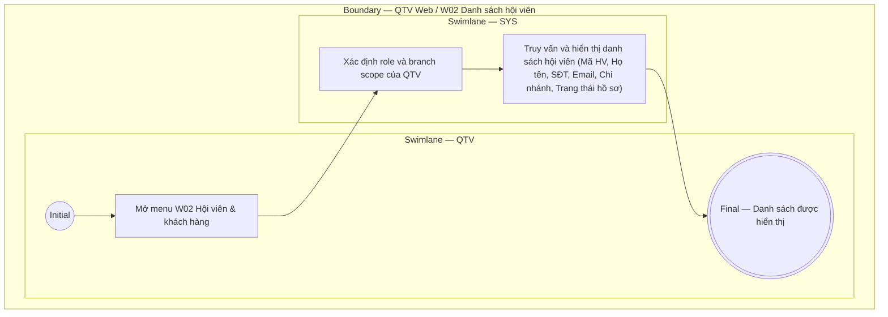

# QTV-W02-US04 - Xem danh sách hội viên

## Preconditions
- QTV đã đăng nhập hệ thống và có quyền tra cứu hồ sơ hội viên.
- QTV thao tác trong phạm vi chi nhánh được phân công (branch scope: chi nhánh đang chọn hoặc toàn hệ thống nếu có quyền).

## Trigger
- QTV mở menu W02 hoặc chọn **Danh sách hội viên**.
- Màn hình liên quan: Web QTV — W02 Hội viên & khách hàng.

## Main Flow

1. QTV mở menu **Hội viên & khách hàng** (W02).
2. SYS xác định role và branch scope của tài khoản QTV.
3. SYS truy vấn và hiển thị bảng danh sách hội viên thỏa mãn phạm vi và các tiêu chí lọc.
4. QTV xem danh sách các trường thông tin hội viên trên từng dòng của bảng dữ liệu.

### Field-level specification — Bảng danh sách hội viên
| Field / control | State | Required | Conditional / dynamic | Source / validation |
| :--- | :--- | :--- | :--- | :--- |
| Mã HV | `READONLY` | required | Không | SYS sinh duy nhất từ `MEMBER_PROFILE.code` (ví dụ: "HV001"); hiển thị dạng text link |
| Họ và tên | `READONLY` | required | Không | Lấy từ `MEMBER_PROFILE.full_name` (ví dụ: "Nguyễn Văn An"); hiển thị kèm avatar viết tắt tên |
| Số điện thoại | `READONLY` | required | `DYNAMIC`: hiển thị định dạng chuẩn hóa 10 số | Lấy từ `MEMBER_PROFILE.phone` (ví dụ: "0901 234 567"); định danh liên hệ duy nhất |
| Email | `READONLY` | optional | Không | Lấy từ `MEMBER_PROFILE.email` (ví dụ: "an.nguyen@example.vn"); hiển thị gạch ngang `-` nếu chưa có |
| Chi nhánh | `READONLY` | required | `DYNAMIC`: theo branch scope | Lấy tên chi nhánh tiếp nhận từ `BRANCH.name` (ví dụ: "Quận 1") |
| Trạng thái hồ sơ | `READONLY` | required | `DYNAMIC`: theo trạng thái record | Lấy từ `MEMBER_PROFILE.status`; hiển thị dạng status badge (ví dụ: badge xanh "Hồ sơ đang hoạt động") |

- **Business rules / logic:**
  - Chỉ hiển thị hồ sơ thuộc role và branch scope của QTV.
  - Dữ liệu trên bảng danh sách là chỉ đọc (`READONLY`); các thao tác thay đổi dữ liệu dùng các User Story thêm/sửa/đổi trạng thái tương ứng.
  - Sắp xếp mặc định theo thời gian tạo mới nhất hoặc theo mã hội viên.

## Exception Flows
- Không có dữ liệu phù hợp: SYS hiển thị empty state "Không tìm thấy hội viên nào".
- Lỗi kết nối / tải dữ liệu: SYS hiển thị thông báo lỗi và cho phép thử lại.

## Activity Diagram — Swimlane
**Trigger:** QTV mở Danh sách hội viên trong menu W02.

