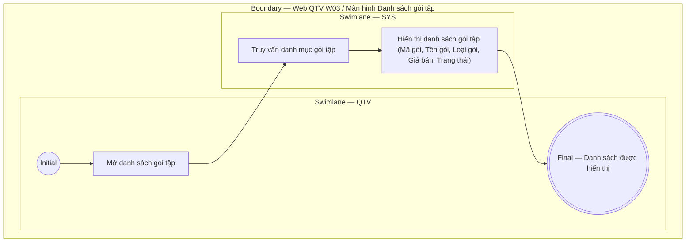

# QTV-W03-US01 - Xem danh sách gói tập

## Preconditions
- QTV đã đăng nhập, có quyền truy cập menu W03 Gói tập.

## Trigger
- QTV mở menu **Gói tập** (W03) từ Web Sidebar.
- Màn hình liên quan: Web QTV — W03 Gói tập.

## Main Flow

1. QTV mở danh sách gói tập.
2. SYS truy vấn danh mục và hiển thị bảng danh sách các gói tập (Mã gói, Tên gói, Loại gói, Giá bán, Thời hạn/Số buổi, Chi nhánh áp dụng, Trạng thái bán).

- **Business rules / logic:**
  - Danh sách gói tập hiển thị đầy đủ các gói đang bán và ngừng bán.
  - Màn hình danh sách là read-only; các thao tác Thêm, Sửa, Ngừng bán sử dụng các User Story tương ứng.

## Exception Flows
- Lỗi tải dữ liệu: SYS hiển thị thông báo lỗi.

## Activity Diagram — Swimlane
**Trigger:** QTV truy cập menu W03 Gói tập.

