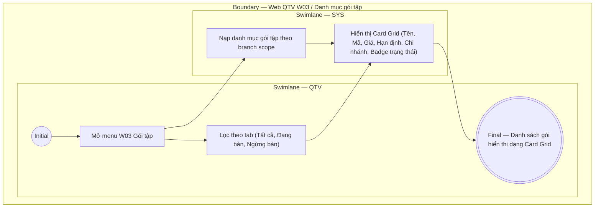

# QTV-W03-US01 - Xem danh sách gói tập

## Preconditions
- QTV đã đăng nhập hệ thống và có quyền quản lý danh mục gói tập.
- Phạm vi chi nhánh của QTV được xác định (xem các gói áp dụng cho chi nhánh được phân quyền hoặc toàn hệ thống).

## Trigger
- QTV mở menu **Gói tập** (W03) từ Web Sidebar.
- Màn hình liên quan: Web QTV — W03 Gói tập.

## Main Flow

1. QTV mở menu **Gói tập** (W03).
2. SYS xác định branch scope và nạp toàn bộ danh mục gói tập.
3. SYS hiển thị giao diện lưới thẻ (Card Grid) các gói tập và thanh lọc trạng thái (`Tất cả`, `Đang bán`, `Ngừng bán`).
4. QTV xem các thông tin chi tiết trên từng thẻ gói tập hoặc bấm chọn tab để lọc gói theo trạng thái bán.

### Field-level specification — Thẻ gói tập trên Card Grid (Bố cục 3 cột / hàng)
- **Bố cục lưới (Card Grid Layout):** 
  - **Số cột:** 3 cột cố định trên mỗi hàng (`grid grid-cols-3`).
  - **Số hàng:** Tự động mở rộng theo tổng số gói tập (ví dụ 9 gói = 3 hàng × 3 cột).
  - **Cách bố trí card:** Các card hình chữ nhật bo góc được xếp đều cân đối từ trái sang phải, từ trên xuống dưới. Mỗi card là một khung độc lập chứa đầy đủ thông tin định danh, giá, quyền lợi, chi nhánh và các nút thao tác.

| Field / control | State | Required | Conditional / dynamic | Source / validation |
| :--- | :--- | :--- | :--- | :--- |
| Tên gói | `READONLY` | required | Không | Lấy từ `PACKAGE.name` (ví dụ: "Gói 1 tháng", "Combo Gym 3 tháng + PT 10 buổi"); tiêu đề đậm trên thẻ |
| Trạng thái gói | `READONLY` | required | `DYNAMIC`: theo trạng thái bán | Lấy từ `PACKAGE.status`; hiển thị badge màu (ví dụ: badge xanh `Đang bán`, badge xám `Ngừng bán`) |
| Mã gói & Phân loại | `READONLY` | required | Không | Định dạng `{PACKAGE.code} · {PACKAGE.type} - {PACKAGE.limit_type}` (ví dụ: "G01 · GYM - Theo ngày", "G05 · GYM - Theo buổi", "G06 · PT - Theo buổi", "G08 · COMBO - Theo ngày + buổi") |
| Giá bán | `READONLY` | required | `DYNAMIC`: theo đơn vị VND | Lấy từ `PACKAGE.price` (ví dụ: "500.000 đ", "3.200.000 đ"); typography số to đậm nổi bật |
| Hạn định / Quyền lợi | `READONLY` | required | `DYNAMIC`: theo loại gói | Hiển thị thời hạn ngày và/hoặc số buổi PT (ví dụ: "Thời hạn: 30 ngày", "Thời hạn: 90 ngày · PT: 10 buổi") |
| Chi nhánh áp dụng | `READONLY` | required | `DYNAMIC`: theo danh sách branch | Hiển thị tên các chi nhánh được phép áp dụng gói (ví dụ: "Áp dụng: Quận 1, Bình Thạnh") |

- **Thao tác trên mỗi thẻ gói (Card Action Controls):**
  - **Nút [Sửa] (Icon cây bút 📝):** Mở modal **Cập nhật danh mục gói tập** (`QTV-W03-US03`), tự động prefill toàn bộ dữ liệu gói.
  - **Nút [Ngừng bán] (nút màu đỏ):** Hiển thị khi gói đang ở trạng thái `Đang bán`, click mở popup xác nhận ngừng bán (`QTV-W03-US04`).
  - **Nút [Mở bán lại] (nút màu tối):** Hiển thị khi gói đang ở trạng thái `Ngừng bán`, click để khôi phục gói về trạng thái `Đang bán`.

- **Business rules / logic:**
  - Danh sách hiển thị theo dạng Card Grid trực quan (3 cột / hàng), phân tách rõ ràng giữa gói Gym, gói PT và Combo.
  - Sắp xếp mặc định theo mã gói hoặc theo nhóm loại gói.
  - Gói đã ngừng bán vẫn hiển thị trên giao diện của QTV (có badge `Ngừng bán`) để phục vụ quản trị và mở bán lại khi cần, nhưng không xuất hiện trong luồng bán mới của Lễ tân hay trên Mobile App của Hội viên.

## Exception Flows
- Không có gói tập nào theo bộ lọc: SYS hiển thị empty state "Không có gói tập nào".
- Lỗi tải dữ liệu: SYS hiển thị thông báo lỗi và nút thử lại.

## Activity Diagram — Swimlane
**Trigger:** QTV mở menu W03 Gói tập.

