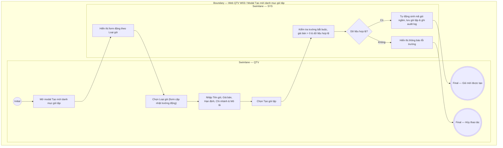

# QTV-W03-US02 - Thêm gói tập

## Preconditions
- QTV đã đăng nhập, có quyền quản lý danh mục gói tập.

## Trigger
- QTV chọn **Tạo mới gói tập** từ màn hình Web W03.
- Màn hình liên quan: Web QTV — W03 Gói tập, modal **Tạo mới danh mục gói tập**.

## Main Flow

1. QTV mở modal **Tạo mới danh mục gói tập**.
2. QTV chọn **Loại gói** (Gym theo thời gian, Gym theo buổi, PT theo buổi, Combo Gym + PT).
3. SYS tự động cập nhật **Cách giới hạn** và cấu trúc các trường nhập liệu tương ứng (Thời hạn, Số buổi PT/Gym).
4. QTV nhập Tên gói, Giá bán, Chi nhánh áp dụng, Trạng thái bán, Mô tả quyền lợi (nếu có) và thông tin hạn định.
5. QTV chọn **Tạo gói tập**.
6. SYS kiểm tra các trường bắt buộc, giá bán lớn hơn 0 và dữ liệu hợp lệ.
7. SYS tạo gói tập mới, tự động sinh mã duy nhất ngầm, lưu danh mục và ghi audit log.

### Field-level specification — modal Tạo mới danh mục gói tập
| Field / control | State | Required | Conditional / dynamic | Source / validation |
| --- | --- | --- | --- | --- |
| Tên gói | `USER-INPUT` | required | Không | QTV nhập (ví dụ: "PT 10 buổi / 90 ngày"); hiển thị trên ứng dụng và hóa đơn |
| Loại gói | `USER-INPUT` | required | `DYNAMIC`: điều khiển hiển thị Cách giới hạn và các trường quyền lợi | QTV chọn 1 trong 4 loại cơ sở chính thức (`Gym theo thời gian`, `Gym theo buổi`, `PT theo buổi`, `Combo Gym + PT`) |
| Cách giới hạn | `USER-INPUT` | required | `DYNAMIC`: tự động thay đổi theo Loại gói chọn | QTV chọn hoặc SYS auto-fill (`Theo thời gian`, `Theo buổi/lượt`, `Theo buổi PT`, `Combo`) |
| Thời hạn | `USER-INPUT` | optional | `CONDITIONAL`: bắt buộc nếu gói có giới hạn thời gian (ví dụ: "90 ngày") | QTV nhập số ngày hiệu lực |
| Số buổi PT / Gym | `USER-INPUT` | optional | `CONDITIONAL`: bắt buộc với gói theo buổi hoặc Combo | QTV nhập số lượng buổi |
| Giá bán | `USER-INPUT` | required | Không | QTV nhập (ví dụ: "2.000.000"); giá niêm yết chính thức, bắt buộc số > 0 |
| Chi nhánh áp dụng | `USER-INPUT` | required | `DYNAMIC`: chọn chi nhánh áp dụng gói | QTV chọn chi nhánh thuộc branch scope (ví dụ: "Quận 1") |
| Trạng thái bán | `USER-INPUT` | required | Mặc định `Đang bán` | QTV chọn trạng thái (`Đang bán` / `Ngừng bán`) |
| Mô tả quyền lợi | `USER-INPUT` | optional | Không | QTV nhập mô tả ngắn hiển thị trên thẻ gói khi hội viên xem trên mobile app |

- **Business rules / logic:**
  - **Dynamic Form Fields**: Form tự động thay đổi các trường điều kiện dựa theo Loại gói:
    - *Gym theo thời gian*: Hiện `Cách giới hạn = Theo thời gian`, `Thời hạn`. Ẩn số buổi PT/Gym (quyền vào Gym là mặc định không giới hạn trong thời hạn gói).
    - *Gym theo buổi*: Hiện `Số lượt/buổi Gym` & `Thời hạn`. Ẩn quyền PT.
    - *PT theo buổi*: Hiện `Số buổi PT` & `Thời hạn PT`.
    - *Combo Gym + PT*: Hiện cả `Thời hạn Gym` và `Số buổi PT`.
  - Mã gói tập do SYS tự động khởi tạo ngầm sau khi lưu, không xuất hiện trên Modal UI.

## Alternate Flows

### AF-01 - Hủy Thao Tác
1. QTV chọn **Hủy** hoặc nút **X**.
2. SYS đóng modal và không lưu dữ liệu.

## Exception Flows
- Thiếu thông tin bắt buộc hoặc Giá bán <= 0: SYS từ chối lưu và báo lỗi tại trường tương ứng.

## Activity Diagram — Swimlane
**Trigger:** QTV chọn Tạo mới gói tập trong menu W03.

