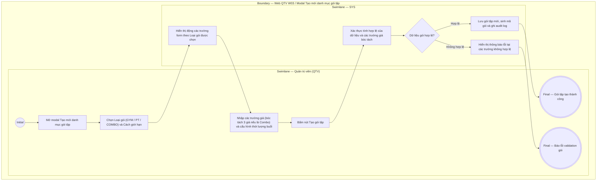

# QTV-W03-US02 - Thêm gói tập

## Preconditions
- QTV đã đăng nhập, có quyền quản lý danh mục gói tập trên Web Portal.

## Trigger
- QTV chọn **Tạo mới gói tập** từ màn hình Web W03.
- Màn hình liên quan: Web QTV — W03 Gói tập, modal **Tạo mới danh mục gói tập**.

## Main Flow

1. QTV mở modal **Tạo mới danh mục gói tập**.
2. QTV chọn **Loại gói** (`GYM`, `PT`, `COMBO`).
3. SYS cập nhật danh sách tùy chọn của trường **Cách giới hạn** tương ứng theo Loại gói.
4. QTV chọn **Cách giới hạn** (với `GYM` chọn `Theo ngày` hoặc `Theo buổi`).
5. SYS điều khiển hiển thị động các trường hạn định và bóc tách giá:
   - Nếu chọn `Cách giới hạn = Theo ngày` (GYM): Hiển thị trường **Thời hạn (ngày)** (bắt buộc); ẩn trường Số lượt Gym và Số buổi PT.
   - Nếu chọn `Cách giới hạn = Theo buổi`:
     + Với `GYM`: Ẩn trường Thời hạn (ngày), hiển thị trường **Số lượt Gym** (bắt buộc).
     + Với `PT`: Ẩn trường Thời hạn (ngày), hiển thị trường **Số buổi PT** (bắt buộc), trường **Hình thức huấn luyện PT** (`1 Kèm 1 Cá nhân` hoặc `1 Kèm Nhiều Nhóm`), trường **Thời lượng buổi tập (phút)** (30, 45, 60, 90, 120 phút).
   - Nếu chọn `COMBO`: Hiển thị trường **Thời hạn (ngày)** (bắt buộc), trường **Số buổi PT** (bắt buộc), **Thời lượng buổi tập (phút)**, và bóc tách **3 trường giá**: `Giá Gym`, `Giá PT` (cơ sở trích hoa hồng PT), và `Giá Combo` thực bán.
6. QTV nhập Tên gói, Giá bán, Chi nhánh áp dụng, Trạng thái bán và Mô tả quyền lợi.
7. QTV chọn **Tạo gói tập**.
8. SYS kiểm tra các trường bắt buộc, tính logic của các trường giá (với Combo: `Giá Combo <= Giá Gym + Giá PT`) và dữ liệu hợp lệ.
9. SYS tạo gói tập mới, tự động sinh mã duy nhất ngầm, lưu danh mục và ghi audit log.

### Field-level specification — modal Tạo mới danh mục gói tập
| Field / control | Loại UI Control | State | Required | Conditional / dynamic | Source / validation |
| :--- | :--- | :--- | :--- | :--- | :--- |
| Loại gói | `Select Dropdown` | `USER-INPUT` | required | `TRIGGER`: Điều khiển danh sách tùy chọn của *Cách giới hạn* (`DYNAMIC`) và hiển thị các trường giá/thời lượng (`CONDITIONAL`) | QTV chọn 1 trong 3 loại: `GYM`, `PT`, `COMBO` |
| Cách giới hạn | `Select Dropdown` | `USER-INPUT` | required | `DYNAMIC`: Luôn hiển thị theo *Loại gói* | `GYM`: chọn `Theo ngày` hoặc `Theo buổi`; `PT`: `Theo buổi` (readonly); `COMBO`: `Theo ngày + buổi` (readonly) |
| Tên gói | `Textbox` | `USER-INPUT` | required | `Không` | QTV nhập tên gói niêm yết (ví dụ: "Gói Gym 1 tháng", "PT 1-1 10 buổi", "Combo Pro 3 tháng Gym + 12 buổi PT") |
| Thời hạn (ngày) | `Number Input` | `USER-INPUT` | conditional | `CONDITIONAL`: • **Hiện khi**: `Cách giới hạn = Theo ngày` (gói GYM) hoặc `Theo ngày + buổi` (gói COMBO) • **Ẩn khi**: `Cách giới hạn = Theo buổi` (`Loại gói = PT` hoặc `Loại gói = GYM` giới hạn theo buổi) • **Bắt buộc khi**: Hiển thị trên form | Số ngày hiệu lực của gói |
| Số lượt Gym | `Number Input` | `USER-INPUT` | conditional | `CONDITIONAL`: • **Hiện khi**: `Loại gói = GYM` và `Cách giới hạn = Theo buổi` • **Ẩn khi**: Các trường hợp khác | Số lượt check-in vào tập Gym |
| Số buổi PT | `Number Input` | `USER-INPUT` | conditional | `CONDITIONAL`: • **Hiện khi**: `Loại gói = PT` hoặc `COMBO` • **Ẩn khi**: `Loại gói = GYM` | Số buổi tập cùng HLV cá nhân |
| Hình thức tập PT | `Select Dropdown` | `USER-INPUT` | conditional | `CONDITIONAL`: • **Hiện khi**: `Loại gói = PT` • **Ẩn khi**: `Loại gói = GYM` hoặc `COMBO` | Chọn: `Gói 1-1 (Cá nhân)` hoặc `Gói 1-Nhiều (Nhóm cùng 1 PT)` |
| Thời lượng buổi tập (phút) | `Select Dropdown` | `USER-INPUT` | conditional | `CONDITIONAL`: • **Hiện khi**: `Loại gói = PT` hoặc `COMBO` • **Ẩn khi**: `Loại gói = GYM` | Cấu hình thời lượng 1 buổi PT: `60 phút` (mặc định), `90 phút`, `120 phút` để hội viên đặt lịch linh động |
| Giá Gym bóc tách | `Currency Input` | `USER-INPUT` | conditional | `CONDITIONAL`: • **Hiện khi**: `Loại gói = COMBO` • **Ẩn khi**: `Loại gói = GYM` hoặc `PT` | Giá trị phần tập Gym trong gói combo |
| Giá PT bóc tách | `Currency Input` | `USER-INPUT` | conditional | `CONDITIONAL`: • **Hiện khi**: `Loại gói = COMBO` • **Ẩn khi**: `Loại gói = GYM` hoặc `PT` | Giá trị phần tập PT trong gói combo (căn cứ trích hoa hồng cho PT) |
| Giá bán niêm yết | `Currency Input` | `USER-INPUT` | required | `Không` | Giá bán gói Gym/PT hoặc Giá trọn gói Combo (`combo_price`); bắt buộc > 0 |
| Chi nhánh áp dụng | `Multi-select Dropdown` | `USER-INPUT` | required | `Không` | Chọn chi nhánh được phép kinh doanh gói |
| Trạng thái bán | `Select Dropdown` | `USER-INPUT` | required | `Không` | `Đang bán` hoặc `Ngừng bán` |
| Mô tả quyền lợi | `Textarea` | `USER-INPUT` | optional | `Không` | Mô tả hiển thị trên thẻ gói cho khách xem |

## Alternate Flows

### AF-01 - Hủy Thao Tác
1. QTV chọn **Hủy** hoặc nút **X**.
2. SYS đóng modal và không lưu dữ liệu.

## Exception Flows
- **Thiếu thông tin bắt buộc hoặc Giá bán <= 0:** SYS báo lỗi tại trường tương ứng.
- **Giá Combo lớn hơn tổng 2 giá thành phần:** SYS cảnh báo nếu Giá bán combo > Giá Gym + Giá PT.

## Activity Diagram — Swimlane
**Trigger:** QTV chọn Tạo mới gói tập trong menu W03.

