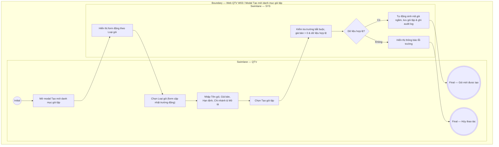

# QTV-W03-US02 - Thêm gói tập

## Preconditions
- QTV đã đăng nhập, có quyền quản lý danh mục gói tập.

## Trigger
- QTV chọn **Tạo mới gói tập** từ màn hình Web W03.
- Màn hình liên quan: Web QTV — W03 Gói tập, modal **Tạo mới danh mục gói tập**.

## Main Flow

1. QTV mở modal **Tạo mới danh mục gói tập**.
2. QTV chọn **Loại gói** (`GYM`, `PT`, `COMBO`).
3. SYS tự động cập nhật danh sách tùy chọn của trường **Cách giới hạn** tương ứng theo Loại gói.
4. QTV chọn **Cách giới hạn** (ví dụ: với GYM chọn `Theo ngày` hoặc `Theo buổi`).
5. SYS tự động điều khiển hiển thị động các trường nhập hạn định (Thời hạn, Số lượt Gym, Số buổi PT) theo cặp Loại gói & Cách giới hạn.
6. QTV nhập Tên gói (ví dụ: "Gói 1 tháng", "Gói PT 10 buổi"), Giá bán, Chi nhánh áp dụng, Trạng thái bán, Mô tả quyền lợi và thông tin hạn định.
7. QTV chọn **Tạo gói tập**.
8. SYS kiểm tra các trường bắt buộc, giá bán lớn hơn 0 và dữ liệu hợp lệ.
9. SYS tạo gói tập mới, tự động sinh mã duy nhất ngầm, lưu danh mục và ghi audit log.

### Field-level specification — modal Tạo mới danh mục gói tập
| Field / control | Loại UI Control | State | Required | Conditional / dynamic | Source / validation |
| :--- | :--- | :--- | :--- | :--- | :--- |
| Loại gói | `Select Dropdown` | `USER-INPUT` | required | `TRIGGER`: Điều khiển danh sách tùy chọn của *Cách giới hạn* (`DYNAMIC`) và điều kiện ẩn/hiện các trường hạn định (`CONDITIONAL`) | QTV chọn 1 trong 3 nhóm dịch vụ: `GYM`, `PT`, `COMBO` |
| Cách giới hạn | `Select Dropdown` | `USER-INPUT` | required | `DYNAMIC`: Luôn hiển thị, danh sách tùy chọn bên trong thay đổi theo *Loại gói* (`TRIGGER`) | • Khi chọn `GYM`: Cho phép chọn `Theo ngày` hoặc `Theo buổi` • Khi chọn `PT`: Cố định `Theo buổi` • Khi chọn `COMBO`: Cố định `Theo ngày + buổi` |
| Tên gói | `Textbox` | `USER-INPUT` | required | Không | QTV nhập tên gói niêm yết (ví dụ: "Gói 1 tháng", "Gói Gym 10 lượt", "Gói PT 10 buổi", "Combo Gym 3 tháng + PT 10 buổi") |
| Thời hạn (ngày) | `Number Input` | `USER-INPUT` | conditional | `CONDITIONAL`: • **Hiện khi**: Luôn hiển thị trên form • **Bắt buộc khi**: Cách giới hạn là `Theo ngày`, `Theo buổi (PT)`, `Theo ngày + buổi` • **Tùy chọn khi**: `Loại gói = GYM` và `Cách giới hạn = Theo buổi` | QTV nhập số ngày hiệu lực của gói (ví dụ: "30", "90", "365") |
| Số lượt Gym | `Number Input` | `USER-INPUT` | conditional | `CONDITIONAL`: • **Hiện khi**: `Loại gói = GYM` và `Cách giới hạn = Theo buổi` (bắt buộc) • **Ẩn khi**: `Loại gói = GYM` + `Theo ngày`; hoặc `Loại gói = PT` / `COMBO` | QTV nhập số lượt được check-in vào tập Gym (ví dụ: "10", "20") |
| Số buổi PT | `Number Input` | `USER-INPUT` | conditional | `CONDITIONAL`: • **Hiện khi**: `Loại gói = PT` hoặc `COMBO` (bắt buộc) • **Ẩn khi**: `Loại gói = GYM` (cả Theo ngày và Theo buổi) | QTV nhập số buổi tập cùng HLV cá nhân (ví dụ: "10", "20") |
| Giá bán | `Currency Input (VND)` | `USER-INPUT` | required | Không | QTV nhập giá niêm yết (ví dụ: "2.000.000"); bắt buộc số > 0 |
| Chi nhánh áp dụng | `Multi-select Dropdown` | `USER-INPUT` | required | Không | QTV chọn 1 hoặc nhiều chi nhánh được phép áp dụng gói thuộc branch scope (hỗ trợ tìm kiếm, tích chọn nhiều chi nhánh hoặc chọn "Tất cả chi nhánh"; các chi nhánh đã chọn hiển thị dạng tag/chip) |
| Trạng thái bán | `Select Dropdown` | `USER-INPUT` | required | Không | QTV chọn trạng thái (`Đang bán` / `Ngừng bán`); mặc định `Đang bán` |
| Mô tả quyền lợi | `Textarea` | `USER-INPUT` | optional | Không | QTV nhập mô tả ngắn hiển thị trên thẻ gói khi hội viên xem trên mobile app |

- **Business rules / logic:**
  - **Dynamic Form Fields theo Loại gói & Cách giới hạn**:
    - **`GYM` + `Theo ngày`**: Form hiển thị trường `Thời hạn (ngày)` (bắt buộc). Ẩn các trường số buổi (quyền vào Gym là không giới hạn trong thời hạn gói).
    - **`GYM` + `Theo buổi`**: Form hiển thị trường `Số lượt Gym` (bắt buộc) và `Thời hạn (ngày)` (tùy chọn thời hạn sử dụng các lượt này).
    - **`PT` + `Theo buổi`**: Form hiển thị trường `Số buổi PT` (bắt buộc) và `Thời hạn (ngày)` (bắt buộc thời hạn hoàn thành các buổi PT).
    - **`COMBO` + `Theo ngày + buổi`**: Form hiển thị cả 2 trường `Thời hạn (ngày)` (thời hạn tập Gym) và `Số buổi PT` (bắt buộc).
  - Tên gói là tên gọi thương mại do QTV tự đặt, không phải là loại gói.
  - Mã gói tập do SYS tự động khởi tạo ngầm sau khi lưu, không xuất hiện trên Modal UI.

## Alternate Flows

### AF-01 - Hủy Thao Tác
1. QTV chọn **Hủy** hoặc nút **X**.
2. SYS đóng modal và không lưu dữ liệu.

## Exception Flows
- Thiếu thông tin bắt buộc hoặc Giá bán <= 0: SYS từ chối lưu và báo lỗi tại trường tương ứng.

## Activity Diagram — Swimlane
**Trigger:** QTV chọn Tạo mới gói tập trong menu W03.

