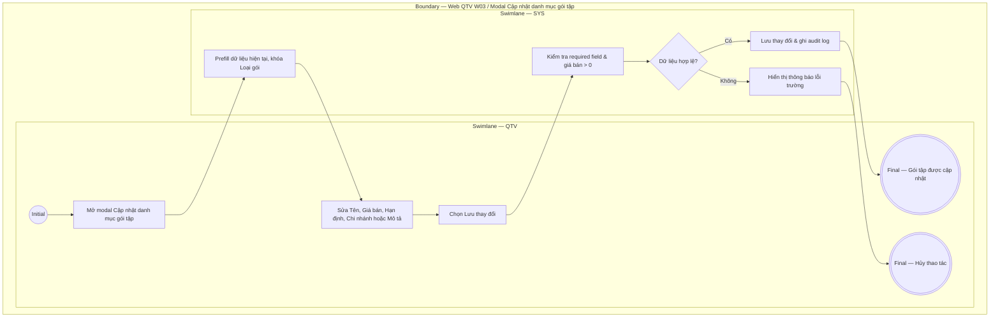

# QTV-W03-US03 - Sửa gói tập

## Preconditions
- QTV đã đăng nhập, gói tập đã tồn tại trong danh mục W03.

## Trigger
- QTV chọn một gói tập và bấm **Sửa gói tập** từ màn hình Web W03.
- Màn hình liên quan: Web QTV — W03 Gói tập, modal **Cập nhật danh mục gói tập**.

## Main Flow

1. QTV mở modal **Cập nhật danh mục gói tập** (Form prefill toàn bộ dữ liệu hiện tại của gói).
2. SYS khóa cố định không cho sửa **Loại gói** và **Cách giới hạn** để đảm bảo toàn vẹn mô hình tính toán.
3. QTV cập nhật các thông tin được phép (Tên gói, Thời hạn, Số buổi PT/Gym, Giá bán, Chi nhánh áp dụng, Trạng thái bán, Mô tả quyền lợi).
4. QTV chọn **Lưu thay đổi**.
5. SYS kiểm tra required field, định dạng dữ liệu và giá bán > 0.
6. SYS lưu cập nhật gói tập và ghi audit log.

### Field-level specification — modal Cập nhật danh mục gói tập
| Field / control | Loại UI Control | State | Required | Conditional / dynamic | Source / validation |
| :--- | :--- | :--- | :--- | :--- | :--- |
| Loại gói | `Readonly Text` | `READONLY (PREFILL)` | required | `TRIGGER`: Căn cứ dữ liệu cố định của gói, điều khiển ẩn/hiện các trường hạn định (`CONDITIONAL`) | Hiển thị loại gói hiện tại (`GYM`, `PT`, `COMBO`), khóa cứng không được sửa |
| Cách giới hạn | `Readonly Text` | `READONLY (PREFILL)` | required | Không | Hiển thị cách giới hạn hiện tại (`Theo ngày`, `Theo buổi`, `Theo ngày + buổi`), khóa cứng không được sửa |
| Tên gói | `Textbox` | `USER-INPUT` | required | Không | Giá trị hiện tại `PREFILL`, QTV có thể cập nhật tên thương mại (ví dụ: "Gói 1 tháng", "Gói PT 10 buổi") |
| Thời hạn (ngày) | `Number Input` | `USER-INPUT` | conditional | `CONDITIONAL`: • **Hiện khi**: Cách giới hạn của gói là `Theo ngày` (gói GYM) hoặc `Theo ngày + buổi` (gói COMBO) • **Ẩn khi**: Cách giới hạn của gói là `Theo buổi` (`Loại gói = PT` hoặc `Loại gói = GYM` giới hạn theo buổi) • **Bắt buộc khi**: Hiển thị trên form | Giá trị hiện tại `PREFILL`, QTV cập nhật số ngày hiệu lực |
| Số lượt Gym | `Number Input` | `USER-INPUT` | conditional | `CONDITIONAL`: • **Hiện khi**: `Loại gói = GYM` và `Cách giới hạn = Theo buổi` • **Ẩn khi**: `Loại gói = GYM` + `Theo ngày`; hoặc `Loại gói = PT` / `COMBO` | Giá trị hiện tại `PREFILL`, QTV cập nhật số lượt |
| Số buổi PT | `Number Input` | `USER-INPUT` | conditional | `CONDITIONAL`: • **Hiện khi**: `Loại gói = PT` hoặc `COMBO` • **Ẩn khi**: `Loại gói = GYM` (cả Theo ngày và Theo buổi) | Giá trị hiện tại `PREFILL`, QTV cập nhật số buổi PT |
| Thời lượng buổi tập (phút) | `Select Dropdown` | `USER-INPUT` | conditional | `CONDITIONAL`: • **Hiện khi**: `Loại gói = PT` hoặc `COMBO` • **Ẩn khi**: `Loại gói = GYM` | Thời lượng 1 buổi PT: `30`, `45`, `60`, `90`, `120` phút |
| Hình thức huấn luyện PT | `Select Dropdown` | `USER-INPUT` | conditional | `CONDITIONAL`: • **Hiện khi**: `Loại gói = PT` hoặc `COMBO` • **Ẩn khi**: `Loại gói = GYM` | Chọn `1 Kèm 1 (Cá nhân)` hoặc `1 Kèm Nhiều (Nhóm)` |
| Số học viên tối đa trong nhóm | `Number Input` | `USER-INPUT` | conditional | `CONDITIONAL`: • **Hiện khi**: (`Loại gói = PT` hoặc `COMBO`) và `Hình thức = 1 Kèm Nhiều` • **Ẩn khi**: Các trường hợp khác | Giới hạn từ 2 đến 10 học viên |
| Tổng giá bán niêm yết (VND) | `Currency Input (VND)` | `USER-INPUT` | required | Không | Giá trị hiện tại `PREFILL`, kiểm tra số > 0 |
| Giá thành phần Gym bóc tách (VND) | `Currency Input (VND)` | `USER-INPUT` | conditional | `CONDITIONAL`: • **Hiện khi**: `Loại gói = COMBO` • **Ẩn khi**: `Loại gói = GYM` hoặc `PT` | Cập nhật giá trị phần Gym trong gói combo |
| Giá thành phần PT bóc tách (VND) | `Currency Input (VND)` | `USER-INPUT` | conditional | `CONDITIONAL`: • **Hiện khi**: `Loại gói = COMBO` • **Ẩn khi**: `Loại gói = GYM` hoặc `PT` | Cập nhật giá trị phần PT trong gói combo (căn cứ trích hoa hồng HLV) |
| Chi nhánh áp dụng | `Multi-select Dropdown` | `USER-INPUT` | required | Không | Prefill danh sách chi nhánh hiện tại; QTV có thể thêm/bớt các chi nhánh áp dụng trong branch scope (hiển thị dạng tag/chip) |
| Trạng thái bán | `Select Dropdown` | `USER-INPUT` | required | Không | QTV chọn trạng thái (`Đang bán` / `Ngừng bán`) |
| Mô tả quyền lợi | `Textarea` | `USER-INPUT` | optional | Không | QTV cập nhật nội dung ngắn hiển thị trên thẻ gói mobile |

- **Business rules / logic:**
  - `Loại gói` (`GYM`/`PT`/`COMBO`) và `Cách giới hạn` là cố định (`READONLY`), không được phép sửa sau khi tạo để bảo đảm tính toàn vẹn của mô hình dịch vụ.
  - Các trường hạn định (Thời hạn, Số lượt Gym, Số buổi PT) tự động hiển thị tương ứng theo cặp Loại gói & Cách giới hạn của bản ghi.
  - Sửa giá/điều kiện gói chỉ có hiệu lực với các lần mua/gia hạn mới; các đăng ký cũ giữ nguyên dữ liệu đã snapshot.

## Alternate Flows

### AF-01 - Hủy Thao Tác
1. QTV chọn **Hủy** hoặc nút **X**.
2. SYS đóng modal và giữ nguyên dữ liệu cũ.

## Exception Flows
- Sửa giá <= 0 hoặc bỏ trống trường bắt buộc: SYS từ chối lưu và hiển thị lỗi.

## Activity Diagram — Swimlane
**Trigger:** QTV chọn Sửa gói tập trong menu W03.

