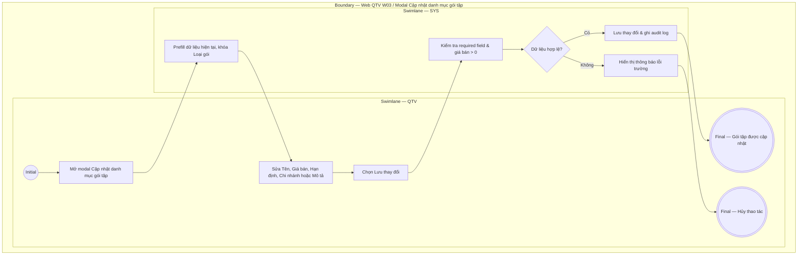

# QTV-W03-US03 - Sửa gói tập

## Preconditions
- QTV đã đăng nhập, gói tập đã tồn tại trong danh mục W03.

## Trigger
- QTV chọn một gói tập và bấm **Sửa gói tập** từ màn hình Web W03.
- Màn hình liên quan: Web QTV — W03 Gói tập, modal **Cập nhật danh mục gói tập**.

## Main Flow

1. QTV mở modal **Cập nhật danh mục gói tập** (Form prefill dữ liệu hiện tại).
2. QTV cập nhật các thông tin được phép (Tên gói, Cách giới hạn, Thời hạn, Số buổi PT/Gym, Giá bán, Chi nhánh áp dụng, Trạng thái bán, Mô tả quyền lợi).
3. QTV chọn **Lưu thay đổi**.
4. SYS kiểm tra required field, định dạng dữ liệu và giá bán > 0.
5. SYS lưu cập nhật gói tập và ghi audit log.

### Field-level specification — modal Cập nhật danh mục gói tập
| Field / control | State | Required | Conditional / dynamic | Source / validation |
| --- | --- | --- | --- | --- |
| Tên gói | `USER-INPUT` | required | Không | Giá trị hiện tại `PREFILL`, QTV cập nhật |
| Loại gói | `READONLY (PREFILL)` | required | Không | Trường cố định: hiển thị loại gói hiện tại, không được phép sửa |
| Cách giới hạn | `USER-INPUT` | required | `DYNAMIC`: khớp với loại gói | QTV cập nhật hoặc giữ nguyên |
| Thời hạn | `USER-INPUT` | optional | `CONDITIONAL`: theo loại gói | QTV cập nhật số ngày hiệu lực |
| Số buổi PT / Gym | `USER-INPUT` | optional | `CONDITIONAL`: chỉ hiển thị với gói theo buổi/Combo | QTV cập nhật số lượng buổi |
| Giá bán | `USER-INPUT` | required | Không | Giá trị hiện tại `PREFILL`, kiểm tra số > 0 |
| Chi nhánh áp dụng | `USER-INPUT` | required | `DYNAMIC`: chọn chi nhánh áp dụng | QTV chọn chi nhánh thuộc branch scope |
| Trạng thái bán | `USER-INPUT` | required | Không | QTV chọn trạng thái (`Đang bán` / `Ngừng bán`) |
| Mô tả quyền lợi | `USER-INPUT` | optional | Không | QTV cập nhật nội dung ngắn hiển thị trên thẻ gói mobile |

- **Business rules / logic:**
  - Loại gói là cố định, không được phép sửa sau khi tạo.
  - Gói Gym mặc định cấp quyền vào tập Gym không giới hạn trong thời hạn gói, không cần trường nhập riêng.
  - Sửa giá/điều kiện gói chỉ có hiệu lực với các lần mua/gia hạn mới; các đăng ký cũ giữ nguyên dữ liệu đã snapshot.

## Alternate Flows

### AF-01 - Hủy Thao Tác
1. QTV chọn **Hủy** hoặc nút **X**.
2. SYS đóng modal và giữ nguyên dữ liệu cũ.

## Exception Flows
- Sửa giá <= 0 hoặc bỏ trống trường bắt buộc: SYS từ chối lưu và hiển thị lỗi.

## Activity Diagram — Swimlane
**Trigger:** QTV chọn Sửa gói tập trong menu W03.

