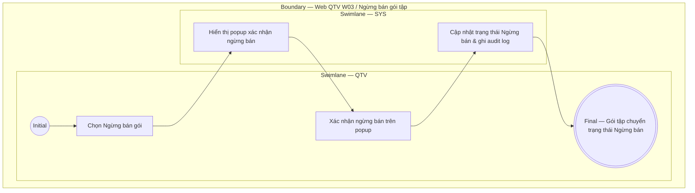

# QTV-W03-US04 - Ngừng bán gói

## Preconditions
- QTV đã đăng nhập, gói tập đang ở trạng thái Đang bán (`ACTIVE`).

## Trigger
- QTV chọn một gói tập trong danh sách W03 và bấm **Ngừng bán gói**.
- Màn hình liên quan: Web QTV — W03 Gói tập.

## Main Flow

1. QTV chọn **Ngừng bán gói** trên danh sách W03.
2. SYS hiển thị popup xác nhận ngừng bán gói tập.
3. QTV chọn **Xác nhận**.
4. SYS cập nhật trạng thái gói tập thành `Ngừng bán`, dừng không cho đăng ký mới và ghi audit log.

- **Business rules / logic:**
  - Ngừng bán gói chỉ ngăn chặn việc tạo đăng ký/gia hạn mới đối với gói này.
  - Tất cả các đăng ký đã bán từ trước vẫn hoạt động bình thường theo đúng snapshot ban đầu.

## Alternate Flows

### AF-01 - Hủy Thao Tác
1. QTV chọn **Hủy** trên popup xác nhận.
2. SYS đóng popup và giữ nguyên trạng thái Đang bán của gói tập.

## Exception Flows
- Gói tập không tồn tại hoặc đã ở trạng thái Ngừng bán: SYS từ chối thao tác.

## Activity Diagram — Swimlane
**Trigger:** QTV chọn Ngừng bán gói trong menu W03.

