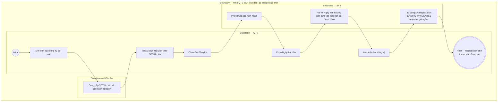

# QTV-W04-US01 - Tạo đăng ký gói mới

## Preconditions
- QTV đã đăng nhập, hội viên đã có hồ sơ hợp lệ trên hệ thống và có ít nhất một gói tập đang mở bán (`selling`).
- QTV thao tác trong phạm vi chi nhánh được phân quyền (branch scope).

## Trigger
- QTV chọn nút **Tạo đăng ký gói mới** tại màn hình W04 Đăng ký & gia hạn.
- Màn hình liên quan: Web QTV — W04 Đăng ký & gia hạn, modal **Tạo đăng ký gói mới**.

## Main Flow

1. QTV mở form **Tạo đăng ký gói mới**.
2. Hội viên cung cấp SĐT hoặc Họ tên; QTV nhập tra cứu và chọn Hội viên.
3. Hội viên cho biết gói muốn đăng ký; QTV chọn Gói đăng ký.
4. SYS tự động pre-fill **Giá gốc hiện hành**.
5. QTV chọn **Ngày bắt đầu**.
6. SYS tự động pre-fill **Ngày kết thúc dự kiến** dựa theo thời hạn của gói được chọn.
7. QTV chọn **Xác nhận lưu đăng ký**.
8. SYS tạo bản ghi đăng ký (`Registration` ở trạng thái `PENDING_PAYMENT`), snapshot giá/quyền lợi và tự động ghi nhận Chi nhánh bán ngầm.

### Field-level specification — modal Tạo đăng ký gói mới
| Field / control | State | Required | Conditional / dynamic | Source / validation |
| --- | --- | --- | --- | --- |
| Hội viên | `USER-INPUT` | required | `DYNAMIC`: tìm kiếm realtime theo SĐT hoặc Họ tên hội viên | `MEMBER_PROFILE` thuộc branch scope |
| Gói đăng ký | `USER-INPUT` | required | `DYNAMIC`: danh sách gói hiện đang mở bán | Package catalog đang `ACTIVE` |
| Ngày bắt đầu | `USER-INPUT` | required | Mặc định ngày hôm nay hoặc chọn ngày tùy chỉnh | QTV chọn định dạng `DD/MM/YYYY` |
| Ngày kết thúc dự kiến [AUTO] | `READONLY (AUTO-FILL)` | optional | `DYNAMIC`: tự động tính toán = Ngày bắt đầu + Thời hạn gói | SYS tự động tính toán |
| Giá gốc hiện hành | `READONLY (PREFILL)` | optional | `DYNAMIC`: tự động lấy giá niêm yết của gói đăng ký được chọn | Snapshot từ Package catalog |

- **Business rules / logic:**
  - **Chi nhánh bán**: Được tự động ghi nhận ngầm trong dữ liệu đăng ký và audit log theo chi nhánh của tài khoản QTV đang thao tác, không hiển thị trên Modal UI.
  - **Trạng thái đăng ký ban đầu**: Đăng ký mới luôn bắt đầu ở trạng thái **`PENDING_PAYMENT` (Chờ thanh toán)**. Đăng ký chưa thanh toán đủ 100% không được dùng để Check-in hoặc đặt lịch PT.
  - **Phân công PT**: Với gói PT hoặc Combo, thuộc tính PT phụ trách ban đầu để trống, chờ hội viên gửi yêu cầu chọn PT (assignment request) và được PT chấp nhận (`ACCEPT`) sau khi đã thanh toán 100%.

## Alternate Flows

### AF-01 - Hủy Thao Tác
1. QTV chọn **Hủy** hoặc nút **X**.
2. SYS đóng modal và không tạo đăng ký.

## Exception Flows
- Chưa chọn hội viên hoặc chưa chọn gói đăng ký: SYS chặn không cho lưu đăng ký.
- Gói tập đã ngừng bán: SYS không hiển thị trong danh sách lựa chọn.

## Activity Diagram — Swimlane
**Trigger:** QTV chọn Tạo đăng ký gói mới trong menu W04.

