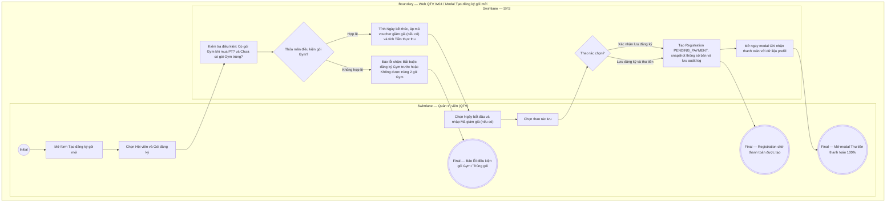

# QTV-W04-US01 - Tạo đăng ký gói mới

## Preconditions
- QTV đã đăng nhập vào Web Portal và được phân quyền tạo hợp đồng đăng ký gói tập.
- Hội viên đã có hồ sơ cá nhân (`ACTIVE`) trên hệ thống.
- Chi nhánh có danh mục gói tập đang mở bán (`ACTIVE`).

## Trigger
- QTV chọn nút **Tạo đăng ký gói mới** tại màn hình W04 Đăng ký & gia hạn.
- Màn hình liên quan: Web QTV — W04 Đăng ký & gia hạn, modal **Tạo đăng ký gói mới**.

## Main Flow

1. QTV mở modal **Tạo đăng ký gói mới**.
2. QTV tra cứu và chọn Hội viên theo SĐT hoặc Họ tên.
3. QTV chọn Gói đăng ký từ danh mục đang mở bán.
4. SYS thực hiện kiểm tra 2 điều kiện nghiệp vụ cốt lõi:
   - **Điều kiện 1 (Quy tắc 1 gói Gym duy nhất):** Nếu gói chọn là gói GYM hoặc Combo và hội viên hiện đang có 1 gói Gym khác đang có hiệu lực (`ACTIVE`), SYS cảnh báo và hướng dẫn chuyển sang chức năng Gia hạn gói nối tiếp (không cho phép 2 gói Gym hiệu lực song song).
   - **Điều kiện 2 (Điều kiện mua gói PT):** Nếu gói chọn là gói PT thuần mà hội viên **chưa có gói GYM nào còn hiệu lực**, SYS lập tức chặn lưu và hiển thị thông báo: *"Hội viên bắt buộc phải đăng ký gói Gym đang còn hiệu lực thì mới được mua gói PT"*.
5. QTV chọn **Ngày bắt đầu** hiệu lực của gói. SYS tự động tính toán **Ngày kết thúc dự kiến** (đối với gói tính theo ngày/Combo = Ngày bắt đầu + Thời hạn ngày; đối với gói tính theo buổi vô thời hạn thì không có ngày kết thúc, hiển thị là `--`) và hiển thị giá gốc niêm yết (bóc tách 3 giá nếu là Combo).
6. QTV có thể nhập **Mã giảm giá / Khuyến mãi (Voucher)** (nếu có). SYS kiểm tra mã hợp lệ và tính số tiền được giảm trừ cùng số tiền thực thu cần thanh toán.
7. QTV lựa chọn một trong hai thao tác hoàn tất:
   - **Xác nhận lưu đăng ký**: Lưu bản ghi đăng ký ở trạng thái `PENDING_PAYMENT` (Chờ thanh toán 100%), không mở modal thanh toán ngay.
   - **Lưu đăng ký và thu tiền**: Lưu bản ghi đăng ký và tự động chuyển tiếp mở ngay modal **Ghi nhận thanh toán** (W08) với đầy đủ thông tin prefill để thu tiền 100% ngay tại quầy.
8. SYS tạo bản ghi hợp đồng đăng ký (`Registration` ở trạng thái `PENDING_PAYMENT`), đóng băng snapshot toàn bộ thông số bán (đơn giá, chiết khấu, giá Gym, giá PT, thời hạn, số buổi, chi nhánh bán) và lưu audit log.
   - **Quy trình luân chuyển trạng thái hợp đồng:**
     * **Khởi tạo:** Đơn đăng ký mới tạo luôn ở trạng thái `Chờ thanh toán` (`PENDING_PAYMENT`). Ở trạng thái này chưa cho phép gán PT phụ trách.
     * **Sau khi thanh toán đủ 100%:**
       + Nếu `Ngày bắt đầu` (`start_date`) sau ngày hiện tại (`> ngày hiện tại`): chuyển sang trạng thái `Chưa đến ngày hiệu lực` (`SCHEDULED`).
       + Nếu `Ngày bắt đầu` (`start_date`) là hôm nay hoặc đã đến hạn (`<= ngày hiện tại`): chuyển sang trạng thái `Đang hiệu lực` (`ACTIVE`).
     * **Quyền gán PT phụ trách:** Ngay khi đơn chuyển sang `Chưa đến ngày hiệu lực` (`SCHEDULED`), QTV/Lễ tân hoặc Hội viên đã được phép chọn/gán PT phụ trách ngay, miễn là đã hoàn tất thanh toán 100%.
     * **Tự động kích hoạt khi đến hạn:** Đến đúng ngày bắt đầu (`start_date <= ngày hiện tại`), hệ thống tự động chuyển trạng thái đơn đăng ký thành `Đang hiệu lực` (`ACTIVE`).
9. SYS xử lý điều hướng tương ứng:
   - Nếu bấm **Xác nhận lưu đăng ký**: SYS đóng modal, hiển thị thông báo thành công và cập nhật bảng danh sách.
   - Nếu bấm **Lưu đăng ký và thu tiền**: SYS đóng modal đăng ký và tự động mở modal **Ghi nhận thanh toán** đã prefill sẵn đơn đăng ký vừa tạo.

### Field-level specification — modal Tạo đăng ký gói mới
| Field / control | Loại UI Control | State | Required | Conditional / dynamic | Source / validation |
| :--- | :--- | :--- | :--- | :--- | :--- |
| Hội viên | `Search Combobox` | `USER-INPUT` | required | `TRIGGER`: Kiểm tra điều kiện gói Gym hiện tại của hội viên | Nhập SĐT hoặc Họ tên để tra cứu realtime trong `MEMBER_PROFILES` |
| Gói đăng ký | `Select Dropdown` | `USER-INPUT` | required | `TRIGGER`: Điều khiển kiểm tra điều kiện và nạp giá | Danh mục gói đang bán (`ACTIVE`); kiểm tra logic gói Gym/PT |
| Ngày bắt đầu | `Date Picker` | `USER-INPUT` | required | `TRIGGER`: Mốc tính ngày kết thúc dự kiến | Mặc định hôm nay; định dạng `DD/MM/YYYY` |
| Ngày kết thúc dự kiến [AUTO] | `Readonly Text` | `READONLY (AUTO-FILL)` | conditional | `CONDITIONAL` | • Hiện ngày kết thúc khi gói tính theo ngày (`GYM_TIME`, `COMBO`): Tự động tính = `Ngày bắt đầu` + `Thời hạn gói`. • Hiển thị `--` khi gói tính theo buổi (`PT_SESSION`, `GYM_SESSION`): Không giới hạn số ngày (vô thời hạn về thời gian, chỉ kết thúc khi dùng hết số buổi). |
| Giá gốc niêm yết | `Currency Readonly` | `READONLY (PREFILL)` | required | `DYNAMIC` | Giá gốc niêm yết từ cấu hình gói (hiển thị rõ giá Gym và giá PT nếu là Combo) |
| Mã giảm giá / Voucher | `Textbox + Action Button [Áp dụng]` | `USER-INPUT` | optional | `Không` | Nhập mã coupon (ví dụ `VIP10`, `SUMMER2026`); bấm Áp dụng để SYS kiểm tra |
| Số tiền giảm trừ [AUTO] | `Currency Readonly` | `READONLY (AUTO-FILL)` | optional | `DYNAMIC` | Số tiền được giảm tương ứng từ mã voucher (mặc định 0 đ) |
| Số tiền thực thu cần thanh toán | `Currency Readonly (Bold)` | `READONLY (AUTO-FILL)` | required | `DYNAMIC` | = `Giá gốc niêm yết` - `Số tiền giảm trừ`; số tiền bắt buộc thanh toán đủ 100% |

## Alternate Flows

### AF-01 - Áp dụng mã giảm giá thành công
1. QTV nhập mã giảm giá và bấm `Áp dụng`.
2. SYS xác thực mã còn hạn, đúng chi nhánh và chưa vượt giới hạn lượt dùng.
3. SYS hiển thị số tiền giảm trừ và cập nhật lại `Số tiền thực thu cần thanh toán`.

### AF-02 - Hủy thao tác
1. QTV chọn `Hủy` hoặc nút `X`.
2. SYS đóng modal và không lưu bản ghi.

### AF-03 - Lưu đăng ký và thu tiền ngay
1. QTV bấm nút **[Lưu đăng ký và thu tiền]**.
2. SYS xác thực và lưu hợp đồng đăng ký ở trạng thái `PENDING_PAYMENT`.
3. SYS đóng modal đăng ký và tự động mở modal **Ghi nhận thanh toán** (W08) với thông tin đăng ký vừa tạo được prefill sẵn sàng để thu tiền.

## Exception Flows
- **Hội viên mua gói PT nhưng chưa có gói Gym còn hạn:** SYS chặn lưu, hiển thị thông báo lỗi: *"Hội viên chưa có gói Gym có hiệu lực. Vui lòng tạo đăng ký gói Gym trước khi mua gói PT"*.
- **Hội viên sở hữu trùng 2 gói Gym hiệu lực song song:** SYS chặn lưu gói Gym thứ hai và gợi ý dùng chức năng Gia hạn gói nối tiếp thời hạn.
- **Mã giảm giá không hợp lệ hoặc đã hết lượt:** SYS hiển thị thông báo lỗi và giữ nguyên giá gốc niêm yết.

## Activity Diagram — Swimlane
**Trigger:** QTV chọn Tạo đăng ký gói mới trong menu W04.

