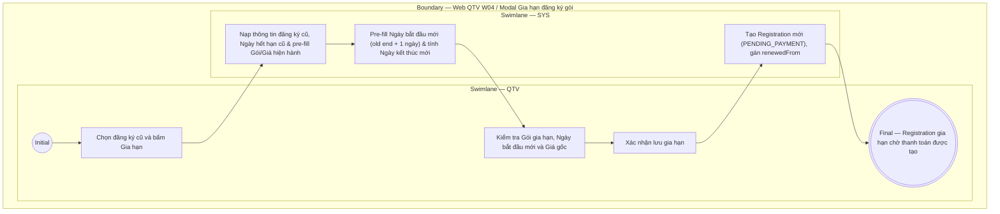

# QTV-W04-US02 - Gia hạn đăng ký gói

## Preconditions
- QTV đã đăng nhập, hội viên có một đăng ký gói trước đó (`Registration` cũ) thuộc chi nhánh được phân quyền (branch scope).
- Gói gia hạn đang ở trạng thái mở bán (`ACTIVE`).

## Trigger
- QTV bấm nút **Gia hạn** tại dòng đăng ký gói trên màn hình W04 Đăng ký & gia hạn.
- Màn hình liên quan: Web QTV — W04 Đăng ký & gia hạn, modal **Gia hạn đăng ký gói**.

## Main Flow

1. QTV chọn **Gia hạn** từ một đăng ký hiện tại của hội viên.
2. SYS nạp thông tin Hội viên, Registration cũ và hiển thị Ngày hết hạn cũ.
3. SYS tự động pre-fill **Gói gia hạn** theo gói cũ (QTV có thể chọn gói khác nếu muốn hoặc nếu gói cũ đã ngừng bán).
4. SYS tự động pre-fill **Giá gốc hiện hành** theo bảng giá niêm yết mới nhất của gói.
5. SYS tự động tính **Ngày bắt đầu mới** (mặc định bằng Ngày hết hạn cũ + 1 ngày).
6. SYS tự động tính toán **Ngày kết thúc mới** dựa trên Ngày bắt đầu mới và thời hạn sử dụng của gói.
7. QTV chọn **Xác nhận lưu gia hạn**.
8. SYS tạo bản ghi đăng ký gia hạn mới (`Registration` ở trạng thái `PENDING_PAYMENT`), liên kết ngầm với hợp đồng cũ (`renewedFrom`), lưu snapshot giá/quyền lợi và tự động ghi nhận Chi nhánh bán ngầm.

### Field-level specification — modal Gia hạn đăng ký gói
| Field / control | State | Required | Conditional / dynamic | Source / validation |
| --- | --- | --- | --- | --- |
| Registration cũ / Hội viên | `READONLY (PREFILL)` | required | `DYNAMIC`: nạp thông tin hội viên & gói cũ | `REGISTRATION` cũ / `MEMBER_PROFILE` |
| Gói gia hạn | `USER-INPUT` / `PREFILL` | required | `DYNAMIC`: mặc định gói cũ, chọn gói khác nếu gói cũ ngừng bán | Package catalog đang `ACTIVE` |
| Ngày hết hạn cũ | `READONLY` | required | Không | Ngày kết thúc của đăng ký cũ |
| Ngày bắt đầu mới | `AUTO-FILL` | required | Mặc định = Ngày hết hạn cũ + 1 ngày; có thể điều chỉnh | SYS tự động tính toán |
| Ngày kết thúc mới [AUTO] | `READONLY (AUTO-FILL)` | optional | `DYNAMIC`: tự động tính toán = Ngày bắt đầu mới + Thời hạn gói | SYS tự động tính toán |
| Giá gốc hiện hành | `READONLY (PREFILL)` | optional | `DYNAMIC`: tự động lấy giá niêm yết mới nhất của gói gia hạn | Snapshot từ Package catalog |

- **Business rules / logic:**
  - **Thanh toán 100%**: Đăng ký gia hạn mới tạo ở trạng thái **`PENDING_PAYMENT` (Chờ thanh toán)**. Phải thanh toán đủ 100% trong 1 lần duy nhất để kích hoạt gói, tuyệt đối không có công nợ hay đóng tiền nhiều lần.
  - **Chi nhánh bán & PT phụ trách**: Chi nhánh bán và thông tin liên kết `renewedFrom` được hệ thống xử lý ngầm. Với gói PT/Combo gia hạn, PT phụ trách không chọn trên modal mà sẽ do hội viên chọn trên mobile app sau khi thanh toán 100%.
  - **Nối tiếp thời hạn**: Ngày bắt đầu của gói gia hạn mặc định nối tiếp ngay sau ngày kết thúc của gói cũ (`old_end_date + 1 ngày`). Số buổi PT gói mới không cộng dồn vào số buổi gói cũ.

## Alternate Flows

### AF-01 - Gia Hạn Khi Gói Cũ Đã Hết Hạn Quá Lâu
1. QTV gia hạn cho đăng ký cũ đã hết hạn từ lâu (`EXPIRED`).
2. QTV có thể tùy chỉnh Ngày bắt đầu mới bằng Ngày hiện tại thay vì nối tiếp quá xa.

## Exception Flows
- Gói cũ đã ngừng bán và không chọn gói gia hạn thay thế: SYS chặn không cho tạo gia hạn.

## Activity Diagram — Swimlane
**Trigger:** QTV chọn Gia hạn tại một đăng ký gói trong menu W04.

