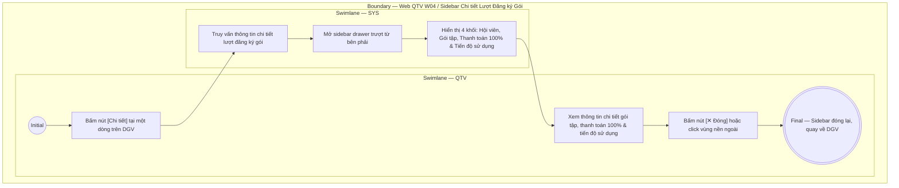

# QTV-W04-US04 - Xem chi tiết lượt đăng ký gói

## Preconditions
- QTV đã đăng nhập hệ thống Web quản lý, có quyền xem danh sách và chi tiết đăng ký.
- Đăng ký gói tập đã tồn tại trên hệ thống và đang hiển thị trên bảng danh sách (Data Grid View).

## Trigger
- QTV bấm nút **Chi tiết** tại một dòng đăng ký trên bảng Data Grid View của menu W04.
- Màn hình liên quan: Web QTV — W04 Đăng ký & gia hạn, sidebar drawer **Chi tiết Lượt Đăng ký Gói**.

## Main Flow

1. QTV bấm nút **Chi tiết** tại một dòng đăng ký trên Data Grid View.
2. SYS mở sidebar drawer **Chi tiết Lượt Đăng ký Gói** trượt từ cạnh phải màn hình.
3. SYS truy vấn thông tin chi tiết của lượt đăng ký gói được chọn.
4. SYS hiển thị thông tin chi tiết phân bổ theo 4 khối trực quan:
   - Header: Mã đăng ký, Badge trạng thái gói và nút Đóng.
   - Khối Hội viên: Avatar, Họ tên, Mã HV, SĐT và Chi nhánh hội viên.
   - Khối Gói tập: Tên gói, Phân loại gói, Kỳ hiệu lực, Chi nhánh áp dụng và Nhân viên tiếp nhận.
   - Khối Thanh toán 100%: Giá trị gói, Trạng thái thanh toán 100% (Phương thức, Thời gian thanh toán hoặc nút Thu tiền ngay nếu đang chờ thanh toán).
   - Khối Quyền lợi & tiến độ sử dụng: Tiến độ ngày tập Gym (kèm progress bar xanh lá) và tiến độ buổi tập PT (kèm progress bar cam).
5. QTV xem các thông tin chi tiết và tiến độ sử dụng dịch vụ của hội viên.
6. QTV bấm nút **✕ Đóng** hoặc click vùng nền ngoài để đóng sidebar drawer.

### Field-level specification — sidebar Chi tiết Lượt Đăng ký Gói
| Field / control | Loại UI Control | State | Required | Conditional / dynamic | Source / validation |
| :--- | :--- | :--- | :--- | :--- | :--- |
| Mã đăng ký | `Readonly Text` | `READONLY` | required | Không | Lấy từ `REGISTRATION.code` (ví dụ: "DK010"); hiển thị chữ to nổi bật trên header |
| Trạng thái gói | `Status Badge` | `READONLY` | required | `DYNAMIC`: theo trạng thái gói | Hiển thị badge viền màu trực quan: `Đang hiệu lực` (viền xanh lá), `Chờ thanh toán` (viền vàng cam), `Đã hết hạn` (viền xám), `Đã hủy` (viền đỏ) |
| Hội viên | `Readonly Text` | `READONLY` | required | Không | Lấy từ `MEMBER_PROFILE.full_name` kèm avatar chữ cái viết tắt (ví dụ: avatar "TB", họ tên "Trần Thị Bình") |
| Mã HV & SĐT | `Readonly Text` | `READONLY` | required | Không | Hiển thị cú pháp `{MEMBER_PROFILE.code} · {MEMBER_PROFILE.phone}` (ví dụ: "HV002 · 0908 111 222") |
| Chi nhánh hội viên | `Readonly Text` | `READONLY` | required | Không | Tên chi nhánh sinh hoạt của hội viên từ `BRANCH.name` (ví dụ: "Quận 1") |
| Tên gói tập | `Readonly Text` | `READONLY` | required | Không | Tiêu đề gói niêm yết từ `PACKAGE.name` (ví dụ: "Combo Gym 3 tháng + PT 10 buổi") |
| Phân loại gói | `Readonly Text / Badge` | `READONLY` | required | `DYNAMIC`: theo loại gói | Badge hiển thị loại hình: `GYM`, `PT`, hoặc `COMBO` |
| Kỳ hiệu lực | `Readonly Text / Date` | `READONLY` | required | Không | Hiển thị khoảng ngày `Kỳ hiệu lực: {start_date} → {end_date}` theo định dạng `DD/MM/YYYY` (ví dụ: "07/09/2026 → 05/12/2026") |
| Chi nhánh áp dụng | `Readonly Text` | `READONLY` | required | Không | Danh sách chi nhánh được phép sử dụng gói (ví dụ: "Quận 1" hoặc "Toàn hệ thống") |
| Nhân viên tiếp nhận | `Readonly Text` | `READONLY` | required | Không | Họ tên nhân viên tạo đăng ký từ `ACCOUNT.full_name` (ví dụ: "Lê Văn Lễ Tân") |
| Số tiền gói (100%) | `Currency Readonly Text (VND)` | `READONLY` | required | Không | Giá trị trọn gói 100% từ `REGISTRATION.price` (ví dụ: "3.200.000 đ"); hệ thống thu đủ 100% 1 lần duy nhất, không áp dụng công nợ |
| Trạng thái thanh toán | `Readonly Text / Badge` | `READONLY` | required | `DYNAMIC`: theo trạng thái thanh toán 100% | • Khi đã thanh toán: Hiển thị badge xanh `Đã thanh toán 100%`, phương thức (`Tiền mặt` hoặc `Chuyển khoản`) và ngày giờ hoàn tất thanh toán • Khi chưa thanh toán: Hiển thị badge vàng `Chờ thanh toán 100%` kèm nút nhanh `[Thu tiền ngay]` |
| Quyền tập Gym | `Readonly Text + Progress Bar` | `READONLY` | conditional | `CONDITIONAL`: • **Hiện khi**: `Loại gói = GYM` hoặc `COMBO` • **Ẩn khi**: `Loại gói = PT` | Hiển thị số ngày còn lại (ví dụ: "Còn 78 ngày"), thanh Progress bar xanh lá thể hiện tỷ lệ ngày đã trôi qua, thông tin chi tiết: "Đã trôi qua: X ngày · Tổng hạn: Y ngày", kèm tổng số lượt check-in thực tế |
| Quyền huấn luyện PT | `Readonly Text + Progress Bar` | `READONLY` | conditional | `CONDITIONAL`: • **Hiện khi**: `Loại gói = PT` hoặc `COMBO` • **Ẩn khi**: `Loại gói = GYM` | Hiển thị số buổi còn lại (ví dụ: "Còn 6 buổi"), thanh Progress bar cam thể hiện tỷ lệ buổi tập hoàn thành, thông tin chi tiết: "Đã tập: X buổi · Tổng cấp: Y buổi", thông tin HLV: "HLV phụ trách: {Tên PT} ({Mã PT})" nếu đã phân công, hoặc "Chưa có PT phụ trách" kèm nút **`[Gán PT phụ trách]`** (nhấn mở modal `QTV-W04-US05`) nếu chưa phân công |

- **Business rules / logic:**
  - Hệ thống áp dụng chính sách **thanh toán 100% 1 lần duy nhất** để kích hoạt gói tập; không tồn tại khái niệm công nợ, nợ tồn hay thanh toán trả góp nhiều lần.
  - Toàn bộ các trường dữ liệu trên sidebar drawer là chỉ đọc (`READONLY`), phục vụ tra cứu chi tiết thông tin gói và quyền lợi của hội viên.
  - Không cần kiểm tra lại branch scope khi mở drawer vì danh sách trên Data Grid View vốn dĩ đã được hệ thống phân quyền lọc sẵn theo branch scope của tài khoản.
  - Tiến độ ngày tập Gym được hệ thống tự động tính toán theo thời gian thực: `Số ngày đã qua = Ngày hiện tại - Ngày bắt đầu` và `Số ngày còn lại = Ngày kết thúc - Ngày hiện tại`.
  - Tiến độ buổi tập PT được cập nhật tự động sau mỗi buổi tập PT được xác nhận kép hoàn thành giữa Hội viên và Huấn luyện viên.
  - Hiển thị động theo loại gói:
    + Gói `GYM`: Ẩn hoàn toàn khối Quyền huấn luyện PT.
    + Gói `PT`: Ẩn hoàn toàn khối Quyền tập Gym.
    + Gói `COMBO`: Hiển thị song song cả 2 khối Gym và PT.

## Alternate Flows

### AF-01 - Đóng Drawer
1. QTV bấm nút **✕ Đóng** trên góc phải sidebar hoặc click chuột vào vùng nền mờ bên ngoài.
2. SYS đóng sidebar drawer và giữ nguyên vị trí dòng dữ liệu trên bảng Data Grid View.

## Exception Flows
- Không tải được dữ liệu chi tiết (lỗi mạng hoặc bản ghi bị xóa): SYS hiển thị thông báo lỗi và nút **Thử lại** ngay trên sidebar.

## Activity Diagram — Swimlane
**Trigger:** QTV bấm nút Chi tiết tại một dòng đăng ký trên bảng Data Grid View của menu W04.

