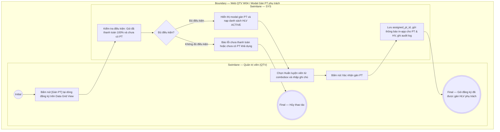

# QTV-W04-US05 - Gán PT phụ trách cho gói đăng ký

## Preconditions
- QTV đã đăng nhập hệ thống, trong phạm vi branch scope.
- Gói đăng ký là gói PT hoặc COMBO thuộc chi nhánh quản lý, đã được thanh toán đủ 100% (ở trạng thái `Đang hiệu lực` hoặc `Chưa đến ngày hiệu lực`) và chưa có PT phụ trách (`assigned_pt_id` đang để trống).
- Theo quy định mới: Hội viên không tự chọn PT trên ứng dụng Mobile; quyền phân công PT phụ trách thuộc về QTV / Lễ tân tại quầy.

## Trigger
- QTV bấm nút **[Gán PT]** trên dòng đăng ký tại Data Grid View menu W04 (hoặc bấm nút **[Gán PT phụ trách]** trong sidebar Chi tiết đăng ký).
- Màn hình liên quan: Web QTV — W04 Đăng ký & gia hạn, modal **Gán PT phụ trách**.

## Main Flow

1. QTV bấm nút **[Gán PT]** tại dòng đăng ký gói PT hoặc COMBO đã thanh toán 100%.
2. SYS mở modal **Gán PT phụ trách**.
3. SYS tự động nạp thông tin đăng ký: Mã đăng ký, Hội viên, Gói đăng ký, Chi nhánh.
4. SYS nạp danh sách Huấn luyện viên đang hoạt động (`ACTIVE`) tại chi nhánh vào Combobox chọn PT.
5. QTV tra cứu và chọn Huấn luyện viên phụ trách phù hợp với chuyên môn hoặc nguyện vọng của hội viên.
6. QTV nhập ghi chú phân công (nếu có).
7. QTV bấm nút **Xác nhận gán PT**.
8. SYS gán `assigned_pt_id` vào hợp đồng `REGISTRATIONS`, gửi thông báo in-app đến Huấn luyện viên được gán và thông báo đến Hội viên, ghi audit log và đóng modal.
9. SYS cập nhật hiển thị trên bảng: Cột `PT phụ trách` hiển thị tên HLV vừa gán, nút `[Gán PT]` tự động chuyển sang trạng thái đã phân công.

### Field-level specification — modal Gán PT phụ trách
| Field / control | Loại UI Control | State | Required | Conditional / dynamic | Source / validation |
| :--- | :--- | :--- | :--- | :--- | :--- |
| Mã đăng ký | `Readonly Text` | `READONLY (PREFILL)` | required | `Không` | Mã hợp đồng đăng ký từ `REGISTRATIONS.reg_code` |
| Hội viên | `Readonly Text` | `READONLY (PREFILL)` | required | `Không` | Họ tên và SĐT hội viên từ `MEMBER_PROFILES` |
| Gói đăng ký | `Readonly Text` | `READONLY (PREFILL)` | required | `Không` | Tên gói đăng ký từ `PACKAGES.package_name` |
| Chi nhánh | `Readonly Text` | `READONLY (PREFILL)` | required | `Không` | Chi nhánh áp dụng của gói |
| Huấn luyện viên phụ trách | `Select Dropdown (Searchable)` | `USER-INPUT` | required | `Không` | QTV chọn HLV thuộc chi nhánh có trạng thái `ACTIVE` |
| Ghi chú phân công | `Textarea` | `USER-INPUT` | optional | `Không` | Ghi chú nguyện vọng hội viên hoặc lưu ý thể lực |

## Alternate Flows

### AF-01 - Hủy Thao Tác
1. QTV chọn **Hủy** hoặc nút **✕** trên modal.
2. SYS đóng modal và giữ nguyên trạng thái gói đăng ký chưa gán PT.

## Exception Flows
- **Chưa thanh toán đủ 100%:** Gói chưa hoàn tất thanh toán không cho phép gán PT phụ trách.
- **Không có PT khả dụng:** Chi nhánh không có PT nào `ACTIVE`, SYS thông báo *"Không có HLV khả dụng tại chi nhánh"*.

## Activity Diagram — Swimlane
**Trigger:** QTV bấm nút Gán PT tại dòng đăng ký gói trong menu W04.

