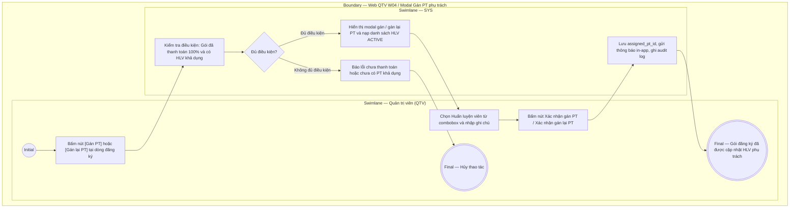

# QTV-W04-US05 - Gán PT phụ trách cho gói đăng ký

## Preconditions
- QTV đã đăng nhập hệ thống, trong phạm vi branch scope.
- Gói đăng ký là gói PT hoặc COMBO thuộc chi nhánh quản lý, đã được thanh toán đủ 100% (ở trạng thái `ACTIVE`, `SCHEDULED`, hoặc `FROZEN`).
- Theo quy định hệ thống: Phân công và gán lại PT phụ trách do QTV / Lễ tân thực hiện trực tiếp tại quầy mà không cần PT duyệt trước.

## Trigger
- QTV bấm nút **[Gán PT]** (khi gói chưa có PT) hoặc nút **[Gán lại PT]** (khi gói đã có PT) trên dòng đăng ký tại Data Grid View menu W04 (hoặc trong drawer Chi tiết đăng ký).
- Màn hình liên quan: Web QTV — W04 Đăng ký & gia hạn, modal **Gán PT phụ trách** / **Gán lại PT phụ trách**.

## Main Flow

1. QTV bấm nút **[Gán PT]** tại dòng đăng ký gói PT hoặc COMBO đã thanh toán 100% (chưa có HLV).
2. SYS mở modal **Gán PT phụ trách**.
3. SYS tự động nạp thông tin đăng ký: Mã đăng ký, Hội viên, Gói đăng ký, Chi nhánh.
4. SYS nạp danh sách Huấn luyện viên đang hoạt động (`ACTIVE`) tại chi nhánh vào Combobox chọn PT.
5. QTV tra cứu và chọn Huấn luyện viên phụ trách phù hợp với chuyên môn hoặc nguyện vọng của hội viên.
6. QTV nhập ghi chú phân công (nếu có).
7. QTV bấm nút **Xác nhận gán PT**.
8. SYS gán `assigned_pt_id` vào hợp đồng `REGISTRATIONS`, gán trực tiếp quyền phụ trách cho PT mà không cần PT chấp thuận, gửi thông báo in-app đến Huấn luyện viên được gán và thông báo đến Hội viên, ghi audit log và đóng modal.
9. SYS cập nhật hiển thị trên bảng: Cột `PT phụ trách` hiển thị tên HLV vừa gán, nút thao tác tự động chuyển thành **[Gán lại PT]**.

### Field-level specification — modal Gán PT phụ trách
| Field / control | Loại UI Control | State | Required | Conditional / dynamic | Source / validation |
| :--- | :--- | :--- | :--- | :--- | :--- |
| Mã đăng ký | `Readonly Text` | `READONLY (PREFILL)` | required | `Không` | Mã hợp đồng đăng ký từ `REGISTRATIONS.reg_code` |
| Hội viên | `Readonly Text` | `READONLY (PREFILL)` | required | `Không` | Họ tên và SĐT hội viên từ `MEMBER_PROFILES` |
| Gói đăng ký | `Readonly Text` | `READONLY (PREFILL)` | required | `Không` | Tên gói đăng ký từ `PACKAGES.package_name` |
| Chi nhánh | `Readonly Text` | `READONLY (PREFILL)` | required | `Không` | Chi nhánh áp dụng của gói |
| HLV phụ trách hiện tại | `Readonly Text` | `READONLY (PREFILL)` | conditional | `CONDITIONAL` | **Hiện khi** mở modal từ nút [Gán lại PT] (gói đã có HLV phụ trách). **Ẩn khi** mở modal từ nút [Gán PT] (gói chưa có HLV phụ trách). |
| Huấn luyện viên phụ trách | `Select Dropdown (Searchable)` | `USER-INPUT` | required | `Không` | QTV chọn HLV thuộc chi nhánh có trạng thái `ACTIVE`. Khi gán lại: không được chọn trùng HLV hiện tại. |
| Ghi chú phân công | `Textarea` | `USER-INPUT` | optional | `Không` | Ghi chú nguyện vọng hội viên hoặc lý do điều chuyển HLV |

## Alternate Flows

### AF-01 - Hủy Thao Tác
1. QTV chọn **Hủy** hoặc nút **✕** trên modal.
2. SYS đóng modal và giữ nguyên trạng thái HLV phụ trách của gói đăng ký.

### AF-02 - Gán Lại PT Phụ Trách
1. QTV bấm nút **[Gán lại PT]** tại dòng đăng ký hoặc trong drawer chi tiết của gói đã có HLV phụ trách.
2. SYS mở modal tiêu đề **Gán lại PT phụ trách**, hiển thị trường `HLV phụ trách hiện tại` và nhãn `Chọn HLV phụ trách mới`.
3. QTV chọn HLV mới từ danh sách HLV active tại chi nhánh (khác HLV hiện tại) và nhập ghi chú điều chuyển.
4. QTV bấm **Xác nhận gán lại PT**.
5. SYS cập nhật `assigned_pt_id` mới trực tiếp, ghi audit log `PT_REASSIGNED`, gửi thông báo in-app cho HLV cũ, HLV mới và Hội viên, đóng modal và cập nhật DataGrid.

## Exception Flows
- **Chưa thanh toán đủ 100%:** Gói chưa hoàn tất thanh toán không cho phép gán hoặc gán lại PT phụ trách.
- **Chọn trùng PT hiện tại:** Khi gán lại, QTV chọn đúng HLV đang phụ trách, SYS hiển thị cảnh báo *"Vui lòng chọn HLV khác với HLV hiện tại"* và không cho lưu.
- **Không có PT khả dụng:** Chi nhánh không có PT nào `ACTIVE`, SYS thông báo *"Không có HLV khả dụng tại chi nhánh"*.

## Activity Diagram — Swimlane
**Trigger:** QTV bấm nút Gán PT hoặc Gán lại PT tại dòng đăng ký gói trong menu W04.

