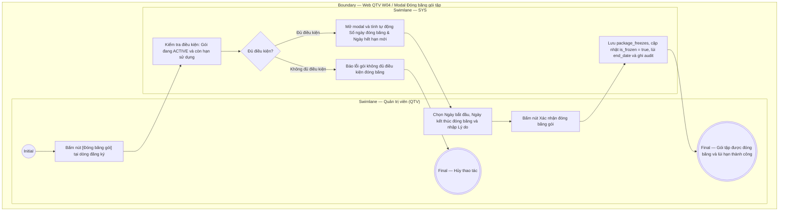

# QTV-W04-US06 - Đóng băng gói tập

## Preconditions
- QTV đã đăng nhập hệ thống, trong phạm vi branch scope.
- Gói đăng ký của hội viên đang ở trạng thái hoạt động (`ACTIVE`) và còn thời hạn sử dụng.
- Hội viên có nhu cầu tạm dừng tập luyện (đi công tác, điều trị chấn thương, lý do cá nhân).

## Trigger
- QTV bấm nút **[Đóng băng gói]** tại dòng đăng ký gói trong menu W04 (hoặc trong drawer chi tiết đăng ký).
- Màn hình liên quan: Web QTV — W04 Đăng ký & gia hạn, modal **Đóng băng gói tập**.

## Main Flow

1. QTV bấm nút **[Đóng băng gói]** tại hợp đồng đăng ký gói của hội viên (áp dụng cho mọi gói có thời hạn sử dụng `end_date IS NOT NULL`, bao gồm cả gói ngày và gói buổi PT).
2. SYS mở modal **Đóng băng gói tập**.
3. SYS hiển thị thông tin hợp đồng hiện tại: Mã đăng ký, Tên hội viên, Thời hạn hiện tại.
4. QTV chọn **Ngày bắt đầu đóng băng** (mặc định là ngày hiện tại; cho phép chọn ngày tương lai $\ge$ hôm nay và $<$ ngày hết hạn gói).
5. QTV nhập **Số ngày tạm dừng / đóng băng** (tối đa bằng số ngày còn lại của gói tính từ ngày bắt đầu đến ngày hết hạn hiện tại) HOẶC chọn **Ngày mở lại dự kiến** (hệ thống tự động tính toán đồng bộ 2 chiều giữa 2 trường).
6. SYS tự động cập nhật khối tóm tắt xem trước:
   - Trạng thái dự kiến: Nếu bắt đầu hôm nay $\rightarrow$ `❄️ Kích hoạt đóng băng ngay hôm nay`; nếu bắt đầu trong tương lai $\rightarrow$ `⏳ Chờ đóng băng` (ghi rõ hội viên vẫn được đi tập đến hết ngày trước ngày bắt đầu).
   - Hạn dùng mới dự kiến của gói: Bằng `Ngày hết hạn cũ` + `Số ngày đóng băng`.
7. QTV nhập **Lý do đóng băng** (ví dụ: *"Hội viên đi công tác nước ngoài 2 tuần"*).
8. QTV bấm **Xác nhận đóng băng**.
9. SYS tạo bản ghi trong bảng `package_freezes`:
   - Nếu ngày bắt đầu là hôm nay: Ghi nhận `status = 'ACTIVE'`, cập nhật `is_frozen = true` trên hợp đồng, tạm khóa quyền check-in và đặt lịch PT.
   - Nếu ngày bắt đầu trong tương lai: Ghi nhận `status = 'SCHEDULED'`, giữ `is_frozen = false` (hợp đồng ở trạng thái `SCHEDULED_FREEZE` / `Chờ đóng băng`), hội viên vẫn được check-in và tập luyện bình thường cho đến ngày bắt đầu.
   - Tự động kéo dài ngày hết hạn `end_date` của gói và tăng `freeze_days_total`.
   - Gửi thông báo in-app cho hội viên và ghi audit log.
10. SYS đóng modal, cập nhật badge trạng thái gói trên danh sách dữ liệu thành `ĐANG ĐÓNG BĂNG` hoặc `CHỜ ĐÓNG BĂNG`.

### Field-level specification — modal Đóng băng gói tập
| Field / control | Loại UI Control | State | Required | Conditional / dynamic | Source / validation |
| :--- | :--- | :--- | :--- | :--- | :--- |
| Thông tin hợp đồng | `Readonly Text Group` | `READONLY (PREFILL)` | required | `Không` | Mã ĐK, Họ tên hội viên, Thời hạn hiện tại (`dd/MM/yyyy - dd/MM/yyyy`) |
| Ngày bắt đầu đóng băng | `Date Picker` | `USER-INPUT` | required | `TRIGGER` | Mặc định hôm nay; bắt buộc $\ge$ hôm nay và $<$ ngày hết hạn hiện tại của gói |
| Số ngày tạm dừng / đóng băng | `Number Box` | `USER-INPUT` | required | `TRIGGER` | Mặc định 7 (hoặc tối đa số ngày còn lại nếu $< 7$); min: 1, max: số ngày còn lại của gói tính từ Ngày bắt đầu |
| Ngày mở lại dự kiến | `Date Picker` | `USER-INPUT` | required | `TRIGGER / DYNAMIC` | Tự động đồng bộ 2 chiều với Số ngày đóng băng; min: `Ngày bắt đầu + 1`, max: `Ngày hết hạn hiện tại` |
| Khối tóm tắt xem trước [AUTO] | `Readonly Preview` | `READONLY (AUTO-FILL)` | required | `DYNAMIC` | Hiển thị trạng thái sau khi lưu (`❄️ Kích hoạt đóng băng ngay hôm nay` hoặc `⏳ Chờ đóng băng kèm ngày được tập`) và Hạn dùng mới dự kiến (+X ngày) |
| Lý do đóng băng | `Textarea` | `USER-INPUT` | required | `Không` | QTV nhập lý do theo đề nghị của hội viên (tối đa 255 ký tự) |

## Alternate Flows

### AF-01 - Hủy thao tác
1. QTV bấm nút `Hủy` hoặc icon `✕`.
2. SYS đóng modal, không thay đổi trạng thái gói.

## Exception Flows
- **Gói đã hết hạn hoặc đã bị hủy:** SYS chặn thao tác và thông báo gói không đủ điều kiện đóng băng.
- **Gói tập vô thời hạn:** SYS thông báo gói tập vô thời hạn không cần đóng băng bảo lưu thời gian.
- **Đã có đợt hẹn đóng băng đang chờ (SCHEDULED):** SYS thông báo gói tập đã có lịch hẹn đóng băng đang chờ thực thi, không cho tạo thêm đợt đóng băng trùng lặp.
- **Ngày bắt đầu đóng băng trong quá khứ:** SYS báo lỗi validation ngày bắt đầu phải từ ngày hiện tại trở đi.
- **Ngày bắt đầu đóng băng sau hoặc bằng ngày hết hạn:** SYS báo lỗi ngày bắt đầu phải trước ngày hết hạn hiện tại.
- **Số ngày đóng băng vượt quá số ngày còn lại:** SYS chặn và báo lỗi số ngày đóng băng không được vượt quá số ngày còn lại của gói.

## Activity Diagram — Swimlane
**Trigger:** QTV bấm nút Đóng băng gói trong menu W04.

