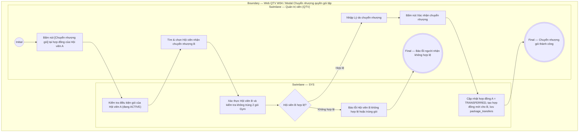

# QTV-W04-US07 - Chuyển nhượng quyền gói tập

## Preconditions
- QTV đã đăng nhập hệ thống, trong phạm vi branch scope.
- Gói tập chuyển nhượng của Hội viên A đang ở trạng thái hợp lệ (`ACTIVE`) và còn thời hạn hoặc số buổi khả dụng.
- Hội viên B (người nhận chuyển nhượng) đã có hồ sơ cá nhân (`ACTIVE`) trên hệ thống.

## Trigger
- QTV bấm nút **[Chuyển nhượng gói]** tại dòng đăng ký gói của Hội viên A trong menu W04.
- Màn hình liên quan: Web QTV — W04 Đăng ký & gia hạn, modal **Chuyển nhượng quyền gói tập**.

## Main Flow

1. QTV bấm nút **[Chuyển nhượng gói]** tại hợp đồng đăng ký của Hội viên A.
2. SYS mở modal **Chuyển nhượng quyền gói tập**.
3. SYS tự động hiển thị thông tin gói chuyển nhượng: Mã hợp đồng, Hội viên chuyển nhượng (A), Tên gói, Số ngày/buổi còn lại khả dụng.
4. QTV tra cứu và chọn **Hội viên nhận chuyển nhượng (B)** theo SĐT hoặc Họ tên.
5. SYS kiểm tra điều kiện của Hội viên B (đảm bảo không bị trùng 2 gói Gym hiệu lực song song).
6. QTV nhập **Lý do chuyển nhượng** (chuyển giao/tặng quyền sử dụng cho bạn bè/người thân miễn phí, không thu phí chuyển nhượng).
7. QTV bấm **Xác nhận chuyển nhượng**.
8. SYS thực hiện giao dịch chuyển nhượng nguyên khối (Atomic Transaction):
   - Chuyển trạng thái hợp đồng cũ của Hội viên A sang `TRANSFERRED` (Đã chuyển nhượng).
   - Khởi tạo hợp đồng mới cho Hội viên B kế thừa nguyên vẹn quyền lợi còn lại (số ngày, số buổi Gym/PT, chi nhánh được phép).
   - Lưu thông tin vào bảng `package_transfers` và ghi audit log.
   - Gửi thông báo in-app cho cả Hội viên A và Hội viên B.
9. SYS đóng modal, hiển thị thông báo chuyển nhượng thành công và cập nhật bảng dữ liệu.

### Field-level specification — modal Chuyển nhượng quyền gói tập
| Field / control | Loại UI Control | State | Required | Conditional / dynamic | Source / validation |
| :--- | :--- | :--- | :--- | :--- | :--- |
| Thông tin gói chuyển nhượng | `Readonly Text Group` | `READONLY (PREFILL)` | required | `Không` | Mã hợp đồng, Họ tên Hội viên A, Tên gói, Số buổi/ngày còn lại |
| Hội viên nhận chuyển nhượng (B) | `Search Combobox` | `USER-INPUT` | required | `TRIGGER`: Kiểm tra điều kiện tài khoản và gói của Hội viên B | Tra cứu theo SĐT hoặc Họ tên trong `MEMBER_PROFILES`; bắt buộc khác Hội viên A |
| Lý do chuyển nhượng | `Textarea` | `USER-INPUT` | required | `Không` | Ghi chú lý do chuyển nhượng (tối đa 255 ký tự; placeholder: "Tặng / chuyển quyền sử dụng cho bạn bè/người thân...") |

## Alternate Flows

### AF-01 - Hủy thao tác
1. QTV bấm nút `Hủy` hoặc icon `✕`.
2. SYS đóng modal, giữ nguyên hợp đồng của Hội viên A.

## Exception Flows
- **Hội viên B trùng với Hội viên A:** SYS chặn và báo lỗi người nhận không được trùng người chuyển.
- **Hội viên B đang có gói Gym hiệu lực song song:** SYS cảnh báo và yêu cầu xử lý gói cũ của B trước khi nhận gói Gym mới.

## Activity Diagram — Swimlane
**Trigger:** QTV bấm nút Chuyển nhượng gói trong menu W04.

