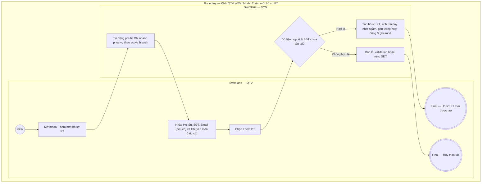

# QTV-W05-US01 - Thêm hồ sơ PT

## Preconditions
- QTV đã đăng nhập, có quyền tạo hồ sơ PT tại chi nhánh đang thao tác.
- QTV thao tác trong phạm vi chi nhánh được phục vụ (branch scope).

## Trigger
- QTV chọn **Thêm hồ sơ PT** trong menu W05.
- Màn hình liên quan: Web QTV — W05 Huấn luyện viên, modal **Thêm mới hồ sơ PT**.

## Main Flow

1. QTV mở modal **Thêm mới hồ sơ PT**.
2. SYS tự động pre-fill **Chi nhánh phục vụ** theo chi nhánh hiện tại mà QTV đang làm việc; QTV có thể chọn chi nhánh khác trong phạm vi được phân quyền (`branch scope`).
3. QTV nhập Họ tên, SĐT, Email (nếu có), Chi nhánh phục vụ và Chuyên môn/Mô tả (nếu có).
4. QTV chọn **Thêm PT**.
5. SYS kiểm tra trường bắt buộc, định dạng email (nếu có nhập) và kiểm tra SĐT hợp lệ, chưa tồn tại trong hệ thống.
6. Nếu hợp lệ, SYS tạo hồ sơ PT, sinh mã duy nhất ngầm, gán trạng thái ban đầu `Đang hoạt động` và ghi audit.
7. SYS hiển thị hồ sơ PT vừa tạo.

### Field-level specification — modal Thêm mới hồ sơ PT
| Field / control | Loại UI Control | State | Required | Conditional / dynamic | Source / validation |
| :--- | :--- | :--- | :--- | :--- | :--- |
| Họ và tên | `Textbox` | `USER-INPUT` | required | Không | QTV nhập (ví dụ: "Nguyễn Văn Hùng"); hỗ trợ dấu tiếng Việt, loại bỏ khoảng trắng thừa |
| Số điện thoại | `Textbox (Phone Input)` | `USER-INPUT` | required | Không | QTV nhập (ví dụ: "0909 888 777"); khóa nghiệp vụ định danh của PT, chuẩn hóa và kiểm tra trùng lặp realtime, giữ nguyên số 0 đầu, `UNIQUE` toàn hệ thống |
| Email | `Textbox (Email Input)` | `USER-INPUT` | optional | Không | QTV nhập (ví dụ: "pt.hung@paradise.vn"); kiểm tra đúng định dạng email RFC nếu có nhập, không bắt buộc |
| Chi nhánh phục vụ | `Select Dropdown` | `USER-INPUT (PREFILL)` | required | Không | Tự động chọn sẵn chi nhánh hiện tại của QTV; cho phép chọn chi nhánh khác trong phạm vi phân quyền (`branch scope`) của tài khoản QTV (ví dụ: "Quận 1", "Quận 3") |
| Chuyên môn / Ghi chú | `Textarea` | `USER-INPUT` | optional | Không | QTV nhập mô tả chuyên môn, chứng chỉ hoặc ghi chú về PT (ví dụ: "HLV Thể hình & Cardio, Chứng chỉ NASM") |

- **Business rules / logic:**
  - Hồ sơ PT mới bắt buộc có họ tên, số điện thoại và chi nhánh phục vụ; email và chuyên môn/ghi chú là tùy chọn.
  - Chi nhánh phục vụ được chọn trong phạm vi `branch scope` của tài khoản QTV đang thao tác.
  - Mỗi PT có đúng một số điện thoại duy nhất trên toàn hệ thống (`UNIQUE`).
  - Mã PT, thời điểm tạo và người tạo do SYS tự động ghi nhận ngầm.
  - Tạo hồ sơ PT chưa tự động cấp tài khoản đăng nhập Mobile; PT thực hiện kích hoạt tài khoản riêng trên ứng dụng Mobile bằng số điện thoại đã lưu trong hồ sơ.

## Alternate Flows

### AF-01 - Số điện thoại đã tồn tại
1. SYS phát hiện số điện thoại nhập vào trùng với hồ sơ PT đã có.
2. SYS báo lỗi SĐT trùng và làm nổi bật trường Số điện thoại.
3. QTV sửa lại số điện thoại hoặc đóng modal hủy thao tác.

## Exception Flows
- Thiếu họ tên hoặc số điện thoại: SYS báo lỗi validation trường bắt buộc.
- Định dạng email không hợp lệ: SYS báo lỗi định dạng email RFC.
- Số điện thoại đã tồn tại: SYS báo lỗi SĐT trùng.
- QTV chọn **Hủy** hoặc nút **✕**: đóng modal không lưu dữ liệu.

## Activity Diagram — Swimlane
**Trigger:** QTV chọn Thêm hồ sơ PT trong menu W05.

