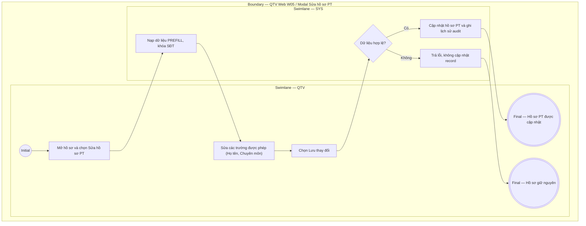

# QTV-W05-US02 - Sửa hồ sơ PT

## Preconditions
- QTV đã đăng nhập, hồ sơ PT đã tồn tại thuộc chi nhánh mà QTV quản lý (branch scope).

## Trigger
- QTV mở một hồ sơ trong danh sách W05 và chọn **Sửa hồ sơ**.
- Màn hình liên quan: Web QTV — W05 Huấn luyện viên, modal **Sửa hồ sơ PT**.

## Main Flow

1. QTV mở modal **Sửa hồ sơ PT**.
2. SYS nạp dữ liệu hiện tại và khóa trường **Số điện thoại** (khóa nghiệp vụ định danh, không được phép sửa).
3. QTV cập nhật các trường được phép (Họ tên, Email, Chi nhánh phục vụ, Chuyên môn/Ghi chú).
4. QTV chọn **Lưu thay đổi**.
5. SYS kiểm tra required field, định dạng email (nếu có nhập) và lưu dữ liệu.
6. SYS cập nhật hồ sơ PT, ghi lịch sử thay đổi và hiển thị kết quả.

### Field-level specification — modal Sửa hồ sơ PT
| Field / control | Loại UI Control | State | Required | Conditional / dynamic | Source / validation |
| :--- | :--- | :--- | :--- | :--- | :--- |
| Họ và tên | `Textbox` | `USER-INPUT (PREFILL)` | required | Không | Giá trị hiện tại nạp sẵn; QTV cập nhật họ và tên |
| Số điện thoại | `Readonly Text` | `READONLY (PREFILL)` | required | Không | Giá trị hiện tại hiển thị cố định; SĐT là khóa nghiệp vụ định danh, không được phép sửa |
| Email | `Textbox (Email Input)` | `USER-INPUT (PREFILL)` | optional | Không | Giá trị hiện tại nạp sẵn; QTV cập nhật địa chỉ email (validate đúng định dạng email RFC nếu có nhập) |
| Chi nhánh phục vụ | `Select Dropdown` | `USER-INPUT (PREFILL)` | required | Không | Giá trị hiện tại nạp sẵn; QTV có thể chọn điều chuyển PT sang chi nhánh khác trong phạm vi phân quyền (`branch scope`) của tài khoản QTV |
| Chuyên môn / Ghi chú | `Textarea` | `USER-INPUT (PREFILL)` | optional | Không | Giá trị hiện tại nạp sẵn; QTV cập nhật mô tả chuyên môn, chứng chỉ hoặc ghi chú |

- **Business rules / logic:**
  - Không cho phép sửa đổi số điện thoại để đảm bảo tính toàn vẹn của dữ liệu định danh và tài khoản.
  - Cho phép điều chuyển chi nhánh phục vụ của PT sang chi nhánh khác thuộc phạm vi `branch scope` của QTV.
  - Sửa hồ sơ không đồng nghĩa đổi trạng thái; đổi trạng thái dùng `QTV-W05-US03`.

## Alternate Flows

### AF-01 - Không Có Thay Đổi
1. QTV mở hồ sơ nhưng không sửa field nào.
2. Nút **Lưu thay đổi** ở trạng thái không khả dụng hoặc thao tác kết thúc không phát sinh bản ghi mới.

## Exception Flows
- Hồ sơ không tồn tại hoặc ngoài branch scope: từ chối truy cập.
- Xóa required field: không cho lưu và chỉ rõ field lỗi.

## Activity Diagram — Swimlane
**Trigger:** QTV mở hồ sơ PT và chọn Sửa hồ sơ.

