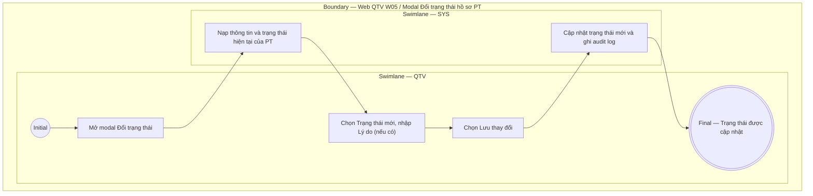

# QTV-W05-US03 - Cập nhật trạng thái hồ sơ PT

## Preconditions
- QTV đã đăng nhập, hồ sơ PT đã tồn tại thuộc chi nhánh mà QTV quản lý (branch scope).
- Đổi trạng thái không xóa hồ sơ PT hoặc lịch sử các buổi tập đã hoàn thành.

## Trigger
- QTV mở hồ sơ PT và chọn **Đổi trạng thái**.
- Màn hình liên quan: Web QTV — W05 Huấn luyện viên, modal **Đổi trạng thái hồ sơ PT**.

## Main Flow

1. QTV mở modal **Đổi trạng thái hồ sơ PT**.
2. SYS hiển thị trạng thái hiện tại của PT.
3. QTV chọn Trạng thái mới và nhập Lý do (nếu muốn).
4. QTV chọn **Lưu thay đổi**.
5. SYS cập nhật trạng thái mới, ghi audit log (bao gồm lý do nếu có) và hiển thị kết quả.

### Field-level specification — form Đổi trạng thái hồ sơ PT
| Field / control | State | Required | Conditional / dynamic | Source / validation |
| --- | --- | --- | --- | --- |
| Mã/tên PT | `READONLY` | required | Không | SYS lấy từ hồ sơ PT được chọn |
| Trạng thái hiện tại | `READONLY` | required | `DYNAMIC`: lấy từ record hiện tại | SYS lấy từ `PT_PROFILE` |
| Trạng thái mới | `USER-INPUT` | required | Không | QTV chọn trạng thái mới (ví dụ: `Đang hoạt động`, `Ngừng hoạt động`, `Đã lưu trữ`) |
| Lý do đổi trạng thái | `USER-INPUT` | optional | Không | QTV nhập tự do (nếu muốn) để ghi nhận vào audit log |

- **Business rules / logic:**
  - Trạng thái PT `Ngừng hoạt động` chỉ ngăn không cho gửi assignment request mới hoặc đặt lịch PT mới; không tự động xóa các booking đã hoàn thành trong lịch sử.
  - Lý do đổi trạng thái là không bắt buộc, chỉ dùng để ghi vết audit nếu QTV nhập.

## Alternate Flows

### AF-01 - Hủy Thao Tác
1. QTV chọn **Hủy** hoặc đóng modal.
2. SYS giữ nguyên trạng thái hiện tại của PT.

## Exception Flows
- Hồ sơ PT không tồn tại hoặc ngoài branch scope: không cho thao tác.
- Lỗi kết nối/lưu dữ liệu: giữ trạng thái cũ và báo thất bại.

## Activity Diagram — Swimlane
**Trigger:** QTV mở hồ sơ PT và chọn Đổi trạng thái.

