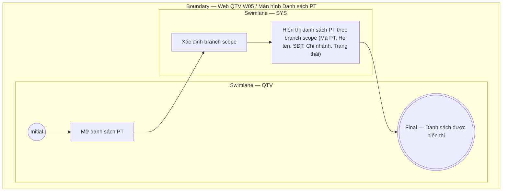

# QTV-W05-US04 - Xem danh sách PT

## Preconditions
- QTV đã đăng nhập, branch scope của QTV đã được xác định.

## Trigger
- QTV mở menu W05 hoặc chọn **Danh sách huấn luyện viên**.
- Màn hình liên quan: Web QTV — W05 Huấn luyện viên.

## Main Flow

1. QTV mở danh sách PT.
2. SYS xác định branch scope của QTV.
3. SYS hiển thị danh sách PT theo branch scope (Mã PT, Họ tên, SĐT, Chi nhánh phục vụ, Trạng thái hồ sơ).

- **Business rules / logic:**
  - Chỉ trả dữ liệu thuộc role và branch scope của QTV.
  - Danh sách là read-only; các thao tác Thêm, Sửa, Đổi trạng thái sử dụng các User Story tương ứng.

## Exception Flows
- Lỗi tải dữ liệu: hiển thị thông báo lỗi.

## Activity Diagram — Swimlane
**Trigger:** QTV mở Danh sách PT trong menu W05.

