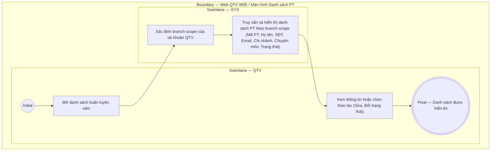

# QTV-W05-US04 - Xem danh sách PT

## Preconditions
- QTV đã đăng nhập, branch scope của QTV đã được xác định.

## Trigger
- QTV mở menu W05 hoặc chọn **Danh sách huấn luyện viên**.
- Màn hình liên quan: Web QTV — W05 Huấn luyện viên.

## Main Flow

1. QTV mở danh sách PT trên menu Web W05.
2. SYS xác định chi nhánh đang làm việc và phạm vi phân quyền (`branch scope`) của QTV.
3. SYS truy vấn và hiển thị danh sách huấn luyện viên thỏa mãn điều kiện theo dạng bảng (Data Grid View).
4. QTV xem thông tin hoặc chọn thao tác nhanh tại từng dòng (Sửa hồ sơ, Đổi trạng thái) hoặc chọn Thêm hồ sơ PT.

### Field-level specification — Bảng danh sách huấn luyện viên (Data Grid View)
| Field / control | Loại UI Control | State | Required | Conditional / dynamic | Source / validation |
| :--- | :--- | :--- | :--- | :--- | :--- |
| Mã PT | `Readonly Text` | `READONLY` | required | Không | SYS sinh tự động duy nhất từ `PT_PROFILE.code` (ví dụ: "PT001", "PT002") |
| Họ và tên | `Readonly Text + Image` | `READONLY` | required | Không | Hiển thị ảnh Avatar tròn (nếu có URL) hoặc huy hiệu viết tắt chữ cái đầu (initials badge) kèm họ và tên của huấn luyện viên từ `PT_PROFILE.full_name` và `PT_PROFILE.avatar_url` (ví dụ: "Nguyễn Văn Hùng") |
| Số điện thoại | `Readonly Text (Phone)` | `READONLY` | required | Không | Số điện thoại định danh duy nhất của PT từ `PT_PROFILE.phone` (ví dụ: "0909 888 777") |
| Email | `Readonly Text` | `READONLY` | optional | Không | Địa chỉ email của PT từ `PT_PROFILE.email` (ví dụ: "pt.hung@paradise.vn"); hiển thị `--` nếu chưa cập nhật |
| Chi nhánh phục vụ | `Readonly Text` | `READONLY` | required | Không | Tên chi nhánh PT đang công tác từ `BRANCH.name` (ví dụ: "Quận 1", "Quận 3") |
| Chuyên môn / Ghi chú | `Readonly Text` | `READONLY` | optional | Không | Tóm tắt chuyên môn từ `PT_PROFILE.specialty` (ví dụ: "Cardio & Thể hình, Boxing"); hiển thị `--` nếu để trống |
| Trạng thái | `Status Badge` | `READONLY` | required | `DYNAMIC`: theo trạng thái record | Hiển thị badge trực quan theo trạng thái: `Đang hoạt động` (xanh lá), `Ngừng hoạt động` (vàng/xám), `Đã lưu trữ` (đỏ) |
| Thao tác | `Action Buttons` | `USER-INPUT` | required | Không | Gồm 2 nút thao tác nhanh trên từng dòng: Nút `[Sửa]` (mở modal Sửa hồ sơ `QTV-W05-US02`) và nút `[Đổi trạng thái]` (mở modal Cập nhật trạng thái `QTV-W05-US03`) |

- **Business rules / logic:**
  - Chỉ hiển thị hồ sơ PT trực thuộc các chi nhánh nằm trong phạm vi quản lý (`branch scope`) của tài khoản QTV đang đăng nhập.
  - Toàn bộ dữ liệu hiển thị trên bảng danh sách là chỉ đọc (`READONLY`).
  - Thao tác thêm mới mở modal `QTV-W05-US01`. Thao tác sửa hồ sơ hoặc đổi trạng thái mở modal `QTV-W05-US02` và `QTV-W05-US03`.

## Exception Flows
- Lỗi tải dữ liệu: SYS hiển thị thông báo lỗi tải danh sách và nút tải lại dữ liệu.

## Activity Diagram — Swimlane
**Trigger:** QTV mở Danh sách PT trong menu W05.

