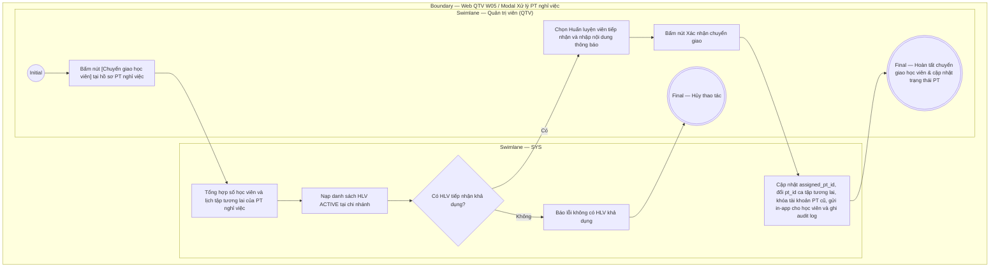

# QTV-W05-US05 - Xử lý PT nghỉ ngang và chuyển giao học viên

## Preconditions
- QTV đã đăng nhập hệ thống, trong phạm vi branch scope.
- Huấn luyện viên (PT cũ) chuẩn bị nghỉ việc hoặc nghỉ ngang đột xuất, hiện đang có học viên phụ trách hoặc các ca đặt lịch trong tương lai.
- Chi nhánh có ít nhất một Huấn luyện viên khác đang hoạt động (`ACTIVE`) để tiếp nhận chuyển giao.

## Trigger
- QTV bấm nút **[Chuyển giao học viên]** tại hồ sơ của PT nghỉ việc trong menu W05.
- Màn hình liên quan: Web QTV — W05 Huấn luyện viên, modal **Xử lý PT nghỉ việc & Chuyển giao học viên**.

## Main Flow

1. QTV bấm nút **[Chuyển giao học viên]** tại hồ sơ PT nghỉ việc (ví dụ: PT Nguyễn Văn Thể).
2. SYS mở modal **Xử lý PT nghỉ việc & Chuyển giao học viên**.
3. SYS hiển thị tóm tắt khối lượng công việc hiện tại của PT nghỉ việc:
   - Tổng số học viên đang phụ trách (`ACTIVE` registrations).
   - Tổng số ca tập PT đã đặt trong tương lai (`UPCOMING`).
4. QTV chọn **Huấn luyện viên tiếp nhận** (ví dụ: PT Đặng Văn Giang) từ danh sách PT `ACTIVE` tại chi nhánh.
5. QTV chọn **Phương thức xử lý tài khoản PT cũ**: `Tạm khóa tài khoản` hoặc `Chuyển trạng thái Ngừng làm việc`.
6. QTV nhập **Lý do chuyển giao & Nội dung thông báo gửi học viên** (ví dụ: *"HLV Nguyễn Văn Thể tạm nghỉ việc vì lý do cá nhân. HLV Đặng Văn Giang sẽ đồng hành và tiếp quản các buổi tập tiếp theo của bạn"*).
7. QTV bấm **Xác nhận chuyển giao**.
8. SYS thực hiện giao dịch chuyển giao nguyên khối:
   - Cập nhật `assigned_pt_id` của toàn bộ hợp đồng liên quan sang PT tiếp nhận.
   - Cập nhật `pt_id` của toàn bộ các lịch tập trong tương lai sang PT tiếp nhận.
   - Chuyển trạng thái hồ sơ PT cũ sang `INACTIVE` và khóa tài khoản đăng nhập.
   - Tự động phát thông báo in-app đến toàn thể học viên trong danh sách chuyển giao.
   - Ghi nhật ký kiểm toán bất biến (Audit Log).
9. SYS đóng modal, hiển thị thông báo chuyển giao thành công và cập nhật danh sách PT.

### Field-level specification — modal Xử lý PT nghỉ việc & Chuyển giao học viên
| Field / control | Loại UI Control | State | Required | Conditional / dynamic | Source / validation |
| :--- | :--- | :--- | :--- | :--- | :--- |
| Thông tin PT nghỉ việc | `Readonly Text Group` | `READONLY (PREFILL)` | required | `Không` | Mã PT, Họ tên, SĐT, Số học viên phụ trách, Số ca tập sắp tới |
| Huấn luyện viên tiếp nhận | `Select Dropdown (Searchable)` | `USER-INPUT` | required | `Không` | Chọn 1 PT `ACTIVE` tại chi nhánh; bắt buộc khác PT nghỉ việc |
| Trạng thái tài khoản PT cũ | `Select Dropdown` | `USER-INPUT` | required | `Không` | `Ngừng làm việc (INACTIVE)` hoặc `Khóa tài khoản (LOCKED)` |
| Thông báo gửi học viên | `Textarea` | `USER-INPUT` | required | `Không` | Nội dung thông báo tự động gửi in-app cho các học viên bị ảnh hưởng |
| Ghi chú nội bộ | `Textarea` | `USER-INPUT` | optional | `Không` | Lý do nghỉ việc của PT lưu hồ sơ nhân sự |

## Alternate Flows

### AF-01 - Hủy thao tác
1. QTV bấm nút `Hủy` hoặc icon `✕`.
2. SYS đóng modal, giữ nguyên trạng thái làm việc của PT.

## Exception Flows
- **Không có PT tiếp nhận khả dụng:** Chi nhánh không có PT nào khác đang `ACTIVE`. SYS vô hiệu hóa nút xác nhận và hiển thị cảnh báo: *"Chi nhánh không còn HLV hoạt động để tiếp nhận. Vui lòng thêm HLV mới hoặc điều chuyển tạm thời từ chi nhánh khác trước khi xử lý nghỉ việc"*.

## Activity Diagram — Swimlane
**Trigger:** QTV chọn Chuyển giao học viên tại hồ sơ PT trong menu W05.

