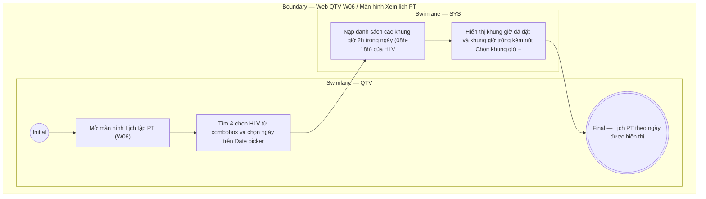

# QTV-W06-US01 - Xem lịch PT

## Preconditions
- QTV đã đăng nhập, branch scope của QTV đã được xác định.

## Trigger
- QTV mở menu W06 hoặc chọn **Lịch tập PT**.
- Màn hình liên quan: Web QTV — W06 Lịch tập PT.

## Main Flow

1. QTV mở màn hình **Lịch tập PT** (W06).
2. QTV gõ Tên, SĐT hoặc Mã PT để tìm và chọn HLV từ combobox **Chọn HLV để xem lịch**.
3. QTV chọn Ngày/Tháng/Năm từ bộ chọn lịch (Date picker / Mini Calendar).
4. SYS hiển thị thông tin PT đã chọn và danh sách các khung giờ làm việc cố định trong ngày (08:00 - 18:00, mỗi buổi kéo dài 2 giờ):
   - **08:00 - 10:00**
   - **10:00 - 12:00**
   - **12:00 - 14:00**
   - **14:00 - 16:00**
   - **16:00 - 18:00**
5. Với các khung giờ đã có người đặt, SYS hiển thị tên hội viên, tên gói PT và trạng thái buổi tập (`Đã đặt`, `Chờ xác nhận hoàn thành`, `Hoàn thành`).
6. Với các khung giờ chưa có người đặt, SYS hiển thị nhãn `Khung giờ trống` kèm nút **Chọn khung giờ +**.

- **Business rules / logic:**
  - Lịch làm việc cố định của PT từ 08:00 đến 18:00, chia làm 5 khung giờ 2 tiếng.
  - Màn hình hiển thị lịch phản ánh realtime trạng thái các khung giờ của PT được chọn.

## Exception Flows
- Lỗi kết nối/tải dữ liệu: SYS hiển thị thông báo lỗi.

## Activity Diagram — Swimlane
**Trigger:** QTV chọn HLV và ngày để xem lịch PT trong menu W06.

