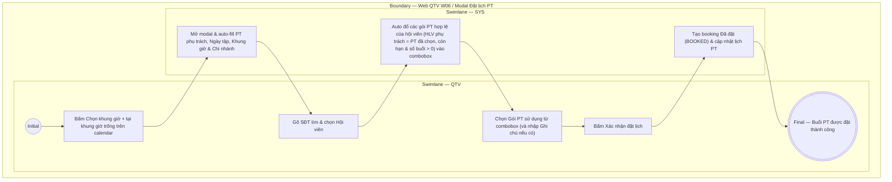

# QTV-W06-US02 - Đặt lịch PT

## Preconditions
- QTV đã mở xem lịch PT của HLV trên màn hình W06 (theo `QTV-W06-US01`), đã chọn HLV trên combobox và chọn ngày trên Date picker.
- Hội viên đã có gói PT hoặc Combo Gym + PT hợp lệ (gói do HLV đã chọn phụ trách, còn hạn và số buổi PT còn lại > 0).

## Trigger
- QTV bấm **Chọn khung giờ +** (hoặc Đặt lịch) tại một khung giờ trống trên màn hình lịch PT (W06).
- Màn hình liên quan: Web QTV — W06 Lịch tập PT, modal **Đặt lịch PT**.

## Main Flow

1. Sau khi xem lịch PT (ở `QTV-W06-US01`), QTV chọn một khung giờ trống trên calendar và bấm **Chọn khung giờ +** (hoặc Đặt lịch).
2. SYS hiển thị modal **Đặt lịch PT** và tự động auto-fill các trường cố định:
   - **PT phụ trách**: Auto-fill dựa trên HLV đã chọn ở combobox ban đầu (`READONLY`).
   - **Ngày tập**: Auto-fill dựa trên ngày đã chọn trên Date picker (`READONLY`).
   - **Khung giờ**: Auto-fill dựa trên khung giờ đã chọn trên calendar (`READONLY`).
   - **Chi nhánh**: Auto-fill theo chi nhánh làm việc hiện tại (`READONLY`).
3. QTV gõ SĐT để tìm kiếm và chọn **Hội viên**.
4. SYS tự động kiểm tra và đổ (auto-fill) danh sách các gói PT / Combo Gym+PT mà hội viên đó đã đăng ký thỏa mãn 3 điều kiện:
   - HLV đang chọn chính là HLV phụ trách gói.
   - Gói còn trong thời hạn sử dụng.
   - Số buổi PT còn lại trong gói > 0 (`remaining_sessions > 0`).
5. QTV chọn **Gói PT sử dụng** từ combobox và nhập Ghi chú cho buổi (nếu có).
6. QTV bấm **Xác nhận đặt lịch**.
7. SYS tạo booking mới ở trạng thái `Đã đặt` (BOOKED) và cập nhật hiển thị khung giờ đó trên lịch PT.

### Field-level specification — modal Đặt lịch PT
| Field / control | State | Required | Conditional / dynamic | Source / validation |
| --- | --- | --- | --- | --- |
| PT phụ trách | `READONLY (PREFILL)` | required | Không | Auto-fill dựa trên HLV đã chọn ở combobox ban đầu |
| Ngày tập | `READONLY (PREFILL)` | required | Không | Auto-fill dựa trên ngày đã chọn trên Date picker |
| Khung giờ | `READONLY (PREFILL)` | required | Không | Auto-fill dựa trên khung giờ đã chọn trên calendar |
| Chi nhánh | `READONLY (PREFILL)` | required | Không | Auto-fill theo chi nhánh làm việc hiện tại |
| Hội viên | `USER-INPUT` | required | `DYNAMIC`: gõ SĐT để tìm kiếm & chọn hội viên | `MEMBER_PROFILE` |
| Gói PT sử dụng | `USER-INPUT` | required | `DYNAMIC`: auto đổ danh sách các gói PT hợp lệ của hội viên (gói còn hạn, số buổi PT > 0 & HLV chọn là người phụ trách) | `REGISTRATION` của hội viên |
| Ghi chú cho buổi | `USER-INPUT` | optional | Không | QTV nhập ghi chú tự do cho buổi tập |

- **Business rules / logic:**
  - Một khung giờ của HLV tại một thời điểm chỉ được đặt tối đa 1 booking.
  - Combobox "Gói PT sử dụng" được hệ thống tự động đổ danh sách các gói thỏa mãn đồng thời 3 điều kiện:
    1. Thuộc sở hữu của hội viên vừa được chọn.
    2. HLV phụ trách gói chính là HLV đang chọn xem lịch ở combobox ban đầu.
    3. Gói còn trong thời hạn sử dụng và số buổi PT còn lại > 0.

## Alternate Flows

### AF-01 - Hủy Thao Tác
1. QTV chọn **Hủy** hoặc nút **X**.
2. SYS đóng modal và giữ nguyên khung giờ trống.

## Activity Diagram — Swimlane
**Trigger:** QTV bấm Chọn khung giờ + tại khung giờ trống trong menu W06.

