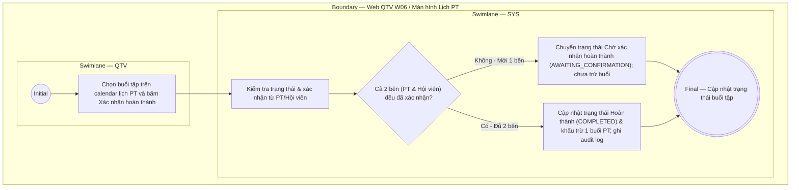

# QTV-W06-US03 - Xác nhận hoàn thành buổi học

## Preconditions
- QTV đã đăng nhập, buổi tập PT đang ở trạng thái `Đã đặt` (BOOKED) hoặc `Chờ xác nhận hoàn thành` (AWAITING_CONFIRMATION).

## Trigger
- QTV chọn nút **Xác nhận hoàn thành** tại buổi tập trên màn hình lịch PT (W06).
- Màn hình liên quan: Web QTV — W06 Lịch tập PT.

## Main Flow

1. QTV chọn buổi tập cần xác nhận trên màn hình lịch PT (W06).
2. QTV bấm nút **Xác nhận hoàn thành**.
3. SYS kiểm tra số lượng bên (PT và Hội viên) đã xác nhận cho buổi tập này.
4. **Trường hợp 1 (Chỉ mới 1 bên xác nhận):**
   - Buổi tập mới chỉ được 1 bên (PT hoặc Hội viên) xác nhận.
   - SYS chuyển/giữ trạng thái buổi tập thành **`Chờ xác nhận hoàn thành` (AWAITING_CONFIRMATION)**.
   - SYS **chưa** khấu trừ buổi tập của hội viên.
5. **Trường hợp 2 (Cả 2 bên đều đã xác nhận kép):**
   - Đã có đủ xác nhận từ cả 2 bên (PT và Hội viên).
   - SYS cập nhật trạng thái buổi tập thành **`Hoàn thành` (COMPLETED)**.
   - SYS tự động khấu trừ 1 buổi PT trong gói tập tương ứng của hội viên và ghi audit log.
6. SYS cập nhật hiển thị trạng thái tương ứng (`Chờ xác nhận hoàn thành` hoặc `Hoàn thành`) trên màn hình lịch PT.

- **Business rules / logic:**
  - Quy tắc xác nhận kép: Buổi tập chỉ chính thức chuyển sang trạng thái `Hoàn thành` (COMPLETED) và bị trừ 1 buổi trong `remaining_sessions` của gói tập khi **cả 2 bên (PT và Hội viên) đều đã bấm xác nhận**.
  - Nếu chỉ mới 1 bên xác nhận, trạng thái buổi tập được ghi nhận là `Chờ xác nhận hoàn thành` (AWAITING_CONFIRMATION) và chưa bị khấu trừ buổi.
  - Thao tác ghi nhận hoàn thành được lưu vết thời điểm và tài khoản QTV thực hiện.

## Alternate Flows
- **AF-01 - Đã có sẵn 1 bên xác nhận trước đó:** Khi QTV/PT/Hội viên bấm xác nhận bên còn lại, hệ thống đối soát đủ 2 bên -> Chuyển ngay sang `Hoàn thành` và trừ buổi.

## Exception Flows
- Buổi tập đã ở trạng thái `Hoàn thành` (COMPLETED) hoặc `Đã hủy` (CANCELLED): SYS từ chối thao tác.

## Activity Diagram — Swimlane
**Trigger:** QTV bấm Xác nhận hoàn thành tại buổi tập trong menu W06.

