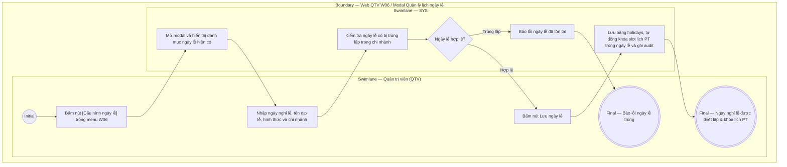

# QTV-W06-US05 - Quản lý lịch ngày lễ

## Preconditions
- QTV đã đăng nhập vào Web Portal, có quyền quản lý vận hành và lịch tập.

## Trigger
- QTV bấm nút **[Cấu hình ngày lễ]** tại thanh công cụ màn hình W06 Lịch tập & buổi PT.
- Màn hình liên quan: Web QTV — W06 Lịch tập & buổi PT, drawer / modal **Quản lý lịch ngày lễ**.

## Main Flow

1. QTV bấm nút **[Cấu hình ngày lễ]** tại màn hình W06.
2. SYS mở giao diện Quản lý lịch ngày lễ, hiển thị danh sách các ngày nghỉ lễ đã được cấu hình trong năm.
3. QTV bấm **+ Thêm ngày nghỉ lễ**.
4. QTV chọn **Ngày nghỉ lễ** (Date Picker).
5. QTV nhập **Tên ngày lễ** (ví dụ: *"Nghỉ Tết Nguyên Đán"*, *"Quốc Khánh 02/09"*).
6. QTV chọn **Hình thức**: `Đóng cửa toàn chi nhánh (khóa Check-in & Lịch PT)` hoặc `Chỉ tạm ngừng xếp lịch PT`.
7. QTV chọn phạm vi áp dụng: `Toàn hệ thống chuỗi` hoặc `Chi nhánh cụ thể`.
8. QTV bấm **Lưu ngày lễ**.
9. SYS lưu bản ghi vào bảng `holidays`, cập nhật trạng thái trên lịch PT: Khóa toàn bộ các slot đặt lịch trong ngày lễ và hiển thị banner "NGÀY NGHỈ LỄ: [Tên ngày lễ]" trên calendar, đồng thời ghi audit log.

### Field-level specification — modal Thêm ngày nghỉ lễ
| Field / control | Loại UI Control | State | Required | Conditional / dynamic | Source / validation |
| :--- | :--- | :--- | :--- | :--- | :--- |
| Ngày nghỉ lễ | `Date Picker` | `USER-INPUT` | required | `Không` | QTV chọn ngày (`DD/MM/YYYY`) |
| Tên ngày lễ | `Textbox` | `USER-INPUT` | required | `Không` | Tên dịp nghỉ lễ hiển thị trên lịch và thông báo |
| Hình thức nghỉ lễ | `Select Dropdown` | `USER-INPUT` | required | `Không` | `Đóng cửa hoàn toàn` hoặc `Chỉ ngừng xếp lịch PT` |
| Chi nhánh áp dụng | `Select Dropdown` | `USER-INPUT` | required | `Không` | `Toàn chuỗi` hoặc chọn 1 chi nhánh cụ thể |
| Ghi chú / Thông báo | `Textarea` | `USER-INPUT` | optional | `Không` | Thông báo gửi hội viên trên ứng dụng Mobile |

## Alternate Flows

### AF-01 - Hủy thao tác
1. QTV chọn `Hủy` hoặc đóng modal. SYS không lưu ngày lễ.

## Exception Flows
- **Ngày lễ bị trùng:** Ngày chọn đã tồn tại trong danh mục ngày lễ của chi nhánh. SYS cảnh báo trùng và yêu cầu chỉnh sửa bản ghi hiện có.

## Activity Diagram — Swimlane
**Trigger:** QTV bấm Cấu hình ngày lễ trong menu W06.

