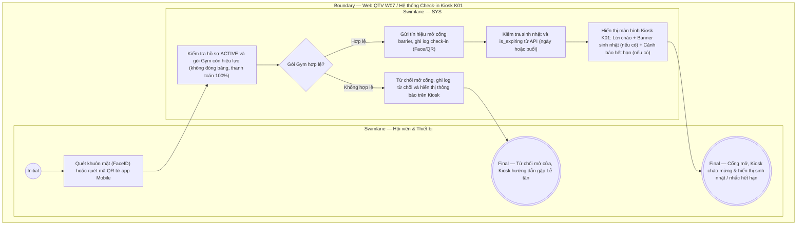

# QTV-W07-US01 - Xử lý check-in tự động qua thiết bị (FaceID, QR Code) & Màn hình chào Kiosk

## Preconditions
- Hệ thống đã kết nối với Camera AI nhận diện khuôn mặt, Đầu đọc quét mã QR và Màn hình chào Kiosk K01 tại cổng kiểm soát.
- Hội viên đã có hồ sơ và gói tập trên hệ thống.

## Trigger
- Hội viên tới phòng Gym, thực hiện quét nhận diện khuôn mặt hoặc đưa mã QR trên app Mobile vào đầu đọc tại cửa.
- Màn hình liên quan: Màn hình chào Kiosk K01 và Web QTV — W07 Ra vào & check-in.

## Quy tắc sắp hết hạn
- Gói đã thanh toán, đang có hiệu lực và chưa hết hạn: theo thời gian còn <= 4 ngày, theo buổi còn <= 3 buổi; Combo dùng OR giữa các quyền lợi áp dụng. Nguồn hiển thị là is_expiring và display_status do SYS/API tính; status nội bộ ACTIVE vẫn dùng cho kiểm tra quyền tập. Không tạo enum/field DB mới và không tự tính ngưỡng riêng trên UI.

## Main Flow

1. Hội viên tới cửa phòng Gym và quét nhận diện qua **Camera Khuôn mặt (FaceID)** hoặc **Đầu đọc mã QR (QR Code từ app Mobile)**.
2. Thiết bị gửi mã định danh/Face vector đến hệ thống (SYS).
3. SYS kiểm tra điều kiện vào tập của hội viên:
   - Hồ sơ hội viên đang ở trạng thái `ACTIVE`.
   - Sở hữu gói Gym còn hiệu lực (`ACTIVE`, không bị đóng băng `is_frozen = false`, đã thanh toán 100%, đúng chi nhánh, còn số buổi Gym nếu là gói theo buổi).
4. Nếu **ĐỦ ĐIỀU KIỆN**:
   - SYS ghi nhận sự kiện `VÀO` (`direction = 'IN'`, `checkin_method = 'FACE'` hoặc `'QR'`).
   - SYS gửi tín hiệu mở cổng barrier.
   - **Tương tác trên màn hình Kiosk K01:**
     + Hiển thị ảnh đại diện Avatar, lời chào mừng thân thiện: *"Chào mừng [Họ tên hội viên] đến với Paradise Gym"*.
     + **Nếu hôm nay là SINH NHẬT của hội viên:** Kiosk tự động phát hiệu ứng pháo hoa, banner *"🎂 CHÚC MỪNG SINH NHẬT [Họ tên]! Chúc bạn có một buổi tập tràn đầy năng lượng và nhận ưu đãi đặc biệt tại quầy Lễ tân"*.
     + **Nếu gói tập SẮP HẾT HẠN (<= 4 ngày hoặc <= 3 buổi):** Kiosk hiển thị cảnh báo màu vàng nổi bật: *"⚠️ Gói tập của bạn sẽ hết hạn sau [X] ngày. Vui lòng gặp Lễ tân tại quầy để gia hạn và nhận ưu đãi duy trì quyền lợi"*. (Phục vụ mục tiêu mời chào gia hạn thu tiền).
5. Nếu **KHÔNG ĐỦ ĐIỀU KIỆN**:
   - SYS từ chối mở cổng, ghi log từ chối và lý do (`Gói hết hạn`, `Chưa kích hoạt`, `Đang đóng băng`, `Hết lượt tập`).
   - Màn hình Kiosk hiển thị thông báo hướng dẫn hội viên liên hệ Lễ tân tại quầy để được hỗ trợ gia hạn/kích hoạt.

### Field-level specification — Màn hình Kiosk chào mừng K01
| Field / control | Loại UI Control | State | Required | Conditional / dynamic | Source / validation |
| :--- | :--- | :--- | :--- | :--- | :--- |
| Avatar hội viên | `Image Display` | `READONLY` | required | `DYNAMIC` | Lấy từ `MEMBER_PROFILES.avatar_url` |
| Lời chào mừng & Họ tên | `Text Heading (Bold)` | `READONLY` | required | `DYNAMIC` | *"Xin chào [Họ và tên hội viên]"* |
| Tên gói & Trạng thái | `Badge / Subtext` | `READONLY` | required | `DYNAMIC` | Tên gói Gym đang sử dụng và số ngày/buổi còn lại |
| Banner Chúc mừng sinh nhật | `Animated Banner` | `READONLY` | conditional | `CONDITIONAL`: • **Hiện khi**: Ngày sinh nhật của hội viên trùng với hôm nay • **Ẩn khi**: Không phải sinh nhật | Hiệu ứng chúc mừng sinh nhật kèm thông điệp nhận quà tại quầy |
| Cảnh báo Gói sắp hết hạn | `Warning Banner` | `READONLY` | conditional | `CONDITIONAL`: • **Hiện khi**: Gói có is_expiring = true theo thời gian hoặc số buổi • **Ẩn khi**: Gói có is_expiring = false | Nguồn API: cảnh báo số ngày hoặc số buổi còn lại theo nguyên nhân; không tự suy ra ngày cho gói vô thời hạn |
| Trạng thái mở cửa | `Status Indicator` | `READONLY` | required | `DYNAMIC` | `MỜI VÀO (Xanh lá)` hoặc `VUI LÒNG GẶP LỄ TÂN (Đỏ)` |

## Alternate Flows

### AF-01 - Check-in bằng mã QR Mobile
1. Hội viên mở app Mobile Hội viên (HV01/HV04) và đưa mã QR cá nhân vào máy quét.
2. Thiết bị giải mã chuỗi QR và gửi về SYS.
3. SYS kiểm tra quyền vào tập và phản hồi kết quả lên Kiosk giống luồng chính.

- Cảnh báo K01 chọn nội dung theo nguyên nhân do SYS trả: còn X ngày hoặc còn Y buổi; Combo có thể hiển thị cả hai. Không hiển thị giá hay dữ liệu thanh toán; cảnh báo không tự từ chối check-in khi quyền tập còn hợp lệ.

## Exception Flows
- **Gói tập đang đóng băng bảo lưu:** Kiosk thông báo: *"Gói tập của bạn đang trong thời gian đóng băng. Vui lòng liên hệ Lễ tân để mở lại gói trước khi vào tập"*.
- **Gói tập đã hết hạn:** Kiosk hiển thị thông báo gói hết hạn và mời hội viên đến quầy gia hạn gói mới.

## Activity Diagram — Swimlane
**Trigger:** Hội viên quét FaceID hoặc mã QR tại cổng kiểm soát.

