# QTV-W07-US02 - Ghi nhận Vào/Ra thủ công

## Preconditions
- QTV đã đăng nhập vào hệ thống Web quản lý, trong phạm vi branch scope.
- Hệ thống đã có dữ liệu hồ sơ hội viên (`MEMBER_PROFILE`) và các gói đăng ký (`REGISTRATION`).

## Trigger
- QTV nhập/quét thông tin hội viên tại Card **Kiểm soát ra/vào** trên màn hình W07 hoặc bấm nút **[⟲ Thủ công]** trên Card Thiết bị để mở modal **Ghi nhận ra/vào thủ công**.
- Màn hình liên quan: Web QTV — W07 Ra / Vào, Card Kiểm soát ra/vào (cột trái) và modal Ghi nhận ra/vào thủ công.

## Main Flow

1. QTV truy cập màn hình W07 Ra / Vào.
2. QTV có thể lựa chọn 1 trong 2 hình thức ghi nhận thủ công:
   - **Hình thức 1 (Thao tác nhanh tại Card Kiểm soát ra/vào bên trái):**
     1. Khách đọc Số điện thoại (hoặc Họ tên / Mã HV); QTV gõ SĐT/Mã HV/Họ tên (hoặc quét mã QR trên ứng dụng hội viên) tại ô tìm kiếm.
     2. SYS tự động hiển thị gợi ý danh sách hội viên khớp; QTV chọn đúng tên hội viên.
     3. SYS tự động nhận diện trạng thái hiện diện (hội viên đang ở TRONG hay NGOÀI phòng tập) để xác định chiều và cập nhật nhãn nút CTA:
        - Nếu hội viên chưa vào: Nút CTA hiển thị nhãn **`[ [ · ] Ghi nhận vào ]`** (chiều VÀO).
        - Nếu hội viên đang ở trong phòng: Nút CTA tự động chuyển thành **`[ Ghi nhận ra ]`** (chiều RA).
     4. QTV bấm nút CTA màu xanh lá (1 click).
     5. SYS xử lý theo chiều sự kiện:
        - **Chiều VÀO:** SYS kiểm tra nhanh 6 điều kiện hợp lệ (Profile ACTIVE, Gói còn hạn, Đã thanh toán 100%, Đúng chi nhánh, Còn số buổi, Trong giờ hoạt động). Nếu đủ 6 điều kiện $\rightarrow$ SYS ghi nhận thành công (direction = `IN`), phát lệnh mở cổng và đẩy ngay 1 dòng sự kiện mới lên đầu bảng **Nhật ký ra/vào hôm nay** với badge `Hợp lệ` (viền xanh lá). Nếu không đủ điều kiện (hết hạn, chưa thanh toán, sai chi nhánh...) $\rightarrow$ SYS dứt khoát chặn lại, hiển thị thông báo lỗi chi tiết màu đỏ và từ chối cho vào.
        - **Chiều RA:** SYS ghi nhận thành công (direction = `OUT`), giải phóng trạng thái hiện diện trong phòng của hội viên, phát lệnh mở cổng ra và đẩy sự kiện lên đầu bảng **Nhật ký ra/vào hôm nay**.
   - **Hình thức 2 (Modal Ghi nhận ra/vào thủ công chuyên sâu qua nút [⟲ Thủ công]):**
     1. QTV bấm nút **[⟲ Thủ công]** trên Card Thiết bị.
     2. SYS hiển thị modal Ghi nhận ra/vào thủ công.
     3. QTV tìm kiếm và chọn Hội viên (`<Mã HV> - <Tên> - <SĐT>`).
     4. SYS tự động nạp danh sách các gói tập đang ACTIVE và có hiệu lực tại chi nhánh của hội viên vào dropdown `Gói tập sử dụng`.
     5. QTV chọn Gói tập sử dụng (nếu hội viên chỉ có duy nhất 1 gói, SYS tự động chọn sẵn).
     6. QTV chọn Loại sự kiện (`Vào` hoặc `Ra`), kiểm tra Điểm vào và Thời điểm ghi nhận.
     7. QTV chọn Lý do thủ công (`Thiết bị lỗi`, `Không nhận diện được khuôn mặt`, `Khác`).
     8. Nếu chọn lý do `Khác`, QTV nhập nội dung bắt buộc tại ô Mô tả lý do khác.
     9. QTV bấm nút **Ghi nhận thủ công**.
3. SYS kiểm tra 6 điều kiện hợp lệ để vào tập (Profile ACTIVE, Gói còn hạn, Đã thanh toán 100%, Đúng chi nhánh, Còn số buổi, Trong giờ hoạt động):
   - Đủ 6 điều kiện: SYS ghi nhận bản ghi sự kiện ra/vào thủ công: `member_id`, `package_id`, `branch_id`, `direction` (`IN`/`OUT`), `source` = `MANUAL`, `reason`, `performed_by` (tài khoản QTV), `timestamp`.
   - Không đủ điều kiện: SYS từ chối dứt khoát, hiển thị thông báo lỗi lý do vi phạm, tuyệt đối không cho phép ghi nhận vào tập.
4. SYS cập nhật hiển thị sự kiện lên đầu danh sách **Nhật ký ra/vào hôm nay** kèm badge `Thủ công` (màu xanh dương).
5. SYS đóng modal (nếu thao tác qua modal) hoặc làm mới form nhập liệu nhanh.

### Field-level specification — Card Kiểm soát ra/vào (Thao tác nhanh bên trái)
| Field / control | Loại UI Control | State | Required | Conditional / dynamic | Source / validation |
| :--- | :--- | :--- | :--- | :--- | :--- |
| Tìm kiếm / tra cứu hội viên | `Textbox (Search)` | `USER-INPUT` | required | `TRIGGER` | QTV gõ SĐT, Họ tên hoặc Mã HV (hoặc quét mã QR) để tra cứu hội viên (`<Mã HV> · <Tên> · <SĐT>`); kích hoạt tự động nhận diện chiều và đổi nhãn nút CTA |
| Nút hành động Vào / Ra | `Button (CTA màu xanh lá)` | `AUTO-FILL` | required | `DYNAMIC` | Luôn hiển thị trên Card; nhãn nút tự động thay đổi theo trạng thái hội viên được chọn: • Hiển thị `[·] Ghi nhận vào` khi hội viên chưa vào phòng • Tự động đổi thành `Ghi nhận ra` khi hội viên đang ở trong phòng tập |

### Field-level specification — Modal Ghi nhận ra/vào thủ công
| Field / control | Loại UI Control | State | Required | Conditional / dynamic | Source / validation |
| :--- | :--- | :--- | :--- | :--- | :--- |
| Hội viên | `Select Dropdown (Searchable)` | `USER-INPUT` | required | `TRIGGER` | QTV gõ SĐT, Mã HV hoặc Tên để tìm & chọn hội viên (`<Mã HV> - <Tên> - <SĐT>`); kích hoạt nạp danh sách gói tập của hội viên |
| Gói tập sử dụng | `Select Dropdown` | `USER-INPUT` | required | `DYNAMIC` | Nạp danh sách các gói đang ACTIVE và có hiệu lực tại chi nhánh của hội viên; QTV chọn gói áp dụng cho lượt tập (tự chọn sẵn nếu hội viên chỉ có 1 gói) |
| Chi nhánh / điểm vào | `Readonly Text / Input` | `READONLY (PREFILL)` | optional | Không | SYS tự động nạp sẵn chi nhánh hiện tại và cổng mặc định (ví dụ: "Quận 1 · Gate-Q1-01") |
| Loại sự kiện | `Select Dropdown` | `USER-INPUT` | required | Không | QTV chọn chiều sự kiện: `Vào` (Check-in) hoặc `Ra` (Check-out) |
| Thời điểm ghi nhận | `DateTime Picker` | `USER-INPUT (PREFILL)` | required | Không | Mặc định nạp ngày giờ hiện tại; hệ thống lưu vết audit thời điểm thao tác |
| Lý do thủ công | `Select Dropdown` | `USER-INPUT` | required | `TRIGGER` | QTV chọn lý do từ danh mục: `Thiết bị lỗi`, `Không nhận diện được khuôn mặt`, `Khác` |
| Mô tả lý do khác | `Textarea` | `USER-INPUT` | conditional | `CONDITIONAL`: • **Hiện và bắt buộc khi**: `Lý do thủ công = Khác` • **Ẩn khi**: `Lý do thủ công` chọn các giá trị còn lại | QTV nhập diễn giải chi tiết lý do thao tác thủ công khi không thuộc các lý do định sẵn (tối đa 255 ký tự) |

- **Business rules / logic:**
  - Quy tắc kiểm tra 6 điều kiện được áp dụng nghiêm ngặt và đồng nhất: Đủ 6 điều kiện mới cho vào; thiếu bất kỳ điều kiện nào (hết hạn, chưa thanh toán, sai chi nhánh, hết buổi) hệ thống dứt khoát từ chối, tuyệt đối không có ngoại lệ đặc cách hay bypass điều kiện.
  - Thao tác thủ công chỉ phục vụ hỗ trợ kỹ thuật khi thiết bị FaceID gặp lỗi hoặc không nhận diện được khuôn mặt hội viên.
  - Mỗi lượt ra/vào thủ công đều lưu rõ danh tính tài khoản thực hiện (`performed_by`), lý do và thời điểm thao tác thực tế.

## Alternate Flows

### AF-01 - Hủy Thao Tác Trên Modal
1. QTV chọn **Hủy** hoặc nút **✕** trên modal.
2. SYS đóng modal và giữ nguyên màn hình W07 hiện tại.

## Exception Flows
- Không đủ điều kiện: SYS từ chối ghi nhận và hiển thị thông báo lỗi chi tiết lý do vi phạm (Gói hết hạn, Chưa thanh toán, Sai chi nhánh, Hết số buổi, Ngoài giờ). Tuyệt đối không cho phép vào phòng tập.
- Không tìm thấy hồ sơ hội viên: SYS thông báo không tìm thấy kết quả và gợi ý sang tiếp nhận khách tại menu W02.

## Activity Diagram — Swimlane
**Trigger:** QTV thực hiện ghi nhận vào/ra thủ công qua Card bên trái hoặc Modal [⟲ Thủ công].

```mermaid
flowchart TB
  subgraph B["Boundary — Web QTV W07 / Ghi nhận thủ công"]
    subgraph L0["Swimlane — QTV"]
      I01(("Initial"))
      A01["Truy cập menu W07 Ra / Vào"]
      D01{"Chọn hình thức ghi nhận?"}

      %% Thao tác nhanh tại Card trái
      A02["Gõ SĐT / Mã HV / Tên vào ô tra cứu & chọn hội viên từ gợi ý"]
      A03["Bấm nút 'Ghi nhận vào'"]
      A08["Bấm nút 'Ghi nhận ra'"]

      %% Thao tác qua Modal thủ công
      A04["Bấm nút 'Thủ công' trên Card Thiết bị để mở Modal"]
      A05["Chọn Hội viên"]
      A06["Chọn Gói tập sử dụng, Loại sự kiện (Vào/Ra) & Lý do thủ công"]
      A07["Bấm nút 'Ghi nhận thủ công' trên modal"]

      F01((("Final — Ghi nhận VÀO thành công (Badge Hợp lệ)")))
      F02((("Final — Từ chối cho vào tập (Không đủ điều kiện)")))
      F03((("Final — Ghi nhận RA thành công (Badge Hợp lệ)")))
      F04((("Final — Ghi nhận qua Modal thành công (Badge Thủ công)")))

      I01 --> A01
      A01 --> D01
      D01 -->|Thao tác nhanh Card trái| A02
      D01 -->|Modal chuyên sâu| A04
    end

    subgraph L1["Swimlane — SYS"]
      %% Bước kiểm tra trạng thái hiện diện (Card trái)
      S01["Kiểm tra trạng thái hiện diện trong hay ngoài phòng tập"]
      D02{"Hội viên đang ở trong phòng?"}

      A02 --> S01
      S01 --> D02

      %% ================= CASE 1: CHIỀU VÀO (CARD TRÁI) =================
      S02["Hiển thị nút CTA: 'Ghi nhận vào'"]
      S04["Kiểm tra 6 điều kiện hợp lệ (Active, Hạn, TT 100%, Branch, Buổi, Giờ)"]
      D03{"Đủ 6 điều kiện hợp lệ?"}
      S05["Lưu sự kiện VÀO (direction=IN) & phát lệnh mở cổng"]
      S06["Đẩy sự kiện VÀO lên đầu Nhật ký ra/vào hôm nay (badge Hợp lệ)"]
      S07["Chặn ghi nhận & hiển thị thông báo lỗi đỏ chi tiết lý do vi phạm"]

      D02 -->|Chưa vào - Chiều VÀO| S02
      S02 --> A03
      A03 --> S04
      S04 --> D03
      D03 -->|Có| S05
      S05 --> S06
      S06 --> F01
      D03 -->|Không| S07
      S07 --> F02

      %% ================= CASE 2: CHIỀU RA (CARD TRÁI) =================
      S08["Đổi nhãn nút CTA: 'Ghi nhận ra'"]
      S09["Lưu sự kiện RA (direction=OUT), giải phóng trạng thái & phát lệnh mở cổng"]
      S10["Đẩy sự kiện RA lên đầu Nhật ký ra/vào hôm nay"]

      D02 -->|Đang trong phòng - Chiều RA| S08
      S08 --> A08
      A08 --> S09
      S09 --> S10
      S10 --> F03

      %% ================= MODAL GHI NHẬN THỦ CÔNG =================
      S11["Hiển thị modal Ghi nhận ra/vào thủ công"]
      S12["Nạp danh sách các gói đang ACTIVE có hiệu lực tại chi nhánh của hội viên"]
      S13["Kiểm tra 6 điều kiện hợp lệ của gói đã chọn"]
      D05{"Gói đủ điều kiện hợp lệ?"}
      S14["Lưu bản ghi sự kiện (source=MANUAL, reason, performed_by)"]
      S15["Đẩy sự kiện lên đầu Nhật ký ra/vào hôm nay (badge Thủ công)"]
      S16["Đóng modal và làm mới form"]

      A04 --> S11
      S11 --> A05
      A05 --> S12
      S12 --> A06
      A06 --> A07
      A07 --> S13
      S13 --> D05
      D05 -->|Có| S14
      S14 --> S15
      S15 --> S16
      S16 --> F04
      D05 -->|Không| S07
    end
  end
```

