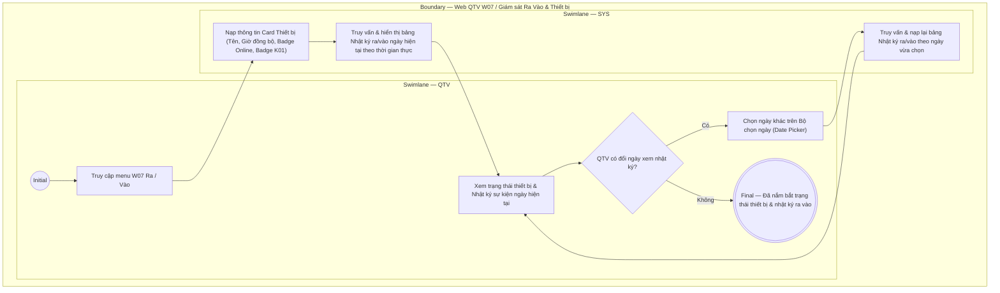

# QTV-W07-US03 - Xem nhật ký Ra/Vào và theo dõi trạng thái thiết bị

## Preconditions
- QTV đã đăng nhập vào hệ thống Web quản lý, trong phạm vi branch scope.
- Hệ thống đã kết nối với thiết bị nhận diện tại chi nhánh và có dữ liệu nhật ký sự kiện ra/vào.

## Trigger
- QTV chọn menu **W07 · Ra / Vào**.
- Màn hình liên quan: Web QTV — W07 Ra / Vào, Card Thiết bị (cột trái) và Danh sách Nhật ký ra/vào hôm nay (cột phải).

## Main Flow

1. QTV truy cập màn hình W07 Ra / Vào.
2. SYS nạp và hiển thị **Card Thiết bị** ở cột bên trái:
   - Tên cổng và thời điểm đồng bộ gần nhất: ví dụ `Gate-Q1-01 · đồng bộ 09:43`.
   - Trạng thái kết nối phần cứng: Badge `Online` (xanh lá) hoặc `Offline` (đỏ).
   - Trạng thái Kiosk chào mừng: Badge `K01 sẵn sàng` (xanh dương) hoặc `K01 ngắt kết nối` (xám).
   - Nút **[⚙ Cấu hình]** (điều hướng sang menu W12 để cấu hình thiết bị) và nút **[⟲ Thủ công]** (mở modal ghi nhận thủ công `QTV-W07-US02`).
3. SYS tự động nạp và hiển thị **Bảng Nhật ký ra/vào (Datagridview)** ở cột bên phải theo ngày được chọn trên Bộ chọn ngày (mặc định nạp ngày hôm nay `TODAY`).
4. Mỗi dòng sự kiện trên bảng Datagridview hiển thị đầy đủ 9 cột thông tin:
   - **Thời gian**: Giờ:phút phát sinh sự kiện (ví dụ: `09:42`).
   - **Loại sự kiện (Vào/Ra)**: Badge `VÀO` (viền xanh lá nhạt) hoặc `RA` (viền xám nhạt).
   - **Hội viên**: Họ tên và mã hội viên (ví dụ: `Nguyễn Văn An · HV001`).
   - **Gói tập**: Tên gói tập áp dụng cho lượt ra/vào (ví dụ: `Gói 3 tháng`).
   - **Điểm quét**: Cổng nhận diện thiết bị hoặc quầy thao tác (ví dụ: `Gate-Q1-01`, `Quầy lễ tân`).
   - **Cách thức**: Phương thức ghi nhận gồm `Quét khuôn mặt` (tự động) hoặc `Thủ công` (nhân viên quầy).
   - **Lý do / Ghi chú**: Thể hiện lý do ghi nhận thủ công (ví dụ: `Thiết bị lỗi`, `Không nhận diện được khuôn mặt`) hoặc lý do từ chối khi không đủ điều kiện (ví dụ: `Gói hết hạn`, `Sai chi nhánh`); hiển thị `-` nếu quét khuôn mặt thành công.
   - **Người thực hiện**: Tên nhân viên/lễ tân thao tác (nếu ghi nhận thủ công) hoặc `Hệ thống` (nếu quét tự động qua cổng).
   - **Trạng thái**: Badge `Hợp lệ` (xanh lá - đủ điều kiện vào/ra) hoặc `Không đủ điều kiện` (đỏ - bị từ chối).
5. QTV xem danh sách sự kiện ra vào, theo dõi tình trạng thiết bị hoặc sử dụng **Bộ chọn ngày** trên thanh header để tra cứu lịch sử ra/vào các ngày trong quá khứ.
6. Khi QTV chọn một ngày khác trên Bộ chọn ngày, SYS tự động truy vấn và cập nhật lại toàn bộ bảng sự kiện theo ngày được chọn.
7. Khi đang xem ngày hiện tại, nếu có hội viên quét cửa mới hoặc lễ tân ghi nhận mới, hệ thống tự động đẩy dòng sự kiện mới lên đầu bảng theo thời gian thực mà không cần tải lại trang.

### Field-level specification — Card Thiết bị (Cột trái)
| Field / control | Loại UI Control | State | Required | Conditional / dynamic | Source / validation |
| :--- | :--- | :--- | :--- | :--- | :--- |
| Thông tin cổng & đồng bộ | `Readonly Text` | `READONLY` | required | Không | Tên cổng và thời điểm đồng bộ gần nhất từ telemetry thiết bị (ví dụ: "Gate-Q1-01 · đồng bộ 09:43") |
| Trạng thái kết nối cổng | `Status Badge` | `READONLY` | required | `DYNAMIC` | Badge xanh lá `Online` (kết nối bình thường) hoặc đỏ `Offline` (mất tín hiệu) |
| Trạng thái màn hình Kiosk | `Status Badge` | `READONLY` | required | `DYNAMIC` | Badge xanh dương `K01 sẵn sàng` hoặc xám `K01 ngắt kết nối` |
| Nút Cấu hình `[⚙ Cấu hình]` | `Button (Secondary)` | `USER-INPUT` | optional | Không | Nút icon/text bấm để điều hướng nhanh sang menu cấu hình thiết bị W12 |
| Nút Thủ công `[⟲ Thủ công]` | `Button (Secondary)` | `USER-INPUT` | optional | Không | Nút bấm mở modal Ghi nhận ra/vào thủ công (`QTV-W07-US02`) |

### Field-level specification — Bảng Nhật ký ra/vào (Cột phải)
| Field / control | Loại UI Control | State | Required | Conditional / dynamic | Source / validation |
| :--- | :--- | :--- | :--- | :--- | :--- |
| Bộ chọn ngày xem nhật ký | `Date Picker` | `USER-INPUT (PREFILL)` | required | Không | Mặc định điền sẵn ngày hôm nay (`TODAY`); cho phép chọn bất kỳ ngày nào $\le$ hôm nay. Khi thay đổi ngày, bảng tự động nạp lại dữ liệu nhật ký của ngày đó |
| Thời gian | `Readonly Text` | `READONLY` | required | Không | Giờ:phút ghi nhận sự kiện từ hệ thống hoặc thiết bị (định dạng `HH:mm`) |
| Loại sự kiện | `Status Badge` | `READONLY` | required | `DYNAMIC` | Badge viền bo `VÀO` (xanh lá nhạt) hoặc `RA` (xám nhạt) |
| Hội viên | `Readonly Text` | `READONLY` | required | Không | Họ và tên kèm mã hội viên (`MEMBER_PROFILE.full_name` · `member_code`) |
| Gói tập | `Readonly Text` | `READONLY` | required | Không | Tên gói tập hội viên sử dụng cho lượt ra/vào |
| Điểm quét | `Readonly Text` | `READONLY` | required | `DYNAMIC` | Tên cổng nhận diện (ví dụ `Gate-Q1-01`) hoặc vị trí ghi nhận (ví dụ `Quầy lễ tân`) |
| Cách thức | `Readonly Text` | `READONLY` | required | `DYNAMIC` | Phương thức xác thực: `Quét khuôn mặt` (nhận diện tự động) hoặc `Thủ công` (nhân viên ghi nhận tại quầy) |
| Lý do / Ghi chú | `Readonly Text` | `READONLY` | required | `DYNAMIC` | Lý do thao tác thủ công (từ modal US02) hoặc lý do từ chối khi không đủ điều kiện; hiển thị `-` nếu quét tự động hợp lệ |
| Người thực hiện | `Readonly Text` | `READONLY` | required | `DYNAMIC` | Tên nhân viên/lễ tân thực hiện thao tác thủ công hoặc `Hệ thống` (nếu quét tự động qua cổng) |
| Trạng thái | `Status Badge` | `READONLY` | required | `DYNAMIC` | Badge kết quả kiểm tra điều kiện lượt ra/vào: `Hợp lệ` (xanh lá - đủ điều kiện vào/ra) hoặc `Không đủ điều kiện` (đỏ - bị từ chối) |

- **Business rules / logic:**
  - Bảng nhật ký mặc định hiển thị toàn bộ các lượt ra/vào trong ngày hiện tại (`TODAY`) của chi nhánh thuộc branch scope.
  - Khi cần tra cứu đối soát lịch sử, QTV chỉ cần chọn ngày tương ứng trên Bộ chọn ngày mà không cần rời màn hình.
  - Phản ánh cả các lượt vào/ra tự động qua Camera/Cổng thông minh lẫn các lượt ghi nhận thủ công do nhân viên quầy thực hiện.
  - Card Thiết bị giúp QTV nắm bắt tức thì tình trạng vận hành của phần cứng cổng và màn hình kiosk chào mừng K01.
  - Nút `[⚙ Cấu hình]` chuyển hướng nhanh sang menu W12 (chỉ hiển thị với vai trò QTV có quyền cấu hình thiết bị).

## Activity Diagram — Swimlane
**Trigger:** QTV mở màn hình W07 Ra / Vào để theo dõi sự kiện và trạng thái thiết bị.

