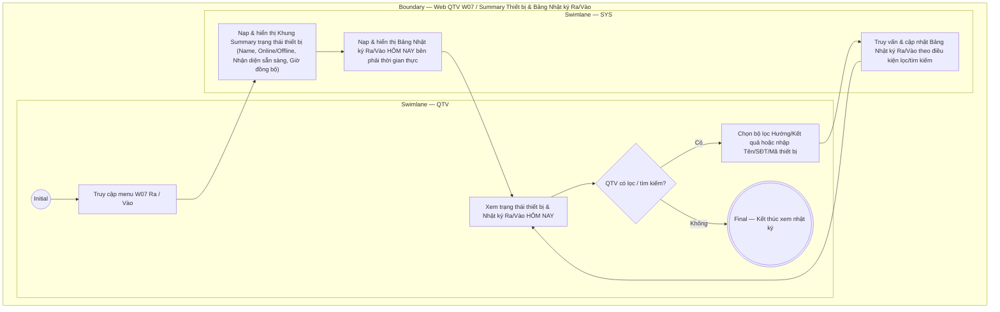

# QTV-W07-US03 - Xem nhật ký Ra/Vào và theo dõi trạng thái thiết bị

## Preconditions
- QTV đã đăng nhập vào Web QTV, mở menu **W07 · Ra / Vào**.
- Hệ thống đã có các bản ghi access log (sự kiện vào/ra) và kết nối với các thiết bị nhận diện tại chi nhánh.

## Trigger
- QTV chọn menu **W07 · Ra / Vào**.
- Màn hình liên quan: Web QTV — W07 Ra / Vào, Khung Trạng thái thiết bị và Bảng Nhật ký Ra/Vào (bên phải).

## Main Flow

1. QTV truy cập màn hình W07 Ra / Vào.
2. SYS nạp và hiển thị **Khung Theo dõi trạng thái thiết bị** (Khung summary nhỏ read-only):
   - **Tên thiết bị**: ví dụ `Gate-Q1-01`.
   - **Trạng thái kết nối**: `Online` / `Offline`.
   - **Trạng thái nhận diện**: `Nhận diện: Sẵn sàng`.
   - **Thời gian đồng bộ**: ví dụ `Đồng bộ: 09:43`.
   - *Lưu ý: Màn hình W07 không có nút Cấu hình thiết bị. Việc cấu hình thiết bị nằm riêng ở menu W12 Hệ thống & thiết bị.*
3. SYS tự động nạp và hiển thị **Bảng Nhật ký Ra/Vào HÔM NAY** ở khu vực bên phải màn hình theo thời gian thực bao gồm các cột:
   - **Thời gian**: Giờ/phút/giây sự kiện (ví dụ: `09:42`).
   - **Vào/Ra**: Nhãn hướng sự kiện (`VÀO` / `RA`).
   - **Hội viên**: Họ tên hội viên (ví dụ: `Nguyễn Văn An`).
   - **Nguồn**: Thiết bị / Phương thức ghi nhận (`CAMERA`, `GATE`, `MANUAL`).
   - **Kết quả**: `Cho phép` (Thành công) / `Từ chối`.
   - **Cảnh báo**: Lý do từ chối hoặc lý do thao tác thủ công (ví dụ: `Cho phép`, `Gói hết hạn`, `Chưa thanh toán`, `Xử lý thủ công: Camera lỗi`).
   - **Thao tác**: Nút xem chi tiết log sự kiện.
4. QTV xem danh sách nhật ký Ra/Vào hôm nay và trạng thái thiết bị.
5. Nếu QTV chọn lọc hoặc tìm kiếm dữ liệu:
   - QTV chọn bộ lọc theo Hướng (`Tất cả`, `VÀO`, `RA`), Kết quả (`Tất cả`, `Cho phép`, `Từ chối`) hoặc nhập từ khóa tìm kiếm (Tên hội viên, SĐT, Mã thiết bị).
   - SYS truy vấn và cập nhật lại Bảng nhật ký Ra/Vào theo đúng điều kiện lọc.
   - QTV quay lại xem danh sách đã được lọc.

- **Business rules / logic:**
  - Bảng nhật ký Ra/Vào mặc định tải dữ liệu của ngày hôm nay ngay khi vừa truy cập menu W07, phản ánh thời gian thực tất cả các lượt vào/ra của hội viên tại phòng Gym từ cả luồng tự động (Camera/Gate) và luồng thủ công (Lễ tân/QTV ghi nhận).
  - Khung trạng thái thiết bị hiển thị read-only giúp người dùng nhanh chóng nhận biết thiết bị nhận diện tại cửa có đang hoạt động bình thường hay không.

## Activity Diagram — Swimlane
**Trigger:** QTV mở màn hình W07 Ra / Vào.

