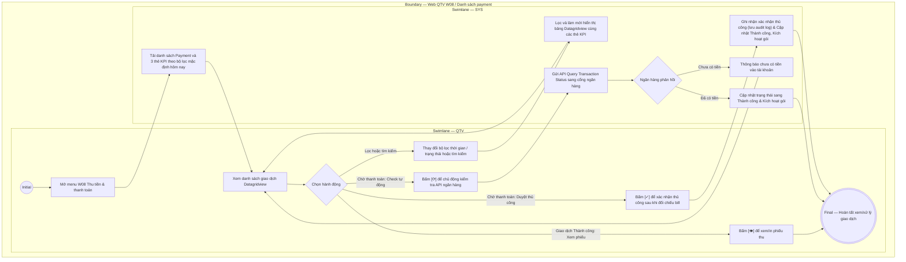

# QTV-W08-US01 - Xem danh sách payment

## Preconditions
- QTV đã đăng nhập vào Web QTV, có quyền tài chính và truy cập menu W08 Thu tiền & thanh toán.
- Hệ thống đã có các bản ghi Payment (giao dịch thanh toán tiền mặt hoặc chuyển khoản QR).

## Trigger
- QTV chọn menu **W08 · Thu tiền & thanh toán** trên thanh điều hướng chính.
- Màn hình liên quan: Web QTV — W08 Thu tiền & thanh toán, tab Danh sách payment.

## Main Flow

1. QTV truy cập menu W08 Thu tiền & thanh toán.
2. SYS nạp và hiển thị **Bảng Danh sách Payment (Datagridview)**:
   - **Mã phiếu**: Mã định danh phiếu thu duy nhất (ví dụ: `PT00123`).
   - **Thời gian**: Giờ:phút ghi nhận giao dịch (hoặc ngày tháng).
   - **Hội viên**: Ô hiển thị 2 dòng: Dòng trên là Họ tên hội viên (chữ đậm nổi bật), Dòng dưới là `Mã HV · SĐT` (chữ xám nhỏ, ví dụ: `HV00123 · 0901 234 567`) giúp định danh chính xác, chống trùng lặp.
   - **Đăng ký**: Mã đơn đăng ký gói liên kết (ví dụ: `DK001`) kèm tên gói tập.
   - **Phương thức**: Hình thức thanh toán (`Tiền mặt` hoặc `Chuyển khoản`).
   - **Số tiền**: Số tiền 100% cần thu/thực thu (màu xanh lá nổi bật, ví dụ: `1.350.000 đ`).
   - **Người thu**: Họ tên nhân viên/QTV thực hiện thu tiền tại quầy hoặc `Hệ thống`.
   - **Chi nhánh**: Chi nhánh phát sinh giao dịch thu tiền.
   - **Trạng thái**:
     + Badge `Thành công` (màu xanh lá): Tiền đã vào tài khoản/két tiền, gói tập đã kích hoạt.
     + Badge `Chờ thanh toán` (màu vàng/cam): Đang chờ khách quét mã VietQR hoặc đang chờ ngân hàng xác nhận.
     + Badge `Hết hạn` (màu xám): Quá thời hạn quét QR (sau 15 phút) mà không nhận được tiền.
   - **Thao tác**:
     + Với giao dịch `Thành công`: Nút **[👁]** (Xem/in phiếu thu tài chính 100%).
     + Với giao dịch `Chờ thanh toán`: Nút **[ ⟳ ]** (Kiểm tra lại trạng thái tức thì qua API ngân hàng) và nút **[ ✓ ]** (Xác nhận đã nhận tiền thủ công khi đã đối chiếu bill của khách).
3. QTV có thể sử dụng nút thao tác trên Header:
   - Nút **[ + Ghi nhận thanh toán ]**: Mở modal Ghi nhận thanh toán 100% bằng Tiền mặt hoặc Quét mã QR chuyển khoản (`QTV-W08-US02`).
4. QTV có thể sử dụng ô tìm kiếm và các bộ lọc:
   - Ô tìm kiếm: Tìm theo Mã phiếu, Mã đăng ký, Tên hội viên hoặc SĐT.
   - **Bộ lọc thời gian thanh toán**: Mặc định điền sẵn **Hôm nay (`TODAY`)**; hỗ trợ chọn một ngày cụ thể hoặc khoảng ngày (*Từ ngày — Đến ngày*).
   - Bộ lọc Phương thức: `Tất cả`, `Tiền mặt`, `Chuyển khoản`.
   - **Bộ lọc Trạng thái**: `Tất cả`, `Thành công`, `Chờ thanh toán`, `Hết hạn`.
5. Khi thay đổi bộ lọc, SYS truy vấn và làm mới danh sách payment cùng các thẻ KPI tương ứng.
6. Với các giao dịch `Chờ thanh toán`:
   - Nếu bấm **[ ⟳ ]**: SYS gửi lệnh API Query Transaction Status sang ngân hàng. Nếu ngân hàng báo tiền đã vào, SYS tự động chuyển sang `Thành công` và kích hoạt gói ngay.
   - Nếu bấm **[ ✓ ]**: SYS mở popup xác nhận đối chiếu bill thực tế. QTV xác nhận $\rightarrow$ SYS chuyển trạng thái sang `Thành công` và lưu vết audit.

### Field-level specification — Bảng Danh sách Payment (Datagridview)
| Field / control | Loại UI Control | State | Required | Conditional / dynamic | Source / validation |
| :--- | :--- | :--- | :--- | :--- | :--- |
| Nút Ghi nhận thanh toán `[ + Ghi nhận thanh toán ]` | `Button (Primary Green)` | `USER-INPUT` | optional | Không | Nút màu xanh lá trên Header; click mở modal Ghi nhận thanh toán 100% (`QTV-W08-US02`) |
| Bộ lọc thời gian thanh toán | `Date / Date Range Picker` | `USER-INPUT (PREFILL)` | required | `TRIGGER` | Mặc định điền sẵn **Hôm nay (`TODAY`)**; cho phép chọn 1 ngày hoặc khoảng ngày (*Từ ngày — Đến ngày*). Khi thay đổi, hệ thống tự động lọc lại bảng payment và đồng bộ tính lại các thẻ KPI |
| Ô tìm kiếm giao dịch | `Text Input (Search)` | `USER-INPUT` | optional | Không | Tìm theo Mã phiếu, Mã đăng ký, Tên hội viên hoặc SĐT |
| Bộ lọc Phương thức | `Select Dropdown` | `USER-INPUT` | optional | Không | Mặc định `Tất cả`; tùy chọn: `Tất cả`, `Tiền mặt`, `Chuyển khoản` |
| Bộ lọc Trạng thái | `Select Dropdown` | `USER-INPUT` | optional | Không | Mặc định `Tất cả`; tùy chọn: `Tất cả`, `Thành công`, `Chờ thanh toán`, `Hết hạn` |
| Cột Mã phiếu | `Readonly Text` | `READONLY` | required | Không | Mã định danh duy nhất của giao dịch / phiếu thu (ví dụ: `PT00123`) |
| Cột Thời gian | `Readonly Text` | `READONLY` | required | Không | Thời điểm phát sinh giao dịch (`HH:mm` hoặc `DD/MM/YYYY`) |
| Cột Hội viên | `Readonly Text (Two-line Cell)` | `READONLY` | required | Không | Hiển thị 2 dòng: Dòng 1 Họ tên hội viên (`MEMBER_PROFILE.full_name`, chữ đậm), Dòng 2 `Mã HV · SĐT` (`MEMBER_PROFILE.member_code · MEMBER_PROFILE.phone`, chữ xám nhỏ) tránh trùng tên |
| Cột Đăng ký | `Readonly Text` | `READONLY` | required | Không | Mã đơn đăng ký gói liên kết (`DK001`, `DK004`...) kèm Tên gói tập |
| Cột Phương thức | `Status Badge / Text` | `READONLY` | required | `DYNAMIC` | Hình thức thanh toán: `Tiền mặt` hoặc `Chuyển khoản` |
| Cột Số tiền | `Readonly Text (Green)` | `READONLY` | required | Không | Số tiền thanh toán 100% (chữ xanh lá nổi bật, định dạng VND: `1.350.000 đ`) |
| Cột Người thu | `Readonly Text` | `READONLY` | required | `DYNAMIC` | Họ tên QTV hoặc Lễ tân đã ghi nhận giao dịch tại quầy (hoặc `Hệ thống` nếu qua QR) |
| Cột Chi nhánh | `Readonly Text` | `READONLY` | required | Không | Chi nhánh phát sinh giao dịch thu tiền (`Quận 1`, `Bình Thạnh`...) |
| Cột Trạng thái | `Status Badge` | `READONLY` | required | `DYNAMIC` | Badge trạng thái: `Thành công` (xanh lá), `Chờ thanh toán` (vàng/cam), `Hết hạn` (xám) |
| Nút Xem phiếu thu `[ 👁 ]` | `Icon Button` | `USER-INPUT` | conditional | `CONDITIONAL`: **Hiện khi** Trạng thái là `Thành công`; **Ẩn khi** Trạng thái khác. Click mở xem/in phiếu thu tài chính 100% cho hội viên |
| Nút Kiểm tra lại `[ ⟳ ]` | `Icon Button` | `USER-INPUT` | conditional | `CONDITIONAL`: **Hiện khi** Trạng thái là `Chờ thanh toán`; **Ẩn khi** Trạng thái khác. Click gửi request API kiểm tra trạng thái thanh toán tức thời từ ngân hàng |
| Nút Xác nhận thủ công `[ ✓ ]` | `Icon Button` | `USER-INPUT` | conditional | `CONDITIONAL`: **Hiện khi** Trạng thái là `Chờ thanh toán`; **Ẩn khi** Trạng thái khác. Click xác nhận thủ công sau khi đã đối chiếu bill chuyển khoản thực tế của khách |

- **Business rules / logic:**
  - Bản ghi Payment ở trạng thái `Thành công` là chứng từ bất biến, không sửa đè hay xóa.
  - Giao dịch chuyển khoản VietQR khi mới sinh sẽ ở trạng thái `Chờ thanh toán`. Khi nhận Webhook thành công hoặc khi bấm nút Kiểm tra lại `[ ⟳ ]` thành công hoặc bấm Xác nhận thủ công `[ ✓ ]` $\rightarrow$ chuyển trạng thái sang `Thành công` và tự động kích hoạt gói tập (`Registration` sang `ACTIVE`/`SCHEDULED`).
  - Quá 15 phút không nhận được tiền, giao dịch `Chờ thanh toán` tự động chuyển sang `Hết hạn`.

## Exception Flows
- Không tìm thấy giao dịch thỏa mãn điều kiện lọc: SYS hiển thị thông báo danh sách trống.
- Kiểm tra qua API ngân hàng thất bại hoặc ngân hàng phản hồi chưa có tiền: SYS hiển thị thông báo "Chưa ghi nhận tiền vào tài khoản ngân hàng. Vui lòng thử lại hoặc đối chiếu bill chuyển khoản".

## Activity Diagram — Swimlane
**Trigger:** QTV mở menu W08 Thu tiền & thanh toán để theo dõi giao dịch và xử lý các giao dịch chờ thanh toán.

