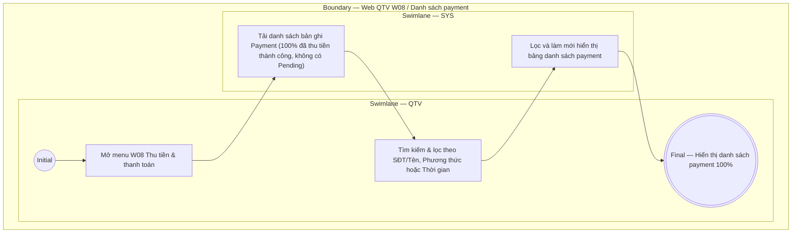

# QTV-W08-US01 - Xem danh sách payment

## Preconditions
- QTV đã đăng nhập vào Web QTV, có quyền tài chính và truy cập menu W08 Thu tiền & thanh toán.
- Hệ thống đã có các bản ghi Payment (giao dịch thu tiền thành công 100%).

## Trigger
- QTV chọn menu **W08 · Thu tiền & thanh toán** trên thanh điều hướng chính.
- Màn hình liên quan: Web QTV — W08 Thu tiền & thanh toán, tab Danh sách payment.

## Main Flow

1. QTV truy cập menu W08.
2. SYS nạp và hiển thị **Danh sách payment** dưới dạng bảng bao gồm các thông tin giao dịch thu tiền thành công 100%:
   - **Mã Payment**: Mã phiếu thu / giao dịch duy nhất (ví dụ: `PAY-001`).
   - **Hội viên**: Tên và số điện thoại hội viên thực hiện thanh toán.
   - **Mã Đăng ký (Registration)**: Mã đăng ký gói liên kết (ví dụ: `DK001`).
   - **Gói tập**: Tên gói tập đăng ký tương ứng.
   - **Số tiền thanh toán**: Số tiền 100% thực thu (không có số dư nợ hay nợ đọng).
   - **Phương thức thanh toán**: Nhãn hình thức (`Tiền mặt` hoặc `Chuyển khoản`).
   - **Ngày / Giờ thanh toán**: Thời điểm ghi nhận giao dịch thành công.
   - **Người ghi nhận**: Tài khoản QTV / Lễ tân thực hiện tạo payment.
   - **Thao tác**: Nút **Xem / In phiếu thu** cho hội viên.
3. QTV có thể sử dụng các bộ lọc và ô tìm kiếm:
   - Ô tìm kiếm: Tìm theo Mã Payment, Mã Registration, Tên hội viên hoặc SĐT.
   - Bộ lọc Phương thức: `Tất cả`, `Tiền mặt`, `Chuyển khoản`.
   - Bộ lọc Thời gian: Lọc theo khoảng ngày / tháng.
4. SYS cập nhật hiển thị bảng danh sách payment theo điều kiện lọc.

- **Business rules / logic:**
  - **Quy tắc về trạng thái Payment**: Payment chỉ được lưu vết khi đã thu tiền thành công 100%. **Hệ thống tuyệt đối không tồn tại Payment ở trạng thái Pending (chờ thanh toán)**. Trạng thái Pending chỉ dành cho bản ghi Đăng ký (Registration).
  - Bản ghi Payment trong danh sách mang tính chất pháp lý và nhật ký tài chính, bảo đảm tính minh bạch và lưu vết audit trail.

## Exception Flows
- Không tìm thấy giao dịch thỏa mãn điều kiện lọc: SYS hiển thị thông báo danh sách trống.

## Activity Diagram — Swimlane
**Trigger:** QTV mở tab Danh sách payment tại menu W08.

