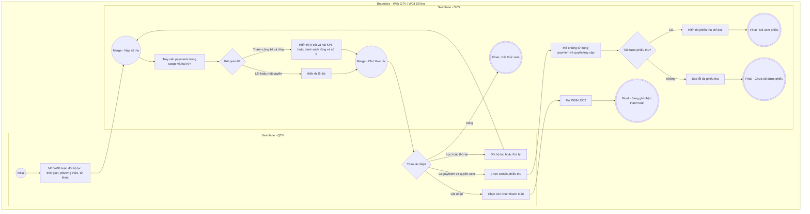

# QTV-W08-US01 - Xem danh sách payment

## Preconditions
- QTV đã đăng nhập, có quyền xem tài chính trong phạm vi chi nhánh được phân quyền. Danh sách có thể rỗng.

## Trigger
- Mở W08 Thu tiền & thanh toán.

## Main Flow
1. QTV mở W08; SYS nạp sổ thu thành công trong scope, mặc định thời gian Hôm nay.
2. SYS hiển thị 9 cột: Mã phiếu, Thời gian, Hội viên (họ tên và Mã HV · SĐT), Đăng ký (mã và tên gói), Phương thức, Số tiền thực thu, Người thu, Chi nhánh, Thao tác xem/in phiếu thu.
3. QTV tìm theo mã phiếu, mã đăng ký, tên hoặc SĐT; chọn ngày/khoảng ngày và phương thức Tiền mặt/Chuyển khoản/Tất cả.
4. SYS làm mới bảng và hai KPI Tổng thực thu, Lượt thanh toán thành công theo bộ lọc và scope.
5. QTV mở xem/in phiếu thu, hoặc chọn Ghi nhận thanh toán để mở QTV-W08-US02.

### Field-level specification — Danh sách payment
| Field / control | Loại UI Control | State | Required | Conditional / dynamic | Source / validation |
| :--- | :--- | :--- | :--- | :--- | :--- |
| Nút Ghi nhận thanh toán `[ + Ghi nhận thanh toán ]` | `Button (Primary Green)` | `USER-INPUT` | optional | Không | Nút tác vụ của màn hình; click mở modal Ghi nhận thanh toán 100% (`QTV-W08-US02`) |
| Bộ lọc thời gian thanh toán | `Date / Date Range Picker` | `USER-INPUT (PREFILL)` | required | `TRIGGER` | Mặc định điền sẵn **Hôm nay (`TODAY`)**; cho phép chọn 1 ngày hoặc khoảng ngày (*Từ ngày — Đến ngày*). Khi thay đổi, hệ thống tự động lọc lại bảng payment và đồng bộ tính lại các thẻ KPI |
| Ô tìm kiếm giao dịch | `Text Input (Search)` | `USER-INPUT` | optional | Không | Tìm theo Mã phiếu, Mã đăng ký, Tên hội viên hoặc SĐT |
| Bộ lọc Phương thức | `Select Dropdown` | `USER-INPUT` | optional | Không | Mặc định `Tất cả`; tùy chọn: `Tất cả`, `Tiền mặt`, `Chuyển khoản` |
| Cột Mã phiếu | `Readonly Text` | `READONLY` | required | Không | Mã định danh duy nhất của giao dịch / phiếu thu (ví dụ: `PT00123`) |
| Cột Thời gian | `Readonly Text` | `READONLY` | required | Không | Thời điểm phát sinh giao dịch (`HH:mm` hoặc `DD/MM/YYYY`) |
| Cột Hội viên | `Readonly Text (Two-line Cell)` | `READONLY` | required | Không | Hiển thị 2 dòng: Dòng 1 Họ tên hội viên (`MEMBER_PROFILE.full_name`, chữ đậm), Dòng 2 `Mã HV · SĐT` (`MEMBER_PROFILE.member_code · MEMBER_PROFILE.phone`, chữ xám nhỏ) tránh trùng tên |
| Cột Đăng ký | `Readonly Text` | `READONLY` | required | Không | Mã đơn đăng ký gói liên kết (`DK001`, `DK004`...) kèm Tên gói tập |
| Cột Phương thức | `Status Badge / Text` | `READONLY` | required | Không | Hình thức thanh toán: `Tiền mặt` hoặc `Chuyển khoản` |
| Cột Số tiền | `Readonly Text (Green)` | `READONLY` | required | Không | Số tiền thanh toán 100% (chữ xanh lá nổi bật, định dạng VND: `1.350.000 đ`) |
| Cột Người thu | `Readonly Text` | `READONLY` | required | Không | Họ tên QTV hoặc Lễ tân đã ghi nhận giao dịch tại quầy (hoặc `Hệ thống` nếu qua QR) |
| Cột Chi nhánh | `Readonly Text` | `READONLY` | required | Không | Chi nhánh phát sinh giao dịch thu tiền (`Quận 1`, `Bình Thạnh`...) |
| Cột Thao tác (Nút Xuất phiếu thu) | Button (Outlined Green) | USER-INPUT | required | Không | Mỗi dòng payment có đúng một nút Xuất phiếu thu `[ 📄 Xuất phiếu thu ]`; click mở popup xem và xuất/in phiếu thu tương ứng |

### Thao tác bộ lọc trên màn hình
| Field / control | Loại UI Control | State | Required | Conditional / dynamic | Source / validation |
| --- | --- | --- | --- | --- | --- |
| Toàn thời gian | Action Button | USER-INPUT | optional | Không | Xóa giới hạn ngày, tải lại danh sách và hai KPI trong scope. |
| Hôm nay | Action Button | USER-INPUT | optional | Không | Đặt Từ ngày và Đến ngày về ngày hiện tại, tải lại cùng bộ lọc. |
| Làm mới | Icon Button | USER-INPUT | optional | Không | Nạp lại dữ liệu API theo bộ lọc hiện tại; không tạo payment. |

## Business Rules
- Mỗi payment là giao dịch đã thu đủ 100% sau giảm giá; sổ thu bất biến và không có trường payment.status. Không có cột/bộ lọc trạng thái thanh toán hoặc KPI đơn chờ ở W08.
- Yêu cầu QR chờ/hết hạn thuộc payment_intents, không nằm trong sổ payments; tiếp tục thanh toán và đối soát qua đăng ký W04/modal W08-US02.
- Giữ bộ lọc trạng thái và quyền hủy đăng ký còn chờ tại W04; chưa thanh toán không phải công nợ.

## Alternate Flows
- Không có payment theo bộ lọc: bảng rỗng, hai KPI bằng 0.
- Đổi bộ lọc hoặc làm mới: nạp lại cùng scope; xem phiếu thu chỉ đọc.

## Exception Flows
- Mất quyền, lỗi tải hoặc không tải được phiếu thu: báo lỗi, cho thử lại; không tự tạo dữ liệu và không báo đã thu tiền.

## Activity Diagram — Swimlane

