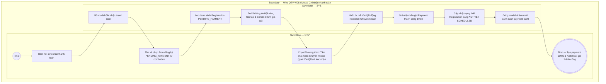

# QTV-W08-US02 - Tạo payment

## Preconditions
- QTV đã đăng nhập vào Web QTV, có quyền thu tiền tài chính.
- Đã tồn tại bản ghi Đăng ký gói tập (`Registration`) ở trạng thái **`PENDING_PAYMENT` (Chờ thanh toán)** được khởi tạo từ menu W04.

## Trigger
- QTV bấm nút **[ + Ghi nhận thanh toán ]** trên màn hình W08 (hoặc được hệ thống tự động chuyển tiếp sau khi tạo đăng ký mới tại W04).
- Màn hình liên quan: Web QTV — W08 Thu tiền & thanh toán, modal **Ghi nhận thanh toán** (`payment-form`).

## Main Flow

1. QTV bấm nút **[ + Ghi nhận thanh toán ]** trên màn hình W08 (hoặc mở từ nút **[Thu tiền]** của một đơn đăng ký cụ thể tại W04).
2. SYS mở modal **Ghi nhận thanh toán**.
3. Tại trường **Hội viên cần thanh toán**, QTV gõ tìm kiếm theo SĐT, Họ tên hội viên hoặc Mã hội viên (danh sách chỉ gồm các hội viên đang có đơn `PENDING_PAYMENT`).
4. SYS tự động kích hoạt và nạp danh sách toàn bộ các gói tập đăng ký chờ thanh toán của chính hội viên đó vào trường **Gói tập đăng ký chờ thanh toán**.
5. QTV chọn gói tập cần thanh toán từ dropdown (nếu hội viên có nhiều gói đang chờ thanh toán) hoặc hệ thống tự động chọn sẵn gói duy nhất.
6. SYS hiển thị **Số tiền thanh toán 100%** (Giá niêm yết của gói đăng ký hoặc giá sau mã giảm giá).
7. QTV chọn **Phương thức thanh toán**: `Tiền mặt` (`CASH`) hoặc `Chuyển khoản` (`BANK_TRANSFER`):
   - **Nếu chọn Tiền mặt**: QTV nhận tiền mặt đủ 100% tại quầy.
   - **Nếu chọn Chuyển khoản**: SYS tự động sinh và hiển thị **Mã QR VietQR động** chứa chính xác số tiền 100% và cú pháp nội dung chuyển khoản để hội viên quét mã bằng ứng dụng ngân hàng.
8. QTV (nếu cần) nhập mã giảm giá hoặc ghi chú giao dịch.
9. QTV bấm nút xác nhận thanh toán trên modal (hoặc hệ thống tự động ghi nhận khi nhận tín hiệu chuyển khoản thành công).
10. SYS kiểm tra tính hợp lệ và ghi nhận giao dịch Payment thành công (100% số tiền đã thu, tuyệt đối không có trạng thái Pending cho bản ghi Payment).
11. SYS tự động kích hoạt Đơn đăng ký (`Registration`) từ `PENDING_PAYMENT` sang **`ACTIVE`** (hoặc **`SCHEDULED`** nếu ngày bắt đầu gói ở tương lai).
12. SYS đóng modal, làm mới danh sách payment W08 và hiển thị tùy chọn xem/in phiếu thu cho hội viên.

### Field-level specification — Modal Ghi nhận thanh toán
| Field / control | Loại UI Control | State | Required | Conditional / dynamic | Source / validation |
| :--- | :--- | :--- | :--- | :--- | :--- |
| Hội viên cần thanh toán | `Combobox (Search & Select)` | `USER-INPUT` | required | `TRIGGER` | Ô tìm kiếm theo SĐT, Họ tên hoặc Mã hội viên; danh sách chỉ hiển thị các hội viên đang có đơn ở trạng thái `PENDING_PAYMENT`. Khi người dùng chọn hội viên, kích hoạt nạp danh sách các gói tập tương ứng vào trường bên dưới |
| Gói tập đăng ký chờ thanh toán | `Combobox (dxSelectBox)` | `USER-INPUT` | required | `DYNAMIC` | Danh sách các gói tập / đơn đăng ký đang chờ thanh toán (`PENDING_PAYMENT`) của riêng hội viên đã chọn ở trường trên (hiển thị Mã ĐK, Tên gói, Kỳ hiệu lực, Giá tiền). Cho phép người dùng chọn gói cụ thể nếu hội viên có nhiều gói đăng ký đang chờ nộp tiền; tự động chọn sẵn nếu chỉ có 1 gói |
| Số tiền thanh toán 100% | `Readonly Text (Green)` | `READONLY` | required | `DYNAMIC` | Hiển thị 100% giá niêm yết của gói đăng ký hoặc giá sau khi trừ mã giảm giá (chữ xanh lá nổi bật); chỉ đọc, cố định thanh toán 1 lần duy nhất |
| Mã giảm giá / Voucher (nếu có) | `Searchable Dropdown (dxSelectBox) + Button [Áp dụng]` | `USER-INPUT` | optional | `Không` | Dropdown hiển thị danh sách các mã voucher đang có hiệu lực tại chi nhánh (Mã, Tên, % giảm hoặc số tiền, đơn tối thiểu); hỗ trợ chọn trực tiếp từ danh sách để tự động áp dụng hoặc nhập mã tùy ý |
| Phương thức thanh toán | `Radio Group` | `USER-INPUT (PREFILL)` | required | `TRIGGER` | Mặc định chọn `Tiền mặt` (`CASH`); tùy chọn: `Tiền mặt` hoặc `Chuyển khoản` (`BANK_TRANSFER`). Đóng vai trò kích hoạt hiển thị mã VietQR động |
| Khối Mã QR VietQR | `QR Code Display` | `READONLY` | conditional | `CONDITIONAL`: **Hiện khi** Phương thức thanh toán là `Chuyển khoản`; **Ẩn khi** Phương thức thanh toán là `Tiền mặt`. Mã VietQR động chứa số tài khoản gym, số tiền 100% và cú pháp `{Mã ĐK} {Mã HV} PARADISE` |
| Ghi chú giao dịch | `Text Area` | `USER-INPUT` | optional | Không | Ghi chú thêm cho giao dịch thu tiền (tối đa 255 ký tự) |

- **Business rules / logic:**
  - **Quy trình kích hoạt gói**: `Registration (PENDING_PAYMENT)` ➔ **Tạo Payment (100% thành công)** ➔ `Registration (ACTIVE / SCHEDULED)`.
  - Payment được tạo ra luôn ở trạng thái đã hoàn tất (100% đã thu tiền). Tuyệt đối không tồn tại trạng thái Pending đối với bản ghi Payment.
  - Hỗ trợ cả 2 hình thức thanh toán trong cùng 1 modal tiện lợi: tiền mặt trực tiếp hoặc quét VietQR động.

## Exception Flows
- Không tìm thấy đơn đăng ký nào ở trạng thái `PENDING_PAYMENT` theo thông tin nhập: SYS hiển thị thông báo "Không tìm thấy đơn đăng ký chờ thanh toán phù hợp".

## Activity Diagram — Swimlane
**Trigger:** QTV bấm nút Ghi nhận thanh toán tại menu W08.

