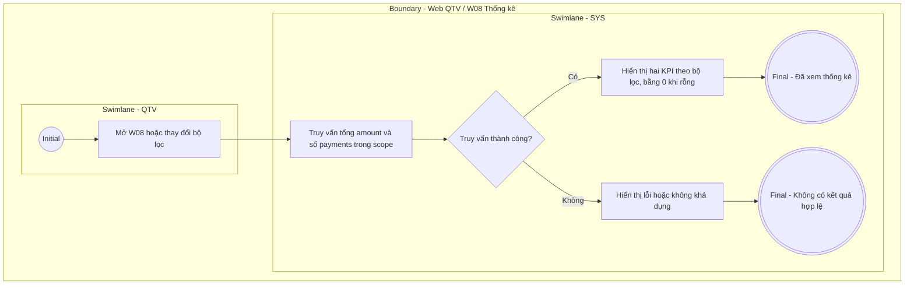

# QTV-W08-US03 - Xem thống kê

## Preconditions
- QTV đã đăng nhập và có quyền tài chính trong phạm vi chi nhánh được phân quyền.

## Trigger
- Mở W08, đổi bộ lọc hoặc có giao dịch thu thành công.

## Main Flow
1. SYS đọc payments theo thời gian (mặc định Hôm nay), phương thức, từ khóa và scope của danh sách W08-US01.
2. SYS hiển thị đúng hai KPI: Tổng thực thu (tổng số tiền đã thu đủ sau giảm giá) và Lượt thanh toán thành công (số payment).
3. Đổi bộ lọc hoặc làm mới sau khi thu tiền cập nhật đồng thời hai KPI và bảng. Hai thẻ chỉ đọc, không có thao tác lọc theo trạng thái.

### Field-level specification — Khối thống kê
| Field / control | Loại UI Control | State | Required | Conditional / dynamic | Source / validation |
| --- | --- | --- | --- | --- | --- |
| Tổng thực thu | Currency metric | READONLY | required | Không | Tổng amount của payments theo bộ lọc/scope; không cộng payment_intents hay giá trị đăng ký chưa trả. |
| Lượt thanh toán thành công | Count metric | READONLY | required | Không | Số payments cùng bộ lọc/scope; không đếm số lần tạo QR hoặc số lần thử xác nhận. |

## Business Rules
- payments chỉ chứa giao dịch thành công và không có status. W08 không có KPI đơn chờ thanh toán, dropdown/cột trạng thái hoặc badge lọc thành công.
- Đăng ký chờ tiếp tục được quản lý tại W04; khởi tạo/hết hạn QR không làm tăng doanh thu.

## Alternate Flows
- Không có giao dịch: cả hai KPI bằng 0.
- Làm mới hoặc đổi bộ lọc: tính lại cùng điều kiện với danh sách.

## Exception Flows
- Lỗi truy vấn hoặc mất quyền: hiển thị lỗi/không khả dụng; không trình bày lỗi thành số 0 hợp lệ.

## Activity Diagram — Swimlane

