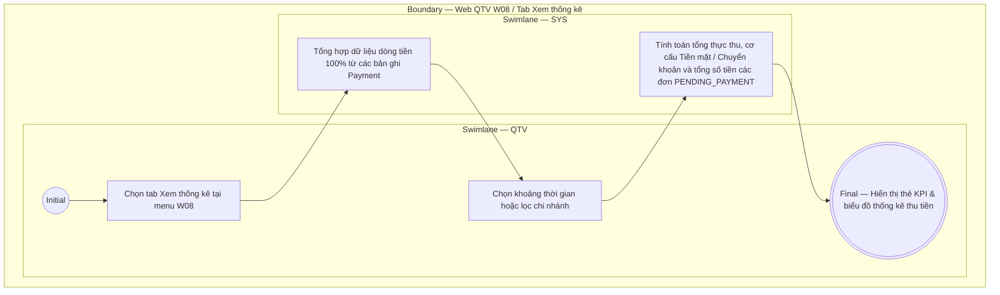

# QTV-W08-US03 - Xem thống kê

## Preconditions
- QTV đã đăng nhập vào Web QTV, có quyền tài chính và đang ở menu W08 Thu tiền & thanh toán.

## Trigger
- QTV chọn tab **Xem thống kê** tại menu W08.
- Màn hình liên quan: Web QTV — W08 Thu tiền & thanh toán, tab Thống kê thanh toán.

## Main Flow

1. QTV chuyển sang tab **Xem thống kê** trên màn hình W08.
2. SYS nạp và hiển thị các thẻ KPI thống kê tài chính thu tiền tổng quan:
   - **Tổng doanh thu thực thu 100%**: Tổng số tiền đã thu từ tất cả các bản ghi Payment thành công trong kỳ.
   - **Thống kê theo Tiền mặt**: Số tiền thực thu bằng hình thức tiền mặt.
   - **Thống kê theo Chuyển khoản**: Số tiền thực thu qua QR / Chuyển khoản ngân hàng.
   - **Số lượt Payment đã hoàn tất**: Tổng số bản ghi Payment đã được tạo thành công.
   - **Tổng số tiền chờ thanh toán**: Tổng số tiền ở các đơn đăng ký (`Registration`) có trạng thái `PENDING_PAYMENT` (Chờ thanh toán) chưa được tạo payment để kích hoạt.
3. QTV chọn khoảng thời gian (Hôm nay, Tuần này, Tháng này, Tùy chọn từ ngày - đến ngày) hoặc lọc theo Chi nhánh.
4. SYS tổng hợp và cập nhật biểu đồ / số liệu thống kê thu tiền theo điều kiện lọc.

- **Business rules / logic:**
  - Thống kê thu tiền phản ánh chính xác dòng tiền thực thu 100% từ các bản ghi Payment thành công.
  - Phân định rõ ràng số tiền thực thu đã hoàn tất giao dịch và tổng số tiền ở các đơn đăng ký đang ở trạng thái chờ thanh toán (`PENDING_PAYMENT`).

## Activity Diagram — Swimlane
**Trigger:** QTV mở tab Xem thống kê tại menu W08.

