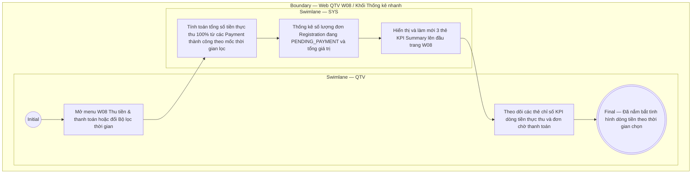

# QTV-W08-US03 - Xem thống kê

## Preconditions
- QTV đã đăng nhập vào Web QTV, có quyền tài chính và đang ở menu W08 Thu tiền & thanh toán.

## Trigger
- QTV truy cập menu **W08 · Thu tiền & thanh toán** trên thanh điều hướng chính hoặc thay đổi giá trị tại **Bộ lọc thời gian thanh toán**.
- Màn hình liên quan: Web QTV — W08 Thu tiền & thanh toán, Khối Thống kê nhanh (KPI Summary Cards).

## Main Flow

1. QTV truy cập menu W08 Thu tiền & thanh toán (hoặc điều chỉnh giá trị tại Bộ lọc thời gian thanh toán).
2. SYS tự động tổng hợp và hiển thị **Khối Thống kê nhanh (KPI Summary Cards)** ở phần trên cùng của màn hình theo mốc thời gian đã chọn (mặc định là Hôm nay `TODAY`):
   - **Thẻ Tổng thực thu**: Tổng số tiền thực thu 100% từ các giao dịch thanh toán thành công trong mốc thời gian lọc (ví dụ: `5.650.000 đ`).
   - **Thẻ Lượt thanh toán thành công**: Tổng số lượt giao dịch payment đã thu tiền thành công 100% trong mốc thời gian lọc (ví dụ: `12 lượt`).
   - **Thẻ Đơn chờ thanh toán**: Tổng số lượng đơn đăng ký (`Registration`) đang ở trạng thái `PENDING_PAYMENT` và tổng giá trị các đơn này đang chờ khách đóng tiền để kích hoạt gói (ví dụ: `3 đơn · 4.500.000 đ`).
3. QTV theo dõi các chỉ số tài chính dòng tiền thực thu và tình hình các đơn chờ thanh toán theo thời gian thực.
4. Khi QTV chọn ngày khác hoặc khoảng ngày tại **Bộ lọc thời gian thanh toán**, SYS lập tức tính toán và làm mới số liệu của cả 3 thẻ KPI đồng bộ với bảng danh sách payment bên dưới.

### Field-level specification — Khối Thống kê nhanh (KPI Summary Cards)
| Field / control | Loại UI Control | State | Required | Conditional / dynamic | Source / validation |
| :--- | :--- | :--- | :--- | :--- | :--- |
| Thẻ Tổng thực thu | `Stat Card (Currency)` | `READONLY` | required | `DYNAMIC` | Tổng số tiền đã thu thành công 100% theo ngày/khoảng ngày được chọn tại Bộ lọc thời gian thanh toán (mặc định hôm nay `TODAY`, ví dụ: `5.650.000 đ`). Nguồn từ các bản ghi Payment `CONFIRMED` |
| Thẻ Lượt thanh toán thành công | `Stat Card (Count)` | `READONLY` | required | `DYNAMIC` | Tổng số lượt giao dịch thanh toán thành công 100% theo ngày/khoảng ngày được chọn tại Bộ lọc thời gian thanh toán (mặc định hôm nay `TODAY`, ví dụ: `12 lượt`) |
| Thẻ Đơn chờ thanh toán | `Stat Card (Count & Currency)` | `READONLY` | required | `DYNAMIC` | Số lượng đơn và tổng giá trị các gói đang ở trạng thái `PENDING_PAYMENT` chờ hội viên đóng tiền để kích hoạt gói tính đến hiện tại hoặc theo thời gian lọc (ví dụ: `3 đơn · 4.500.000 đ`) |

- **Business rules / logic:**
  - Các chỉ số KPI phản ánh trung thực và tức thời dòng tiền thực thu 100% từ các giao dịch thành công.
  - Tuyệt đối không có chỉ số công nợ hay nợ đọng; phân định rõ số tiền đã thu vào quỹ và số tiền của các đơn đăng ký đang chờ đóng tiền (`PENDING_PAYMENT`).
  - Số liệu tự động cập nhật ngay khi:
    1. Thay đổi ngày/khoảng ngày tại Bộ lọc thời gian thanh toán.
    2. Có giao dịch thanh toán mới thành công.
    3. Có đơn đăng ký mới được tạo ở trạng thái `PENDING_PAYMENT` từ menu W04.

## Activity Diagram — Swimlane
**Trigger:** QTV mở menu W08 hoặc đổi bộ lọc thời gian để theo dõi thống kê dòng tiền.

