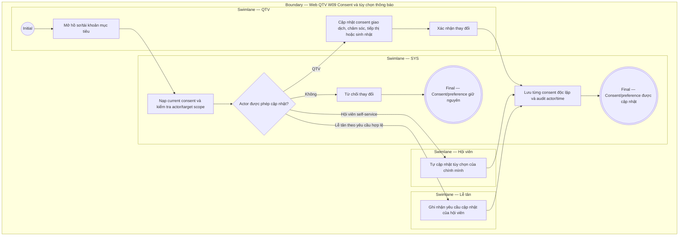

# QTV-W09-US04 - Quản lý consent và tùy chọn thông báo

## Preconditions
- Người thực hiện đã đăng nhập hoặc ở ngữ cảnh hội viên self-service hợp lệ; hội viên đã có hồ sơ trong hệ thống.
- QTV quản lý consent/tùy chọn thông báo trên Web theo role, branch scope và permission được cấp; lễ tân cập nhật theo yêu cầu hợp lệ; hội viên tự quản lý trên Mobile/Web App.

## Trigger
- QTV chọn quản lý consent/tùy chọn thông báo trong hồ sơ hội viên hoặc hội viên tự thay đổi tùy chọn.
- Màn hình liên quan: Web QTV — W09 Chăm sóc & thông báo, modal/tab tùy chọn consent.

## Main Flow
1. QTV mở hồ sơ hội viên hoặc màn hình tài khoản/chăm sóc W09.
2. Hệ thống hiển thị các nhóm consent độc lập (Thông báo giao dịch, Chăm sóc tùy chọn, Tiếp thị/Marketing, Sinh nhật công khai).
3. QTV cập nhật trạng thái đồng ý/từ chối theo yêu cầu của hội viên.
4. QTV bấm xác nhận thay đổi.
5. SYS kiểm tra permission và lưu lịch sử thay đổi consent.
6. Hệ thống áp dụng ngay quy tắc lọc thông báo và hiển thị theo consent mới.

### Field-level specification — modal / tab quản lý consent và tùy chọn thông báo
| Field / control | State | Required | Conditional / dynamic | Source / validation |
|---|---|---|---|---|
| Hội viên / Tài khoản | `READONLY (PREFILL)` | required | `DYNAMIC`: prefill thông tin hội viên được chọn trong scope | Member profile record |
| Consent Thông báo giao dịch | `USER-INPUT` + `PREFILL` | required | `DYNAMIC`: Bật/Tắt (mặc định Bật do liên quan quyền lợi) | Consent store |
| Consent Chăm sóc tùy chọn | `USER-INPUT` + `PREFILL` | required | `DYNAMIC`: Bật/Tắt | Consent store |
| Consent Tiếp thị / Marketing | `USER-INPUT` + `PREFILL` | required | `DYNAMIC`: Bật/Tắt (phải có consent mới được gửi marketing) | Consent store |
| Consent Sinh nhật công khai | `USER-INPUT` + `PREFILL` | required | `DYNAMIC`: Bật/Tắt (chỉ hiển thị bảng mừng sinh nhật K01 khi Bật) | Consent store |
| Lý do / Yêu cầu thay đổi | `USER-INPUT` | optional | `CONDITIONAL`: khi QTV/Lễ tân thay đổi thay cho hội viên | QTV / Lễ tân nhập |
| Người sửa / Thời điểm cập nhật | `AUTO-FILL` + `READONLY` | required sau lưu | `DYNAMIC`: ghi log khi commit thành công | SYS clock & current user account |

- **Business rules / logic:**
  - Tách biệt rõ ràng 4 nhóm consent: Giao dịch, Chăm sóc tùy chọn, Tiếp thị/Marketing và Sinh nhật công khai.
  - Đồng ý nhận nhắc lịch/giao dịch không đồng nghĩa với đồng ý nhận quảng cáo/marketing.
  - Màn hình công cộng K01 chỉ hiển thị tên/ảnh mừng sinh nhật khi có consent Sinh nhật công khai.
  - Mọi thao tác thay đổi consent đều được ghi audit log.

## Alternate Flows
### AF-01 — Hội viên tự cập nhật tùy chọn
1. Hội viên mở phần Cài đặt tài khoản trên Mobile/Web App.
2. Hệ thống hiển thị danh sách consent cá nhân.
3. Hội viên bật/tắt các tùy chọn và xác nhận.
4. Hệ thống lưu tùy chọn mới cho hội viên đó.

### AF-02 — Lễ tân cập nhật theo yêu cầu tại quầy
1. Lễ tân mở hồ sơ hội viên trong chi nhánh phục vụ.
2. Lễ tân ghi nhận yêu cầu thay đổi consent của hội viên.
3. Hệ thống lưu thay đổi và audit log.  

## Exception Flows
- Thao tác ngoài branch scope hoặc thiếu permission: từ chối lưu.
- Cố tình dùng consent chăm sóc để gửi tiếp thị khi chưa có consent Marketing: hệ thống chặn gửi.

## Activity Diagram — Swimlane
**Trigger:** QTV chọn quản lý consent/tùy chọn thông báo trong hồ sơ hội viên hoặc hội viên tự thay đổi tùy chọn.

