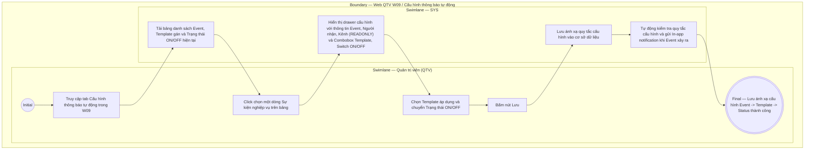

# QTV-W09-US01 - Cấu hình thông báo tự động

## Preconditions
- Quản trị viên (QTV) đã đăng nhập vào hệ thống Web QTV với quyền quản lý cấu hình thông báo.
- Hệ thống đã định nghĩa sẵn danh mục các Sự kiện nghiệp vụ (Events) có kích hoạt phát thông báo in-app tự động.

## Trigger
- QTV truy cập menu **W09 · Quản lý thông báo** và chọn tab **Cấu hình thông báo tự động**.
- Màn hình liên quan: Web QTV — Tab `W09 · Cấu hình thông báo tự động`.

## Main Flow

1. QTV truy cập màn hình **W09 · Quản lý thông báo** $\rightarrow$ chọn tab **Cấu hình thông báo tự động**.
2. Hệ thống hiển thị bảng danh sách các Sự kiện nghiệp vụ (Business Events) bao gồm 3 cột thông tin chính:
   - **Event (Sự kiện):** Mã và tên sự kiện nghiệp vụ (ví dụ: `PAYMENT_CONFIRMED`, `BOOKING_CREATED`, `BOOKING_CANCELLED`, `PT_REQUEST_ACCEPTED`, `PACKAGE_EXPIRING`).
   - **Template (Mẫu áp dụng):** Tên mẫu thông báo in-app đang gán cho sự kiện (ví dụ: *"Thanh toán thành công"*).
   - **Trạng thái:** Công tắc Bật/Tắt (`ON` / `OFF`).
3. QTV click chọn một dòng sự kiện cần điều chỉnh trên bảng.
4. Hệ thống hiển thị form / drawer chi tiết cấu hình sự kiện:
   - **Mã & Tên sự kiện:** `READONLY` (ví dụ: `PAYMENT_CONFIRMED - Thanh toán thành công`).
   - **Người nhận (Recipient):** `READONLY` (được cố định bởi nghiệp vụ, ví dụ: *Hội viên sở hữu đăng ký*).
   - **Kênh thông báo (Channel):** `READONLY` (mặc định: `IN_APP`).
   - **Mẫu thông báo (Template):** Combobox cho phép QTV chọn mẫu thông báo áp dụng từ danh sách mẫu có sẵn (`US02`).
   - **Trạng thái:** Chọn `ON` (Cho phép tự động gửi) hoặc `OFF` (Tắt tự động gửi).
5. QTV bấm `[ Lưu cấu hình ]`.
6. Hệ thống kiểm tra và lưu lại bảng ánh xạ quy tắc (Event $\rightarrow$ Template $\rightarrow$ Enabled/Disabled).
7. **Quy tắc nghiệp vụ:**
   - **Phân định kiến trúc:**
     - **Backend Code / Business Logic:** Quyết định cố định quy tắc người nhận (**Recipient Rule** - *"Ai phải nhận"*):
       - `PAYMENT_CONFIRMED` $\rightarrow$ `REGISTRATION_MEMBER` (Tự động tra cứu Registration $\rightarrow$ Member $\rightarrow$ Account nhận).
       - `BOOKING_CREATED` $\rightarrow$ `BOOKING_MEMBER_AND_PT` (Member đặt lịch & PT của ca tập).
       - `BOOKING_CANCELLED` $\rightarrow$ `BOOKING_MEMBER_AND_PT` (Member & PT của ca tập bị hủy).
       - `PT_REQUEST_ACCEPTED` $\rightarrow$ `REQUEST_MEMBER` (Member gửi yêu cầu phân công).
       - `PT_REQUEST_RECEIVED` $\rightarrow$ `REQUESTED_PT` (PT được chọn phân công).
       - `PACKAGE_EXPIRING` $\rightarrow$ `REGISTRATION_MEMBER` (Member sở hữu gói tập sắp hết hạn).
     - **QTV trên W09-US01:** Chỉ quyết định *"Có tự động gửi hay không"* (`Enabled: ON/OFF`) và *"Sử dụng mẫu nào"* (`Template`).
   - Khi một sự kiện nghiệp vụ xảy ra (ví dụ Thanh toán 100% thành công), Hệ thống (SYS) tự động kiểm tra cấu hình W09:
     - Nếu `Trạng thái = ON`: SYS lấy Recipient Rule từ Code, lấy Template đã gán, render dữ liệu thực tế và tự động gửi In-app notification cho đúng tài khoản người nhận.
     - Nếu `Trạng thái = OFF`: SYS bỏ qua, không gửi In-app notification.
   - QTV **không được quyền thay đổi Người nhận (Recipient Rule)** hay Kênh gửi (`IN_APP`) cố định của sự kiện.

### Field-level specification — Màn hình & Drawer Cấu hình thông báo tự động
| Field / control | State | Required | Conditional / dynamic | Source / validation |
|---|---|---|---|---|
| Tab `Cấu hình thông báo tự động` | `USER-INPUT` | required | `DYNAMIC`: chọn tab cấu hình | Thao tác chuyển tab |
| Bảng danh sách Event | `READONLY` | required | `DYNAMIC`: hiển thị cột Event, Template và Trạng thái ON/OFF | Database notification_event |
| Mã & Tên sự kiện | `READONLY` | required | `DYNAMIC`: nạp tên sự kiện được chọn | Event metadata |
| Đối tượng nhận (Recipient) | `READONLY` | required | `DYNAMIC`: hiển thị đối tượng nhận cố định theo nghiệp vụ (Hội viên / PT / Lễ tân) | Business recipient rule |
| Kênh thông báo (Channel) | `READONLY` | required | `DYNAMIC`: hiển thị mặc định `IN_APP` | Cấu hình kênh |
| Combobox chọn Mẫu thông báo | `USER-INPUT` + `PREFILL` | required | `DYNAMIC`: danh sách các Template khả dụng từ `US02` | Database notification_template |
| Trạng thái kích hoạt | `USER-INPUT` + `PREFILL` | required | `DYNAMIC`: chọn `ON` (Cho phép tự động gửi) hoặc `OFF` (Tắt tự động gửi) | Event Status |
| Nút `[ Lưu ]` | `USER-INPUT` | required | `CONDITIONAL`: bấm để lưu ánh xạ quy tắc | Thao tác lưu form |

## Alternate Flows

### AF-01 — Tắt thông báo tự động cho sự kiện
1. QTV chuyển trạng thái sự kiện `PACKAGE_EXPIRING` sang `OFF`.
2. QTV bấm `[ Lưu ]`.
3. SYS ghi nhận trạng thái `OFF`. Khi gói tập còn 3 ngày (event xảy ra), SYS tự động kiểm tra quy tắc và không phát notification.

## Exception Flows

- Lỗi kết nối mạng: SYS hiển thị thông báo lỗi và giữ nguyên cấu hình cũ.

## Activity Diagram — Swimlane
**Trigger:** QTV chọn một sự kiện nghiệp vụ để cấu hình trong W09.

